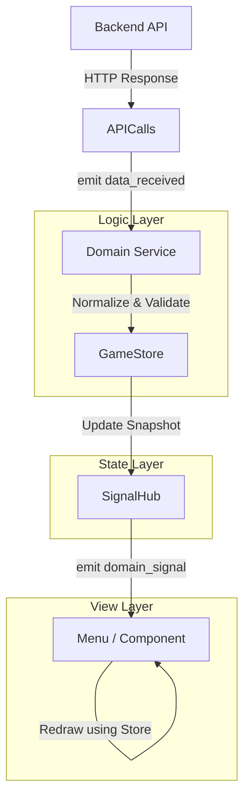

# Data Flow Architecture

Desolate Frontiers uses a unidirectional data flow pattern to ensure UI consistency and simplify state management across the application.

## The Pipeline

The data flow follows a strict unidirectional path to maintain a "Single Source of Truth":

### 1. `APICalls` (Transport)
- The low-level layer responsible for making HTTP requests to the backend.
- Handles JWT authentication and session token storage.
- Emits `fetch_error` for network/backend errors.

### 2. `Domain Services` (Logic)
- Examples: `ConvoyService`, `MapService`, `UserService`.
- Thin wrappers that call `APICalls` and process the results.
- **Responsibility**: They do not hold state. They transform raw API payloads and push them into the `GameStore`.

### 3. `GameStore` (State Snapshot)
- The "Single Source of Truth" for the application's current state.
- Stores snapshots of data (e.g., `_convoys`, `_user`, `_tiles`).
- When state is updated via a `set_*` method, it updates the local snapshot and notifies `SignalHub`.

### 4. `SignalHub` (Event Bus)
- A global dispatcher for domain-level events.
- UI components and other services subscribe to `SignalHub` to react to changes without needing direct references to the services that triggered them.

### 5. `UI Components` (View)
- Menus (extending `MenuBase`) subscribe to `SignalHub` (e.g., `convoys_changed`).
- They use the data snapshot from `GameStore` to redraw themselves efficiently.

---

## Signal Conventions

To prevent confusion when navigating the codebase, distinguish between **Transport Signals** and **Domain Signals**:

| Feature | Transport Signals (`APICalls`) | Domain Signals (`SignalHub`) |
| :--- | :--- | :--- |
| **Purpose** | Raw completion of an HTTP request. | Notification that the game state has changed. |
| **Listener** | Domain Services (e.g., `ConvoyService`). | UI Components and other Services. |
| **Payload** | Raw JSON or Dictionary from the server. | Normalized Godot objects or Dictionaries. |
| **Usage** | `APICalls.convoy_data_received.connect(...)` | `SignalHub.convoys_changed.connect(...)` |

> [!IMPORTANT]
> **UI components should almost never listen to `APICalls`.** They should wait for the service to process the data and emit a domain signal through `SignalHub`. This ensures the UI always has access to the most up-to-date snapshot in the `GameStore` when it tries to redraw.

---

## Periodic Refresh (Polling)

The **`RefreshScheduler`** is responsible for orchestrating periodic background updates.

- It maintains a `Timer` that periodically calls `refresh_all()` on domain services (primarily `ConvoyService`).
- Polling is automatically suspended on logout and resumed on the `initial_data_ready` signal.
- The refresh interval is configurable via `res://app_config.cfg`.

---

## How to Add a New Domain Service

If you are adding a new feature (e.g., "Missions"), follow these steps:

1. **Create the Service**: Create `mission_service.gd` and register it as an Autoload.
2. **Implement API Call**: Add a method to fetch mission data via `APICalls`.
3. **Update GameStore**: Add `_missions` state and `set_missions()` to `GameStore.gd`.
4. **Update SignalHub**: Add a `missions_changed` signal to `SignalHub.gd`.
5. **Hook to Scheduler**: If missions should update periodically, call `MissionService.refresh()` from `RefreshScheduler._on_convoy_refresh_timeout()`.
6. **Subscribe in UI**: Your menu can now connect to `SignalHub.missions_changed` to update its view.
