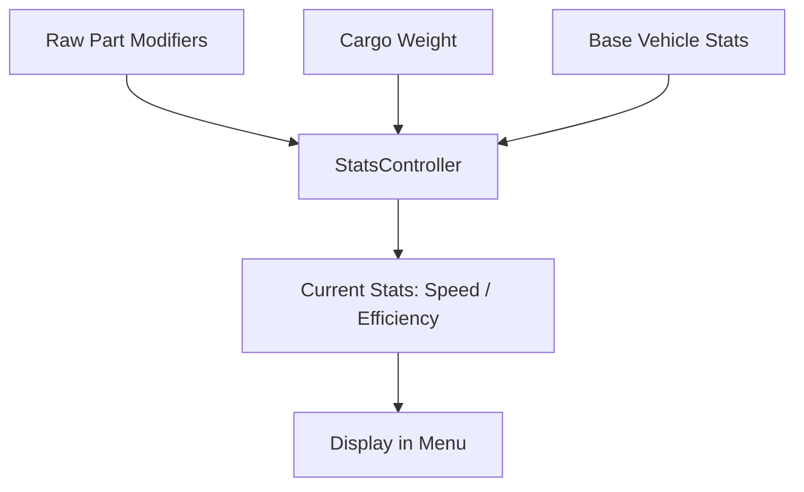

# Data Schema: Core Contracts

This document defines the "Source of Truth" for the core data objects in *Desolate Frontiers*. Both the Godot client and the backend must adhere to these schemas.

> [!TIP]
> Real example payloads for the objects below live in [Data Examples](../99_Reference/data_dumps/README.md) — convoy, vehicle, cargo, part, vendor, and the full map.

## 1. The Convoy Object
A Convoy is a collection of vehicles traveling together.

| Key | Type | Description |
| :--- | :--- | :--- |
| `convoy_id` | `uuid` | The unique identifier for the convoy. |
| `name` | `string` | User-defined name. |
| `x`, `y` | `float` | Current map coordinates (tile-space). |
| `vehicles` | `Array[Vehicle]` | List of vehicles in the convoy. |
| `all_cargo` | `Array[Cargo]` | Unified list of all cargo items across all vehicles. |
| `journey` | `Dictionary?` | Active journey data (route, progress, etc.). |
| `money` | `int` | Current funds associated with this convoy (synced to User). |
| `fuel`, `water` | `float` | Aggregate resource totals across all vehicles. |

## 2. The Vehicle Object
Vehicles are the primary carriers of cargo and parts.

| Key | Type | Description |
| :--- | :--- | :--- |
| `vehicle_id` | `uuid` | Unique identifier. |
| `name` | `string` | The display name (e.g., "Dreysler Pentagram"). |
| `shape` | `string` | Visual identifier for the sprite (e.g., "minivan", "truck"). |
| `cargo_capacity` | `float` | Maximum volume (m³) this vehicle can carry. |
| `weight_capacity` | `float` | Maximum mass (kg) this vehicle can carry. |
| `parts` | `Array[Part]` | List of installed components. |
| `top_speed` | `float` | Current calculated top speed (includes part modifiers). |
| `efficiency` | `float` | Current fuel efficiency (lower is better). |

## 3. The Cargo Object
Cargo represents items held in vehicles, warehouses, or vendor inventories.

| Key | Type | Description |
| :--- | :--- | :--- |
| `cargo_id` | `uuid` | Unique identifier. |
| `class_id` | `uuid` | Identifies the *type* of item (e.g., "Fuel IBC", "Jerry Can"). |
| `quantity` | `float` | Number of items in this stack. |
| `unit_volume` | `float` | Volume per single unit. |
| `unit_weight` | `float` | Weight per single unit. |
| `fuel`, `water`, `food` | `float?` | Resource contents (if this is a container). |
| `parts` | `Array[Part]?` | If this cargo is a "Part Item", it contains its Part definition here. |
| `recipient` | `uuid?` | If present, this is a **Mission Item** for a specific settlement. |

## 4. The Part Object
Parts are components installed into Vehicle slots.

| Key | Type | Description |
| :--- | :--- | :--- |
| `part_id` | `uuid` | Unique identifier. |
| `slot` | `string` | Placement (e.g., "engine", "tires", "paintjob"). |
| `critical` | `bool` | If true, the vehicle cannot move without this part. |
| `bolt_on` | `bool` | If true, can be installed without a mechanic. |
| `requirements` | `Array[string]` | Required slot types (e.g., ["battery"] for electric motors). |
| `*_add` | `float?` | Flat modifiers to stats (e.g., `top_speed_add`). |
| `*_multi` | `float?` | Percentage modifiers to stats (e.g., `weight_capacity_multi`). |

## Terminology: Base vs. Current
- **`base_*`**: The immutable stat of the item as it was spawned.
- **Current (No Prefix)**: The stat after applying all part modifiers, wear, and cargo weight. 
- **`unit_*`**: The value for a single item in a stack.

## Derived Data Logic

## Stability & Keys
- **`cargo_id`**: Ephemeral. Changes if a stack is split or merged by the backend.
- **`stable_key`**: (Client-Side) Derived from `class_id` + `metadata`. Used to maintain UI selection during refreshes.

---

## 5. The User Object
The `User` dictionary is stored in `GameStore._user` and emitted via `SignalHub.user_changed`.

| Key | Type | Description |
| :--- | :--- | :--- |
| `user_id` | `uuid` | The canonical player identifier. |
| `name` | `string` | Display name. |
| `money` | `int` | Current funds (normalised to `int` by `GameStore.set_user()`). |
| `metadata` | `Dictionary` | Freeform server metadata. |
| `metadata.tutorial` | `int?` | Current tutorial stage. Absent = completed. `1`–`7` = in progress. `8` = done. |

> [!IMPORTANT]
> `money` in the raw API payload can arrive as a `String`, `int`, or `float`. Always read from `GameStore.get_user()` which normalises it to `int`. Never parse `money` from a raw convoy or user payload directly.

---

## 6. The Settlement Object
Settlements are nested inside tile data and extracted into a flat array by `GameStore._derive_settlements_from_tiles()`. Model: `Scripts/Data/Models/Settlement.gd`.

| Key | Type | Description |
| :--- | :--- | :--- |
| `sett_id` | `uuid` | Unique identifier. Also aliased as `id` in some payloads. |
| `name` | `string` | Display name (e.g., "Fort Ironhold"). |
| `sett_type` | `string` | Settlement tier: `"village"`, `"town"`, `"city"`, `"city-state"`, `"dome"`, `"military_base"`. |
| `x`, `y` | `int` | Tile-space coordinates. |
| `vendors` | `Array[Vendor]` | Vendors present at this settlement. May be partial (shallow) in map snapshots. |

> [!NOTE]
> The canonical flat settlements array lives in `GameStore.get_settlements()`. Individual menus cache it locally via `_set_latest_settlements_snapshot()` to support fast lookups (e.g. mission destination resolution).

---

## 7. The Vendor Object
Vendors are embedded in `Settlement.vendors`. Model: `Scripts/Data/Models/Vendor.gd`.

| Key | Type | Description |
| :--- | :--- | :--- |
| `vendor_id` | `uuid` | Unique identifier. Also aliased as `id`. |
| `name` | `string` | Vendor display name (e.g., "Dr. Aris"). |
| `sett_id` | `uuid` | Parent settlement ID. |
| `cargo_inventory` | `Array[Cargo]` | Items available for purchase. **May be empty** in map snapshots — requires a `VendorService.request_vendor()` call to populate. |
| `vehicle_inventory` | `Array[Vehicle]` | Vehicles for sale. |
| `fuel_price`, `water_price`, `food_price` | `float?` | Resource prices. Presence of these keys is used as a heuristic to detect a "full" vs. "shallow" vendor payload. |

---

## 8. The Journey Object
The `journey` key on a Convoy is `null` when idle and a `Dictionary` when en route.

| Key | Type | Description |
| :--- | :--- | :--- |
| `destination_settlement_id` | `uuid` | Target settlement. |
| `destination_settlement_name` | `string` | Human-readable destination. |
| `progress` | `float` | Completion ratio `0.0`–`1.0`. |
| `eta` | `string` | ISO-8601 timestamp of estimated arrival. |
| `route` | `Array` | Ordered list of tile waypoints. |

> [!TIP]
> Always guard journey access with a null check: `var has_journey = journey_data != null and not journey_data.is_empty()`. Shallow convoy snapshots may omit the `journey` key entirely.

