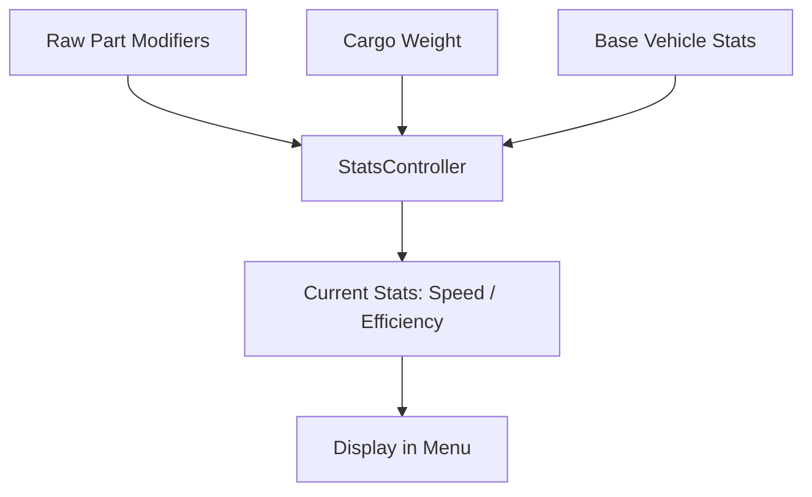

# Data Schema: Core Contracts

This document defines the "Source of Truth" for the core data objects in *Desolate Frontiers*. Both the Godot client and the backend must adhere to these schemas.

## 1. The Convoy Object
A Convoy is a collection of vehicles traveling together.

| Key | Type | Description |
| :--- | :--- | :--- |
| `convoy_id` | `uuid` | The unique identifier for the convoy. |
| `name` | `string` | User-defined name. |
| `x`, `y` | `float` | Current map coordinates (tile-space). |
| `vehicles` | `Array[Vehicle]` | List of vehicles in the convoy. |
| `all_cargo` | `Array[Cargo]` | Unified list of all cargo items across all vehicles. |
| `journey` | `Dictionary?` | Active journey data (route, progress, etc.). |
| `money` | `int` | Current funds associated with this convoy (synced to User). |
| `fuel`, `water` | `float` | Aggregate resource totals across all vehicles. |

## 2. The Vehicle Object
Vehicles are the primary carriers of cargo and parts.

| Key | Type | Description |
| :--- | :--- | :--- |
| `vehicle_id` | `uuid` | Unique identifier. |
| `name` | `string` | The display name (e.g., "Dreysler Pentagram"). |
| `shape` | `string` | Visual identifier for the sprite (e.g., "minivan", "truck"). |
| `cargo_capacity` | `float` | Maximum volume (m³) this vehicle can carry. |
| `weight_capacity` | `float` | Maximum mass (kg) this vehicle can carry. |
| `parts` | `Array[Part]` | List of installed components. |
| `top_speed` | `float` | Current calculated top speed (includes part modifiers). |
| `efficiency` | `float` | Current fuel efficiency (lower is better). |

## 3. The Cargo Object
Cargo represents items held in vehicles, warehouses, or vendor inventories.

| Key | Type | Description |
| :--- | :--- | :--- |
| `cargo_id` | `uuid` | Unique identifier. |
| `class_id` | `uuid` | Identifies the *type* of item (e.g., "Fuel IBC", "Jerry Can"). |
| `quantity` | `float` | Number of items in this stack. |
| `unit_volume` | `float` | Volume per single unit. |
| `unit_weight` | `float` | Weight per single unit. |
| `fuel`, `water`, `food` | `float?` | Resource contents (if this is a container). |
| `parts` | `Array[Part]?` | If this cargo is a "Part Item", it contains its Part definition here. |
| `recipient` | `uuid?` | If present, this is a **Mission Item** for a specific settlement. |

## 4. The Part Object
Parts are components installed into Vehicle slots.

| Key | Type | Description |
| :--- | :--- | :--- |
| `part_id` | `uuid` | Unique identifier. |
| `slot` | `string` | Placement (e.g., "engine", "tires", "paintjob"). |
| `critical` | `bool` | If true, the vehicle cannot move without this part. |
| `bolt_on` | `bool` | If true, can be installed without a mechanic. |
| `requirements` | `Array[string]` | Required slot types (e.g., ["battery"] for electric motors). |
| `*_add` | `float?` | Flat modifiers to stats (e.g., `top_speed_add`). |
| `*_multi` | `float?` | Percentage modifiers to stats (e.g., `weight_capacity_multi`). |

## Terminology: Base vs. Current
- **`base_*`**: The immutable stat of the item as it was spawned.
- **Current (No Prefix)**: The stat after applying all part modifiers, wear, and cargo weight. 
- **`unit_*`**: The value for a single item in a stack.

## Derived Data Logic

## Stability & Keys
- **`cargo_id`**: Ephemeral. Changes if a stack is split or merged by the backend.
- **`stable_key`**: (Client-Side) Derived from `class_id` + `metadata`. Used to maintain UI selection during refreshes.
