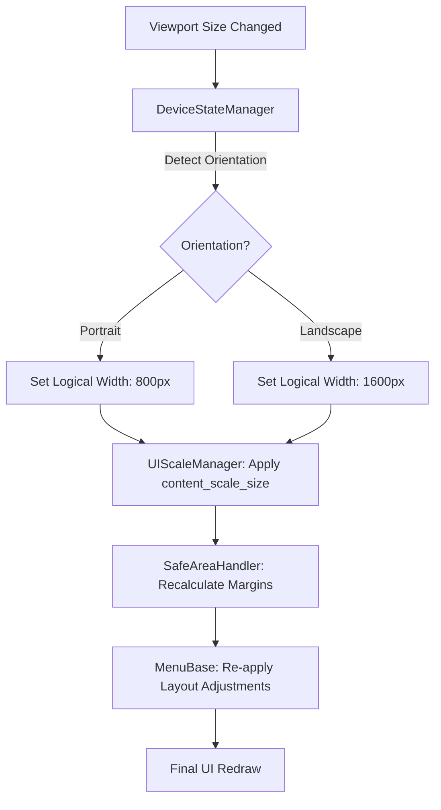

# Device State & Orientation Management

This system coordinates hardware orientation, viewport scaling, and UI safe-area adjustments to ensure a consistent experience across all devices.

## The Coordination Loop

When a device rotates or the window resizes, the following chain of events occurs:

## Key Components

### 1. DeviceStateManager (`device_state_manager.gd`)
The primary listener for window/hardware events. 
- **Responsibility**: Detects if the device is in portrait or landscape mode.
- **Signals**: Emits `orientation_changed(mode)` to trigger the rest of the chain.

### 2. UIScaleManager (`ui_scale_manager.gd`)
The authority on viewport scaling.
- **Responsibility**: Calculates the exact `content_scale_size` based on the orientation target (e.g., 800px).
- **Rule**: All UI logic must assume these logical units, not raw physical pixels.

### 3. SafeAreaHandler (`safe_area_handler.gd`)
Handles hardware notches and islands.
- **Component**: `SafeRegionContainer`
- **Logic**: Uses `DisplayServer.get_display_safe_area()` and converts it into logical coordinates using the current scale.

## Debugging Orientation
You can simulate orientation shifts in the Godot Editor by resizing the game window. The `DeviceStateManager` will automatically trigger the scale shift when the aspect ratio crosses the 1.0 threshold.
