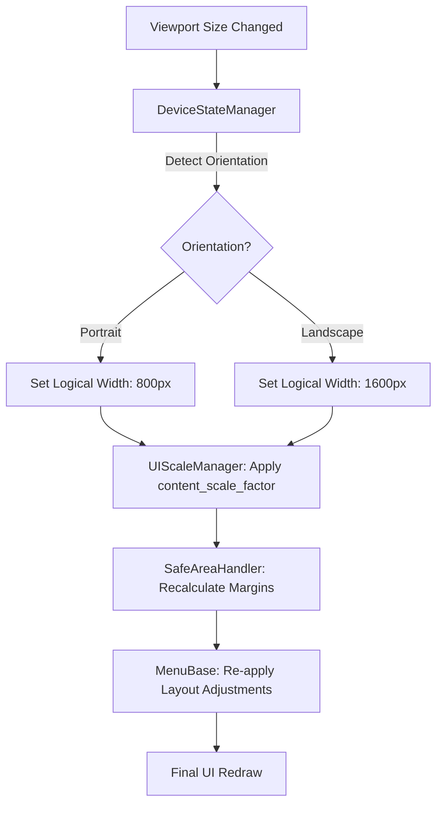

# Device State & Orientation Management

This system coordinates hardware orientation, viewport scaling, and UI safe-area adjustments to ensure a consistent experience across all devices.

## The Coordination Loop

When a device rotates or the window resizes, the following chain of events occurs:

```mermaid
graph TD
    Resize[Viewport Size Changed] --> DSM[DeviceStateManager]
    DSM -->|Detect Orientation| Orientation{Orientation?}
    
    Orientation -->|Portrait| Port[Set Logical Width: 800px]
    Orientation -->|Landscape| Land[Set Logical Width: 1600px]
    
    Port --> Scale[UIScaleManager: Apply content_scale_factor]
    Land --> Scale
    
    Scale --> Safe[SafeAreaHandler: Recalculate Margins]
    Safe --> Menu[MenuBase: Re-apply Layout Adjustments]
    
    Menu --> Redraw[Final UI Redraw]
```

> [!NOTE]
> As of the June 2026 scaling refactor, `DeviceStateManager` no longer scales fonts. The old `get_font_multiplier()` / `get_scaled_base_font_size()` methods were removed. `UIScaleManager` scales all text via **`content_scale_factor` only** — it explicitly zeroes `content_scale_size` (`UI_scale_manager.gd:143`: *"content_scale_size with a zero axis is silently ignored by Godot, which is why it never worked here"*). DeviceStateManager only reports orientation/mode for layout decisions. *(Corrected 2026-07-28 — this note previously credited `content_scale_size` with the scaling.)*

> [!NOTE]
> Scaling statements here mirror
> [AI_ONBOARDING § The Law of Logical Pixels](../AI_ONBOARDING.md) — that page wins on conflict.

## Key Components

### 1. DeviceStateManager (`device_state_manager.gd`)
The primary listener for window/hardware events. 
- **Responsibility**: Detects if the device is in portrait or landscape mode.
- **Signals**: Emits `layout_mode_changed(mode: LayoutMode, screen_size: Vector2, is_mobile: bool)`
  (`device_state_manager.gd:10`) to trigger the rest of the chain. *(Corrected 2026-07-28 — previously
  named `orientation_changed(mode)`, which does not exist.)*

### 2. UIScaleManager (`ui_scale_manager.gd`)
The authority on viewport scaling.
- **Responsibility**: Calculates `content_scale_factor` = `physical_window_width / target_logical_width` for the active orientation. This is the only scaling operation — no per-node font math.
- **Rule**: All UI logic must assume these logical units, not raw physical pixels.

### 3. SafeAreaHandler (`safe_area_handler.gd`)
Handles hardware notches and islands.
- **Component**: `SafeRegionContainer`
- **Logic**: Uses `DisplayServer.get_display_safe_area()` and converts it into logical coordinates using the current scale.

## Debugging Orientation
You can simulate orientation shifts in the Godot Editor by resizing the game window. The `DeviceStateManager` will automatically trigger the scale shift when the aspect ratio crosses the 1.0 threshold.

## Related

- **Constrained by:** [ui_system](ui_system.md) — `DeviceStateManager` is orientation-only; scaling belongs to `UIScaleManager`
- **See also:** [UIAudit](UIAudit.md) — per-element responsive behaviour
