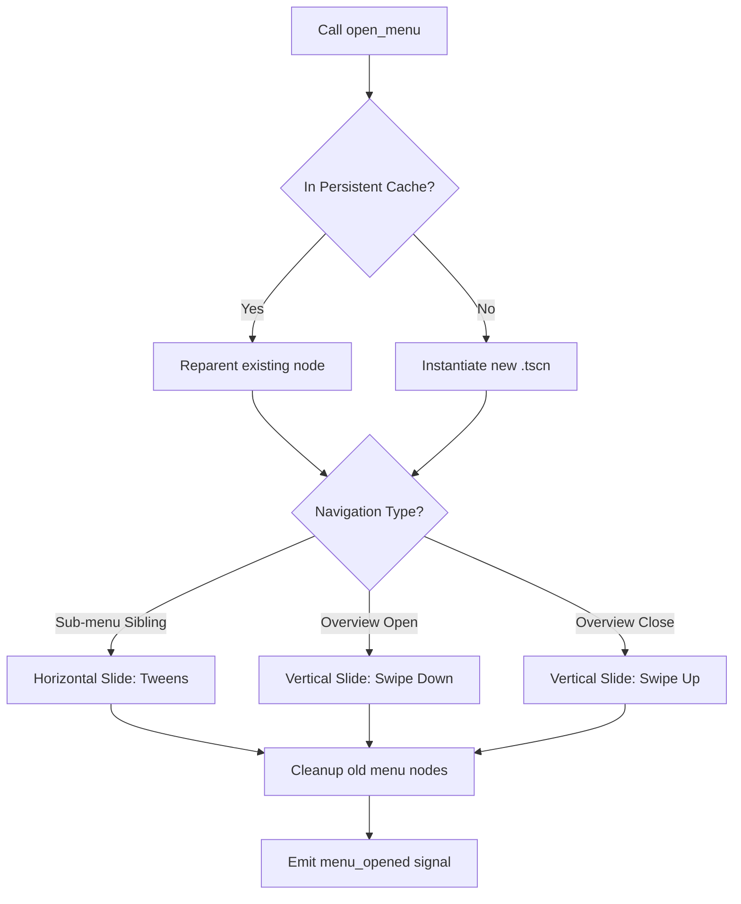

# MenuManager

The `MenuManager` is the central orchestrator for all full-screen UI navigation in *Desolate Frontiers*. It manages menu lifecycles, navigation history (the stack), and UI state persistence.

## Key Responsibilities

1. **Navigation Orchestration**: Opens and closes menus while ensuring only one "active" menu is visible at a time.
2. **State Management**:
   - Maintains a `menu_stack` for "back" functionality.
   - Stores `_menu_states` (e.g., scroll positions) for menus that don't use node persistence.
3. **Persistence Cache**: Stores live menu nodes (`_persistent_menu_cache`) that should survive navigation (like the Journey or Vehicle menus) to avoid re-instantiation overhead.
4. **Transition Animations**: Handles directional sliding (horizontal for sub-menus, vertical for the Overview) to provide a polished, premium feel.
5. **Static Bottom Navigation**: Manages the common navigation bar (`StaticBottomNav`) that stays visible across all convoy-related menus.

### Opening & Transition Flow



---

## Architecture & Integration

### Registering a Host
The `MenuManager` requires a host container to display menus. This is typically done in the `GameRoot` or main scene:

```gdscript
# res://Scenes/MainScreen.tscn
func _ready():
    MenuManager.register_menu_container($MainUI/MenuContent)
```

### Menu Types & Ordering
Menus are categorized to determine their slide direction:
- `convoy_overview`: The top-level layer (swipes vertically).
- `convoy_vehicle_submenu`, `convoy_journey_submenu`, etc.: Sibling sub-menus (swipe horizontally).

---

## Transition Logic

The `MenuManager` uses a `Tween`-based animation system:
- **Horizontal Slide**: When switching between sub-menus (e.g., Vehicles to Cargo), the new menu slides in from the right (or left), and the old one slides out.
- **Vertical Swipe**: When opening the Convoy Overview, it swipes **down** from the top, covering the current sub-menu. When closing, it swipes **up**, revealing the sub-menu underneath.

---

## Persistent Menu Cache

To enable persistence for a menu:
1. Set `persistence_enabled = true` in your `MenuBase` script.
2. The `MenuManager` will now `reparent()` the menu instead of `queue_free()` when navigating away.
3. When returning to the same `convoy_id`, the existing node is restored instantly with its exact UI state.

---

## API Summary

- `open_convoy_menu(data)`: Opens the main overview.
- `open_convoy_vehicle_menu(data)`: Opens the vehicle sub-menu.
- `open_convoy_settlement_menu(data)`: Opens the settlement sub-menu.
- `go_back()`: Navigates to the previous item in the stack.
- `close_all_menus()`: Wipes the stack and hides the UI.
- `menu_opened(menu_node, menu_type)`: Signal emitted on any menu open.
- `menu_visibility_changed(is_open, menu_name)`: Signal emitted for high-level visibility state.
