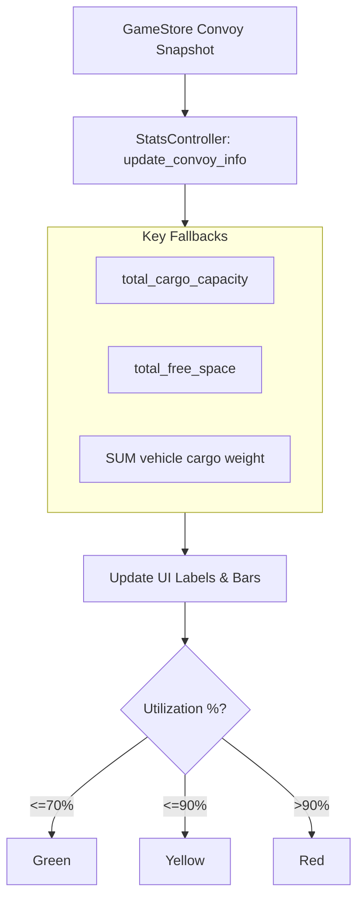

# Convoy Stats: Capacity & Math

This system manages the calculation of convoy volume and weight utilization, providing visual feedback to the player during trade.

## Capacity Math Logic

## Schema Fallbacks
Because different vehicle types or backend versions may use different keys, the `VendorPanelConvoyStatsController` uses a robust fallback system:
- **Volume**: Primarily uses `total_cargo_capacity` and `total_free_space`.
- **Weight**: Checks a list of possible keys (`total_cargo_weight_capacity`, `weight_capacity`, etc.). If missing, it manually sums the weights of all cargo and parts in the convoy.

## Visual Feedback
- **Projection**: The bars show "Projected" utilization based on the current transaction quantity *before* it is committed to the server.
- **Color Thresholds**:
    - **Green**: Safe.
    - **Yellow**: Approaching limit.
    - **Red**: Critically full (Max button will respect this).

## Tests
This system is covered by comprehensive GUT tests to prevent math regressions:
- [test_vendor_panel_convoy_stats_controller.gd](../../../Tests/test_vendor_panel_convoy_stats_controller.gd)

## Controllers
- `vendor_panel_convoy_stats_controller.gd`
