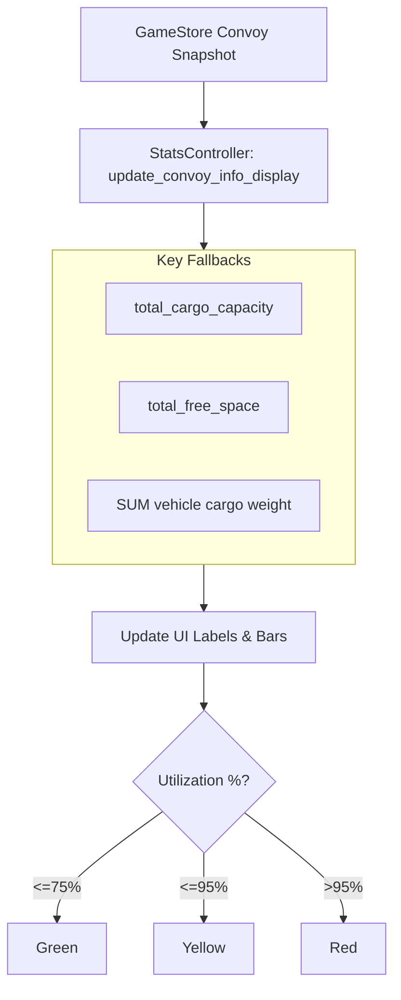

# Convoy Stats: Capacity & Math

This system manages the calculation of convoy volume and weight utilization, providing visual feedback to the player during trade.

## Capacity Math Logic

```mermaid
graph TD
    Data[GameStore Convoy Snapshot] --> Calc[StatsController: update_convoy_info_display]
    
    subgraph Fallbacks [Key Fallbacks]
    A[total_cargo_capacity]
    B[total_free_space]
    C[SUM vehicle cargo weight]
    end
    
    Calc --> Fallbacks
    Fallbacks --> Update[Update UI Labels & Bars]
    
    Update --> Colors{Utilization %?}
    Colors -->|<=75%| Green[Green]
    Colors -->|<=95%| Yellow[Yellow]
    Colors -->|>95%| Red[Red]
```
*(Corrected 2026-07-28 — function is `update_convoy_info_display`, and thresholds are 75%/95%, not
70%/90%; `vendor_panel_convoy_stats_controller.gd:307-312`, same Material-color convention as
[DesignSystem § Status Thresholds](../DesignSystem.md).)*

## Schema Fallbacks
Because different vehicle types or backend versions may use different keys, the `VendorPanelConvoyStatsController` uses a robust fallback system:
- **Volume**: Primarily uses `total_cargo_capacity` and `total_free_space`.
- **Weight**: Primarily uses `total_weight_capacity` / `total_remaining_capacity`. If a per-vehicle
  sum is needed, falls back to each vehicle's `weight_capacity` (or `max_weight`) and sums them
  (`vendor_panel_convoy_stats_controller.gd:27-28,61-67`).

## Visual Feedback
- **Projection**: The bars show "Projected" utilization based on the current transaction quantity *before* it is committed to the server.
- **Color Thresholds** (`_bar_color_for_pct()`): **Green** ≤75% · **Yellow** ≤95% · **Red** >95%
  (Max button will respect this).

## Tests
This system is covered by comprehensive GUT tests to prevent math regressions:
- [test_vendor_panel_convoy_stats_controller.gd](../../../Tests/test_vendor_panel_convoy_stats_controller.gd)

## Controllers
- `vendor_panel_convoy_stats_controller.gd`

## Related

- **See also:** [VendorPanelOverview](VendorPanelOverview.md)
- **See also:** [Transactions](Transactions.md) — capacity limits that gate Max
