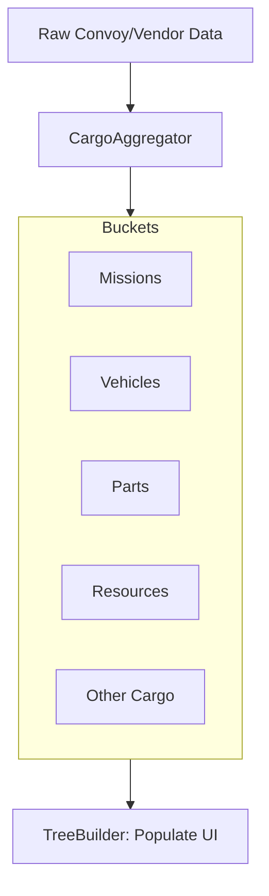

# Data Management: Aggregation & Selection

The Vendor Panel transforms raw backend JSON snapshots into structured UI "Buckets" using the **`VendorCargoAggregator`**.

## The Aggregation Process



### Stable Keys (Selection Continuity)
Convoy aggregation uses a **Stable Key** system to ensure selection persists across refreshes, even if the underlying `cargo_id` or stack order changes.
- **Rules**: Keys are derived from item properties (e.g., `item_name` + `metadata`) rather than ephemeral UUIDs.
- **Duplicates**: Multiple stacks of the same item type are aggregated into a single logical row.

## Vendor Stock Item Data Shape (Parts)

> **Gotcha: vendor `cargo_inventory` items have no price fields.** Do not attempt to read `price`, `unit_price`, or `value` off the raw vendor listing — they won't be there.

A vendor stock part looks like this at aggregation time:

```json
{
  "cargo_id": "c6dd4475-...",
  "name": "6-speed Manual Kit",
  "base_price": 0,
  "weight": 12.0,
  "volume": 123.0,
  "vehicle_id": "00000000-0000-0000-0000-000000000000",
  "is_part": true
}
```

The `is_part: true` flag is **added by `VendorCargoAggregator`** at classification time — it does not come from the backend. The zero UUID in `vehicle_id` is normal for vendor stock. The full priced detail (`price`, `unit_price`, `parts[]`, `slot`, etc.) only arrives after `APICalls.get_cargo(cargo_id)` — see [Transactions.md](Transactions.md) for how that fetch is wired.

## Sellability Rules (Gating)
In **SELL** mode, the convoy tree is filtered to show only what the current vendor is allowed to buy:
1. **General Cargo**: Always sellable.
2. **Bulk Resources**: Only shown if the vendor has a defined price for that resource (e.g., `fuel_price > 0`).
3. **Resource Containers**: Items like jerry cans are only sellable if the vendor buys the resource they contain.
4. **Vehicles**: Only shown if the vendor is classified as a vehicle parts or vehicle dealer.

## Selection Identity
When an item is selected, the **`selection_manager.gd`** tracks it using this priority:
1. `stable_key` (Best for aggregated convoy items)
2. `cargo_id` / `vehicle_id` (Best for unique items)
3. `res:<type>` (For bulk resources like fuel/water)
4. `name:<item_name>` (Fallback)

## Controllers
- `cargo_aggregator.gd`
- `selection_manager.gd`
- `vendor_panel_vehicle_sell_controller.gd`
