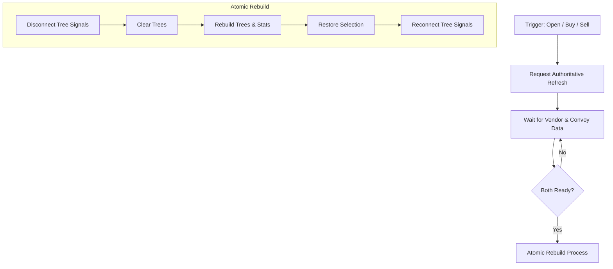

# Lifecycle: Refresh & Selection Stability

The Vendor Panel uses a sophisticated refresh system to ensure the UI stays synchronized with the server without losing the user's current selection.

## Refresh Orchestration

All refresh requests convergence on the **`VendorPanelRefreshController`**.

## Atomic Rebuild Pattern
To prevent UI race conditions, the panel follows a strict "Atomic" sequence during data updates:
1. **Signal Isolation**: Temporarily disconnects `item_selected` signals.
2. **Reconstruction**: Repopulates trees and recomputes stats using the latest `GameStore` snapshot.
3. **Restoration**: Attempts to re-select the previously highlighted item using semantic keys (Stable Keys or IDs).
4. **Resumption**: Reconnects signals to allow user interaction.

## UX Stability Rules
- **Debouncing**: Rapid data updates are debounced by a timer to prevent UI flicker.
- **Selection Guard**: If the user has *just* selected an item (within a small cooldown window), a background refresh will defer processing to avoid interrupting the user's flow.
- **Watchdog Timer**: If a requested authoritative refresh doesn't arrive within the expected window, the watchdog triggers a retry.

## Controllers
- `vendor_panel_refresh_controller.gd`
- `vendor_panel_refresh_scheduler_controller.gd`
- `selection_manager.gd`
