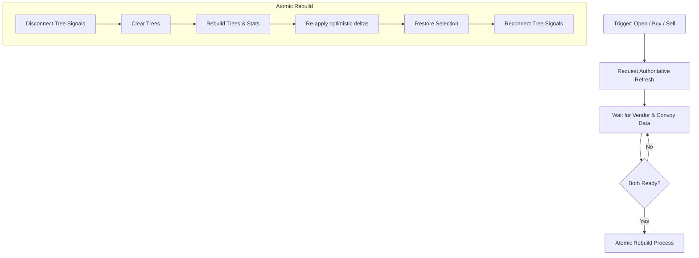

# Lifecycle: Refresh & Selection Stability

The Vendor Panel uses a sophisticated refresh system to ensure the UI stays synchronized with the server without losing the user's current selection.

## Panel Instance Lifecycle — who creates and destroys the panel

> **The panel is owned by `ConvoySettlementMenu`, not by itself.** Everything below about refresh and
> selection stability assumes the panel *survives* the refresh. Until Sprint 13 it frequently did not.

`VendorTradePanel` instances are created by `convoy_settlement_menu.gd::_create_vendor_tab()` and freed by
`_clear_tabs()`. The rule since S13-13:

- **`_display_settlement_info()` rebuilds tabs only when the set of vendors actually changed.** It
  compares `_desired_vendor_ids()` (from the settlement snapshot) against `_mounted_vendor_ids()` (read
  from each tab's `vendor_id` node meta). When they match it refreshes in place and returns, logging
  `[VendorPanel][DIAG] settlement rebuild SKIPPED — vendor set unchanged`.
- **All rebuild requests are coalesced** through `_queue_display_settlement_info()`. `call_deferred()`
  does not de-duplicate, so the previous code built two panels on every menu open — one from the
  synchronous call in `initialize_with_data()`, one from the deferred call queued by
  `MenuBase._refresh_from_store → _update_ui`.
- **A panel is never freed with a transaction in flight.** `_defer_rebuild_for_active_transaction()`
  holds the rebuild while any mounted panel has `_transaction_in_progress`, capped at 10 s.
- **Rotation is a re-layout, not a re-instantiate.** Each panel re-applies its own orientation sizing
  from its own `layout_mode_changed` handler (`vendor_trade_panel.gd::_on_layout_mode_changed`).

**Why it matters:** a freed panel takes its in-flight transaction with it. The API result signal lands on
a dead node — no optimistic stock update, no success toast, no button restore, no error path — while the
request still succeeds server-side. That is why any state which must outlive a rebuild lives **outside**
the panel instance; see [Transactions § Optimistic Projections](Transactions.md#optimistic-projections).

## Refresh Orchestration

All refresh requests convergence on the **`VendorPanelRefreshController`**.

```mermaid
graph TD
    Trigger[Trigger: Open / Buy / Sell] --> Req[Request Authoritative Refresh]
    Req --> Wait[Wait for Vendor & Convoy Data]
    
    Wait --> Ready{Both Ready?}
    Ready -->|Yes| Atomic[Atomic Rebuild Process]
    Ready -->|No| Wait
    
    subgraph Atomic_Rebuild [Atomic Rebuild]
    Disconnect[Disconnect Tree Signals] --> Clear[Clear Trees]
    Clear --> Rebuild[Rebuild Trees & Stats]
    Rebuild --> Reapply[Re-apply optimistic deltas]
    Reapply --> Restore[Restore Selection]
    Restore --> Reconnect[Reconnect Tree Signals]
    end
```

`_populate_vendor_list()` is the choke point every refresh path funnels through, which is why the
optimistic re-apply step lives there rather than in any individual caller.

## Atomic Rebuild Pattern
To prevent UI race conditions, the panel follows a strict "Atomic" sequence during data updates:
1. **Signal Isolation**: Temporarily disconnects `item_selected` signals.
2. **Reconstruction**: Repopulates trees and recomputes stats using the latest `GameStore` snapshot.
3. **Restoration**: Attempts to re-select the previously highlighted item using semantic keys (Stable Keys or IDs).
4. **Resumption**: Reconnects signals to allow user interaction.

## UX Stability Rules
- **Debouncing**: Rapid data updates are debounced by a timer to prevent UI flicker.
- **Selection Guard**: If the user has *just* selected an item (within a small cooldown window), a background refresh will defer processing to avoid interrupting the user's flow.

## The two watchdogs — don't confuse them

They have different owners, different timeouts, and different failure modes.

| | **Refresh watchdog** | **Transaction watchdog** |
|---|---|---|
| Lives in | `vendor_panel_refresh_scheduler_controller.gd` | `vendor_transaction_watchdog.gd` |
| Storage | per-panel (`_watchdog_retries`) | **`static` registry, outside every panel** |
| Watches | a `/vendor/get` payload that didn't arrive | a buy/sell request that never resolved |
| Timeout | 1200 ms (`start_refresh_watchdog` default) | 20 s (`VendorTransactionWatchdog.TIMEOUT_MS`) |
| On fire | re-requests the payload **once** | reverts the projection, re-enables Buy/Max, clears `_transaction_in_progress`, toasts |

The transaction watchdog is deliberately *not* panel-local: its worst case is the panel being freed
before the reply lands, which is exactly when a panel-local timer would die with it. Any live panel ticks
it every 2 s; entries whose dispatching panel is gone (`is_instance_id_valid(owner_id) == false`) are
adopted by whichever panel is alive, while an entry whose owner still exists is left for that owner to
time out from its own `_pending_tx.started_ms`.

## Controllers
- `vendor_panel_refresh_controller.gd`
- `vendor_panel_refresh_scheduler_controller.gd`
- `selection_manager.gd`
- `vendor_transaction_watchdog.gd` — request-lifetime bound, survives the panel
- `vendor_optimistic_stock.gd` — optimistic deltas, survives the panel

## Related

- **See also:** [VendorPanelOverview](VendorPanelOverview.md)
- **See also:** [Checklist](Checklist.md) — regression checks for this sequence
