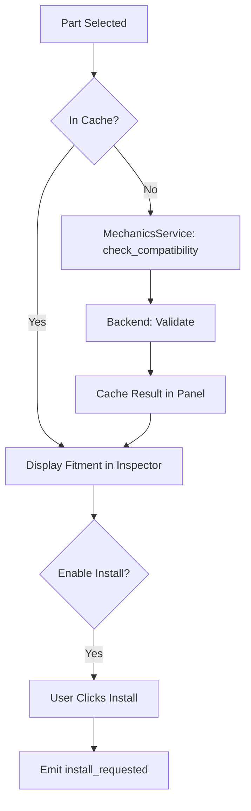

# Mechanics: Compatibility & Install

The Vendor Panel integrates with the `MechanicsService` to allow players to check part compatibility and initiate installations directly from the trade screen.

## Compatibility Check Flow

## The Compatibility Cache
To avoid redundant API calls and UI stutter, the panel maintains a local `_compat_cache` keyed by `vehicle_id` + `part_uid`.
- **Prefetch**: When a part is selected, the system automatically fires compatibility requests for *every* vehicle in the convoy.
- **Persistence**: The cache remains active as long as the panel is open, but is cleared on a full refresh if data consistency cannot be guaranteed.

## Install Logic
- **Install Button**: Visibility is managed by the `VendorPanelCompatController`. It only appears in BUY mode for compatible parts.
- **Delegation**: The Vendor Panel **does not** handle the installation itself. It emits the `install_requested` signal, which the parent menu (or `MenuManager`) intercepts to trigger the actual mechanic flow.

## Controllers
- `vendor_panel_compat_controller.gd`
- `MechanicsService.gd` (Autoload)
