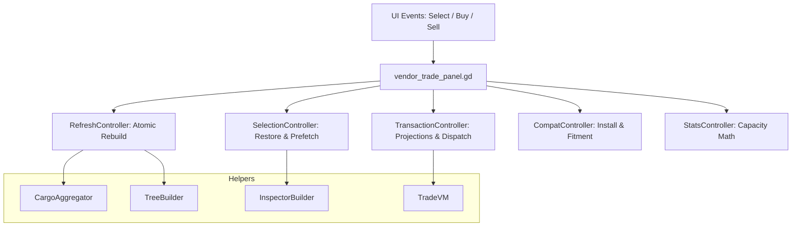

# Vendor Trade Panel: High-Level Overview

The Vendor Trade Panel is the central UI for trading goods, managing vehicle parts, and viewing settlement/vendor inventory.

## Design Goals: "Thin Panel, Fat Controllers"
The panel script (`vendor_trade_panel.gd`) is intentionally a **wiring and state shell**. Complex logic lives in specialized controller modules (mostly `RefCounted` with static methods). This ensures:
- **Modular Testing**: Individual systems (like pricing or capacity math) can be tested in isolation.
- **Maintenance**: Changes to the inspector don't risk breaking the transaction logic.
- **Strict Linting**: Typed accessors prevent common GDScript errors.

## High-Level Mental Model

The panel drives five primary UI areas:
1. **Vendor Inventory Tree** (Left)
2. **Convoy Inventory Tree** (Left/Middle)
3. **Inspector** (Middle): Rich item info, fitment, and mission details.
4. **Transaction Controls** (Right): Quantity, Price, and Buy/Sell/Install actions.
5. **Convoy Stats** (Bottom): Volume and weight capacity feedback.

## System Interaction

## Primary Files
- **Logic Shell**: [vendor_trade_panel.gd](../../../Scripts/Menus/vendor_trade_panel.gd)
- **Controllers**: Located in `Scripts/Menus/VendorPanel/`
- **Tests**: [test_vendor_panel_convoy_stats_controller.gd](../../../Tests/test_vendor_panel_convoy_stats_controller.gd)
