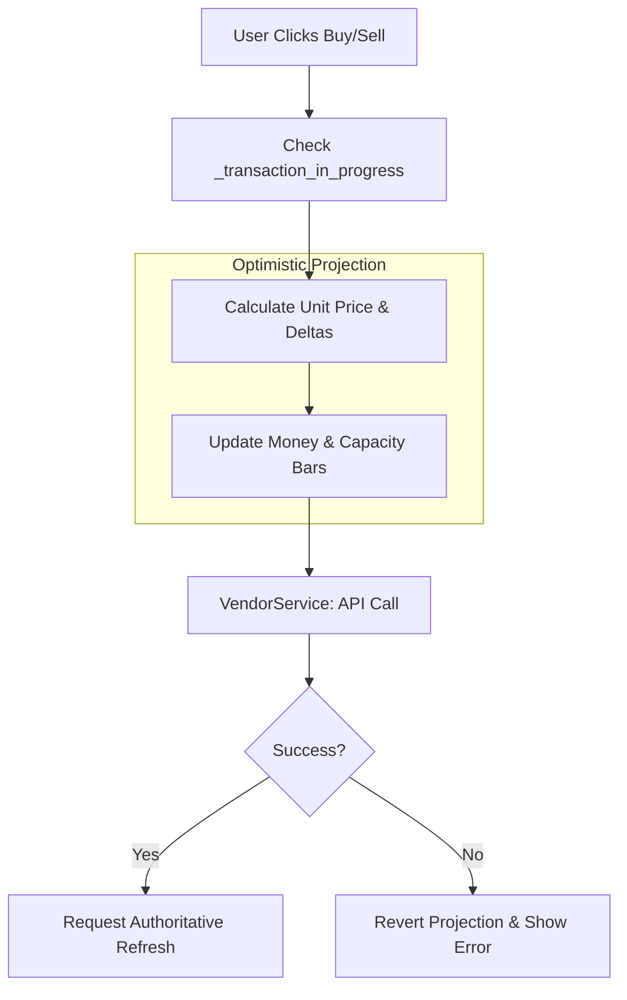

# Transactions: Pricing & Projections

The transaction system manages how goods are bought and sold, including price calculations and immediate UI feedback before server confirmation.

## The Transaction Loop

## Max Quantity Logic
The "Max" button uses complex constraints depending on the mode:
- **SELL Mode**: Max is the total quantity of the selected aggregate.
- **BUY Mode**: Max is the **lowest** of:
    1. Vendor Stock.
    2. Player Affordability (Money).
    3. Remaining Convoy **Volume** Capacity.
    4. Remaining Convoy **Weight** Capacity.

## Optimistic Projections
To make the UI feel responsive, the panel "projects" the result of a transaction immediately:
- The **Money Label** is updated locally.
- The **Capacity Bars** (Volume/Weight) slide to their expected new positions.
- If the API call fails, the `on_api_transaction_error` path reverts these changes to match the current `GameStore` state.

## Price Math
- **Unit Price**: Calculated via `PriceUtil` and `VendorTradeVM`. It handles various backend schema keys (`unit_price`, `value`, `delivery_reward`).
- **Total Price**: Unit Price × Quantity.

## Controllers
- `vendor_panel_transaction_controller.gd`
- `vendor_trade_vm.gd`
- `Scripts/System/Utils/price_util.gd`
