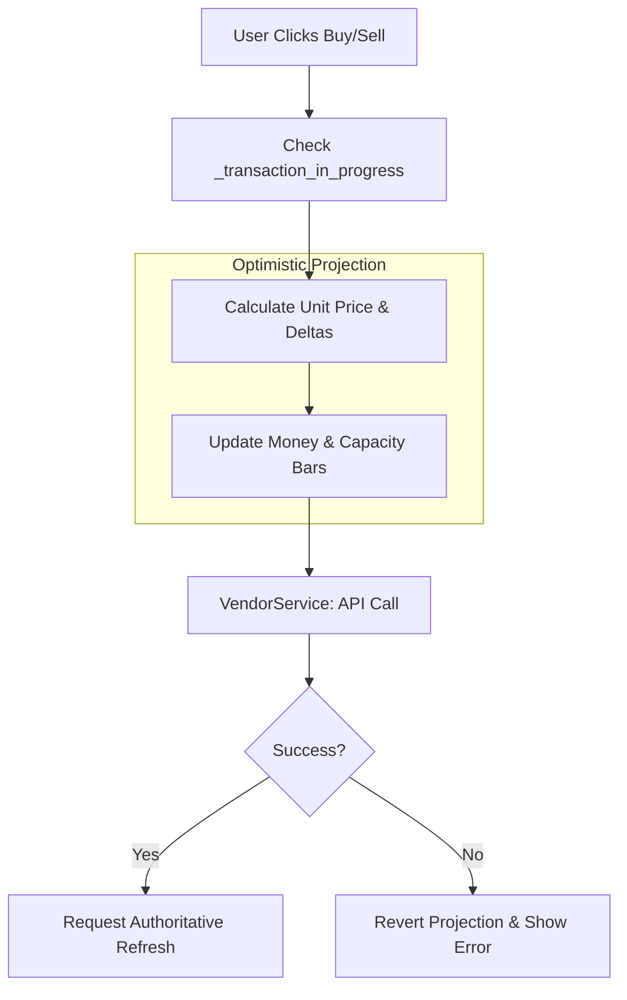

# Transactions: Pricing & Projections

The transaction system manages how goods are bought and sold, including price calculations and immediate UI feedback before server confirmation.

## The Transaction Loop



## Max Quantity Logic
The "Max" button uses complex constraints depending on the mode:
- **SELL Mode**: Max is the total quantity of the selected aggregate.
- **BUY Mode**: Max is the **lowest** of:
    1. Vendor Stock.
    2. Player Affordability (Money).
    3. Remaining Convoy **Volume** Capacity.
    4. Remaining Convoy **Weight** Capacity.

## Optimistic Projections
To make the UI feel responsive, the panel "projects" the result of a transaction immediately:
- The **Money Label** is updated locally.
- The **Capacity Bars** (Volume/Weight) slide to their expected new positions.
- If the API call fails, the `on_api_transaction_error` path reverts these changes to match the current `GameStore` state.

## Price Math
- **Unit Price**: Calculated via `PriceUtil` and `VendorTradeVM`. It handles various backend schema keys (`unit_price`, `value`, `delivery_reward`).
- **Total Price**: Unit Price × Quantity.

## Vendor Part Pricing — Lazy Fetch (Critical Architecture Note)

> **TL;DR: Vendor stock parts carry no price. The price arrives asynchronously via `get_cargo`. Do not try to read it off the initial item dict.**

Vendor `cargo_inventory` items are **thin summaries**: they contain `cargo_id`, `name`, `base_price: 0`, volume/weight, and no price fields. This is intentional — the backend only sends the full priced detail on demand.

### How the price is resolved

```
Part selected in vendor list
  └─ SelectionController: MechanicsService.ensure_cargo_details(cargo_id)
       └─ APICalls.get_cargo(cargo_id)  [async HTTP]
            └─ cargo_data_received signal
                 └─ MechanicsService._cargo_detail_cache[cargo_id] = rich_dict
                      (rich_dict has: price, unit_price, base_unit_price, parts[], slot, etc.)
                 └─ vendor_trade_panel._on_cargo_data_received()
                      └─ _ensure_selection_priced()  ← merges price into live selection
                      └─ _update_transaction_panel() + _update_inspector()
```

`_ensure_selection_priced()` (in `vendor_trade_panel.gd`) reads from `MechanicsService.get_enriched_cargo(cargo_id)` and merges `price`/`unit_price`/`base_unit_price` directly into the live `selected_item.item_data` dict. It is **idempotent** — once the item prices > 0 it is a no-op.

### Why not use the compat payload's `value` field?

`data[0].value` in the compat response is the **part's intrinsic value** (e.g. what it's worth as a component), not the vendor's **sale price**. These differ (sale price can be lower due to vendor margins). Always use the enriched cargo price.

### What the Mechanics/Cargo menus do differently

Those menus call `MechanicsService.ensure_cargo_details()` as part of their own selection flow, which is why they display the correct price immediately. The vendor panel now follows the same pattern.

### Key files
- `vendor_panel_selection_controller.gd` — triggers `ensure_cargo_details` on selection
- `vendor_trade_panel.gd` — `_ensure_selection_priced()`, `_on_cargo_data_received()`
- `Scripts/System/Services/mechanics_service.gd` — `ensure_cargo_details()`, `get_enriched_cargo()`

## Controllers
- `vendor_panel_transaction_controller.gd`
- `vendor_trade_vm.gd`
- `Scripts/System/Utils/price_util.gd`
