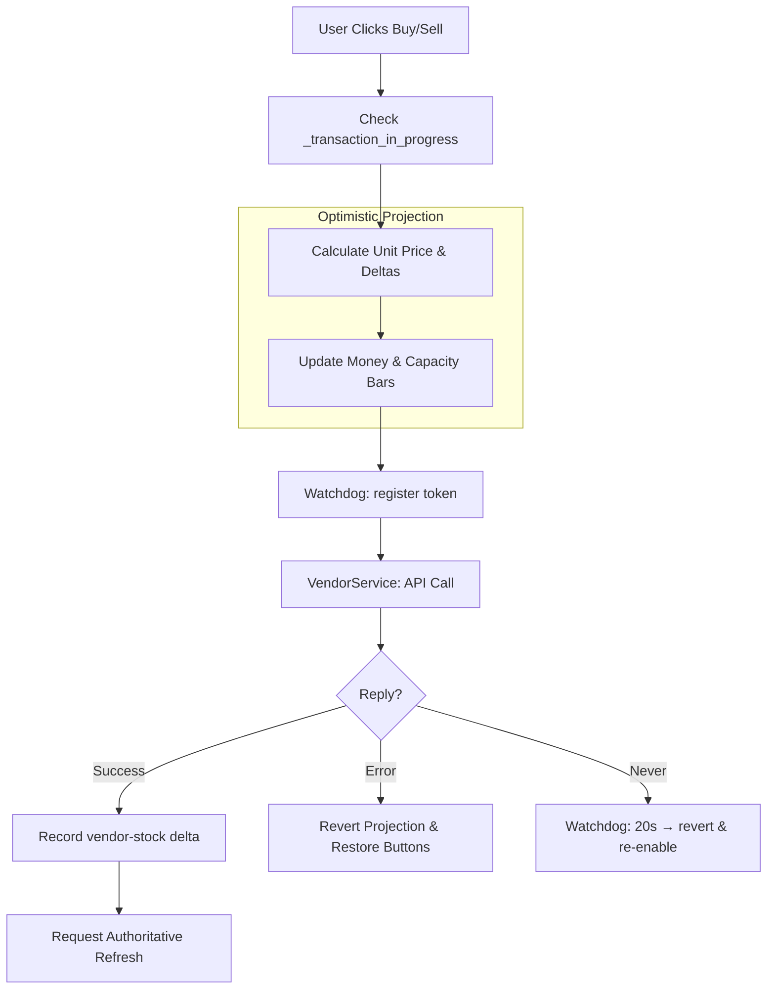

# Transactions: Pricing & Projections

The transaction system manages how goods are bought and sold, including price calculations and immediate UI feedback before server confirmation.

## The Transaction Loop


```mermaid
graph TD
    Click[User Clicks Buy/Sell] --> Guard[Check _transaction_in_progress]
    Guard --> Math[Calculate Unit Price & Deltas]
    
    subgraph Projection [Optimistic Projection]
    Math --> Project[Update Money & Capacity Bars]
    end
    
    Project --> Register[Watchdog: register token]
    Register --> Dispatch[VendorService: API Call]
    Dispatch --> Result{Reply?}
    
    Result -->|Success| Stock[Record vendor-stock delta] --> Refresh[Request Authoritative Refresh]
    Result -->|Error| Revert[Revert Projection & Restore Buttons]
    Result -->|Never| Timeout[Watchdog: 20s → revert & re-enable]
```

## Max Quantity Logic
The "Max" button uses complex constraints depending on the mode:
- **SELL Mode**: Max is the total quantity of the selected aggregate.
- **BUY Mode**: Max is the **lowest** of:
    1. Vendor Stock.
    2. Player Affordability (Money).
    3. Remaining Convoy **Volume** Capacity.
    4. Remaining Convoy **Weight** Capacity.
    5. Remaining **raw-resource headroom** (`max_fuel - fuel`, etc.) for bulk fuel/water/food.

> ⚠️ These are **pooled** convoy aggregates, which over-estimates for large items — a single item cannot
> split across two vehicles. Tracked as **S13-7** in [TODO](../../TODO.md).

## Optimistic Projections

To make the UI feel responsive, the panel projects the result of a transaction immediately. There are
**three** projections, and they do not live in the same place:

| Projection | Where the state lives | Reverted by |
|---|---|---|
| **Money label** | the panel (`_pending_tx.money_delta`) | `on_api_transaction_error`, watchdog timeout |
| **Capacity bars** (volume/weight) | the panel (`_pending_tx.*_delta`) | `on_api_transaction_error`, watchdog timeout |
| **Vendor stock** (the row's quantity) | **`VendorOptimisticStock` — outside the panel** | superseded by authoritative `/vendor/get` |

### Vendor stock lives outside the panel — and why

`vendor_optimistic_stock.gd` is a `static` registry keyed by `vendor_id`. A panel-instance member could
not survive the panel being destroyed and re-instantiated, which used to happen between transactions
(see [Lifecycle § Panel Instance Lifecycle](Lifecycle.md#panel-instance-lifecycle--who-creates-and-destroys-the-panel)).
The observed symptom was a 300 → 155 buy followed by a sell that started from **300 again**.

- **Matching is by `cargo_id` first**, display name second. Vendor buckets are keyed by *name*
  (`cargo_aggregator.gd::_aggregate_vendor_item`) but the dispatch uses `cargo_id`; two rows can share a
  name. The name fallback is still required for the virtual `Fuel/Water/Food (Bulk)` rows, which have no
  `cargo_id`.
- **Deltas accumulate**, so two buys before the refresh lands are both reflected.
- **Cleared** the moment authoritative `/vendor/get` data arrives (both `on_hub_vendor_panel_ready` and
  `on_vendor_panel_data_ready`), with a 30 s TTL as the backstop.

> ⚠️ **Two application modes — picking the wrong one double-counts.** `_update_vendor_ui()` re-renders the
> **cached** bucket set (`_populate_list_from_agg`) rather than re-aggregating, so those buckets already
> carry every earlier delta.
>
> - `apply_single_delta()` — one increment. Use immediately after a transaction, on live buckets.
> - `apply_to_buckets()` — the running total. Use **only** in `_populate_vendor_list()`, on a bucket set
>   freshly aggregated from server data that carries no projections yet.
>
> Using the accumulated total on live buckets re-applies the whole history each time: buying 5 then 4 out
> of 120 produced 115 then **106** instead of 111.

### Error and timeout repair

- `on_api_transaction_error()` repairs state **unconditionally** — projection revert,
  `_transaction_in_progress = false`, button text/`disabled`, loading overlay. Only the **toast** is
  gated on `is_visible_in_tree()`. The guard used to sit above the repair, so a panel that was hidden
  when the error landed came back stuck on a disabled "Processing…" button forever.
- `_pending_tx.started_ms` is read by the transaction watchdog (20 s), which reverts the projection and
  re-enables the buttons if no reply ever arrives. See
  [Lifecycle § The two watchdogs](Lifecycle.md#the-two-watchdogs--dont-confuse-them).

> **Selection is cleared after every transaction** — `show_transaction_feedback()` sets
> `selected_item = null`, on success as well as error, so buying the same item twice needs a reselect.
> Deliberate ("clear panel" request), but it contradicts the refresh path's effort to *restore*
> selection. Tracked as **S13-15**.

## Price Math
- **Unit Price**: Calculated via `PriceUtil` and `VendorTradeVM`. It handles various backend schema keys (`unit_price`, `value`, `delivery_reward`).
- **Total Price**: Unit Price × Quantity.

## Vendor Part Pricing — Lazy Fetch (Critical Architecture Note)

> **TL;DR: Vendor stock parts carry no price. The price arrives asynchronously via `get_cargo`. Do not try to read it off the initial item dict.**

Vendor `cargo_inventory` items are **thin summaries**: they contain `cargo_id`, `name`, `base_price: 0`, volume/weight, and no price fields. This is intentional — the backend only sends the full priced detail on demand.

### How the price is resolved

```
Part selected in vendor list
  └─ SelectionController: MechanicsService.ensure_cargo_details(cargo_id)
       └─ APICalls.get_cargo(cargo_id)  [async HTTP]
            └─ cargo_data_received signal
                 └─ MechanicsService._cargo_detail_cache[cargo_id] = rich_dict
                      (rich_dict has: price, unit_price, base_unit_price, parts[], slot, etc.)
                 └─ vendor_trade_panel._on_cargo_data_received()
                      └─ _ensure_selection_priced()  ← merges price into live selection
                      └─ _update_transaction_panel() + _update_inspector()
```

`_ensure_selection_priced()` (in `vendor_trade_panel.gd`) reads from `MechanicsService.get_enriched_cargo(cargo_id)` and merges `price`/`unit_price`/`base_unit_price` directly into the live `selected_item.item_data` dict. It is **idempotent** — once the item prices > 0 it is a no-op.

### Why not use the compat payload's `value` field?

`data[0].value` in the compat response is the **part's intrinsic value** (e.g. what it's worth as a component), not the vendor's **sale price**. These differ (sale price can be lower due to vendor margins). Always use the enriched cargo price.

### What the Mechanics/Cargo menus do differently

Those menus call `MechanicsService.ensure_cargo_details()` as part of their own selection flow, which is why they display the correct price immediately. The vendor panel now follows the same pattern.

### Key files
- `vendor_panel_selection_controller.gd` — triggers `ensure_cargo_details` on selection
- `vendor_trade_panel.gd` — `_ensure_selection_priced()`, `_on_cargo_data_received()`
- `Scripts/System/Services/mechanics_service.gd` — `ensure_cargo_details()`, `get_enriched_cargo()`

## Controllers
- `vendor_panel_transaction_controller.gd`
- `vendor_trade_vm.gd`
- `Scripts/Menus/VendorPanel/price_util.gd`
- `Scripts/Menus/VendorPanel/vendor_optimistic_stock.gd` — vendor-stock deltas, outlives the panel
- `Scripts/Menus/VendorPanel/vendor_transaction_watchdog.gd` — request-lifetime bound, outlives the panel

## Related

- **See also:** [VendorPanelOverview](VendorPanelOverview.md)
- **See also:** [ConvoyStats](ConvoyStats.md) — the weight/volume constraints Max respects
- **See also:** [ErrorSystem](../../04_Technical/ErrorSystem.md) — how failed transactions surface
