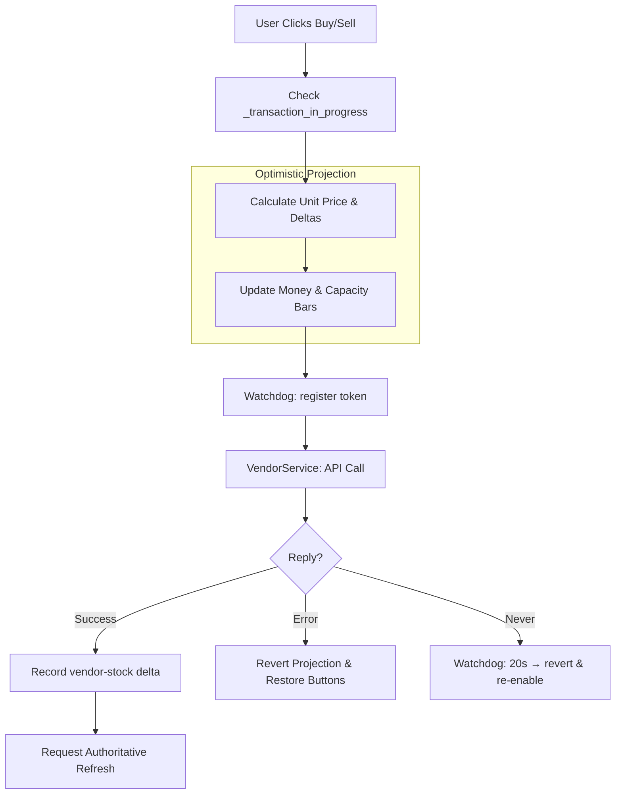

# Transactions: Pricing & Projections

The transaction system manages how goods are bought and sold, including price calculations and immediate UI feedback before server confirmation.

## The Transaction Loop


```mermaid
graph TD
    Click[User Clicks Buy/Sell] --> Guard[Check _transaction_in_progress]
    Guard --> Math[Calculate Unit Price & Deltas]
    
    subgraph Projection [Optimistic Projection]
    Math --> Project[Update Money & Capacity Bars]
    end
    
    Project --> Register[Watchdog: register token]
    Register --> Dispatch[VendorService: API Call]
    Dispatch --> Result{Reply?}
    
    Result -->|Success| Stock[Record vendor-stock delta] --> Refresh[Request Authoritative Refresh]
    Result -->|Error| Revert[Revert Projection & Restore Buttons]
    Result -->|Never| Timeout[Watchdog: 20s → revert & re-enable]
```

## Max Quantity Logic

- **SELL Mode**: Max is the total quantity of the selected aggregate.
- **BUY Mode**: stock, money and raw-resource headroom are **ceilings**; what actually fits is a
  separate packing question asked afterwards.
    1. Vendor Stock.
    2. Player Affordability (Money).
    3. Remaining **raw-resource headroom** (`max_fuel - fuel`, etc.) — bulk fuel/water/food only.
    4. `CargoFillPlanner.plan()` run over that ceiling — how many whole units fit **per vehicle**.

Max reports **0** honestly when nothing fits (it used to force 1, which the server then rejected) and
toasts which of the four limits bound: no stock, can't afford one, no resource headroom, or *"No single
vehicle has room for one of these."*

## Cargo packing — the client mirrors the server allocator

**Pooled convoy arithmetic is only correct for bulk resources.** A litre of fuel divides across
containers; a crate does not. 40 m³ of free space spread over four vehicles cannot accept one 15 m³
item, so `total_free_space / unit_volume` over-counts exactly when it matters.

`Scripts/Menus/VendorPanel/cargo_fill_planner.gd` (`CargoFillPlanner`) walks vehicles
**largest-free-volume first**, each taking
`min(floor(free_vol / unit_vol), floor(free_wt / unit_wt), still needed)`. That is a deliberate
line-for-line mirror of the backend allocator — `desolate_frontiers` `chassis/df_obj/vendor_cls.py`,
module-level `plan_cargo_placement()`, called by `Vendor.sell_cargo()`. **If either side's ordering or
rounding changes, both change in the same pass**, or the preview predicts a quantity the server refuses.

- Per-vehicle room prefers the server's own `free_space` / `remaining_capacity` — the exact values the
  allocator decides against — falling back to capacity-minus-used. Negative free space (a vehicle left
  over-filled by the pre-fix server) is clamped to 0 so it contributes nothing rather than eating
  another vehicle's room.
- Rows are read through `vehicle_rows()`, which tries `vehicle_details_list` → `vehicles` →
  `vehicle_list`. The raw API emits `vehicles`; augmented client copies use `vehicle_details_list`.
  Reading only one yields an **empty plan, which is not a safe failure** — every caller then falls back
  to pooled maths and Max silently over-offers again. That abort logs loudly for the same reason.
- Bulk resources deliberately keep the pooled path.
- One code path serves all three consumers — Max, the spinbox `max_value` cap, and the footer warning —
  via `VendorPanelTransactionController.plan_fit()`. Wiring it to Max alone left typed quantities
  unguarded.

### When the server refuses anyway: the fit offer

A purchase is **all-or-nothing** — the server never delivers fewer units than asked for. Instead every
refusal from `Vendor.sell_cargo()` carries a ` [fits:N/M]` marker: N of the M requested would have fit,
measured by the allocator over convoy state the server had just read.

```
400 "…across all vehicles to add 13 Bauxite Ore. [fits:3/13]"
  └─ CargoFillPlanner.parse_server_fit_marker()   ← strips the marker, returns {fits, requested}
       └─ quantity box drops to 3, Buy re-enables at the real price for 3
            └─ footer: "Only 3 of 13 fit — tap Buy to take 3."
```

Two rules make it work:

- **Strip before anything displays.** `ErrorTranslator` matches on substrings, so the marker survives
  translation and would be shown to the player verbatim. The strip happens *before*
  `VendorPanelRefreshController.on_api_transaction_error()`, which toasts the message too.
- **The server's number outranks the local planner** (`_server_fit` in `vendor_trade_panel.gd`).
  `_update_transaction_panel()` skips its own fit check at or below the vouched quantity, and the
  spinbox cap never drops below it. The panel's convoy copy is the likelier stale party — it is what
  produced the refusal — so letting it clamp the offer away would be the worst of both worlds. Scoped
  to one `cargo_id` **and** one convoy; spent on the next successful transaction.

## Optimistic Projections

To make the UI feel responsive, the panel projects the result of a transaction immediately. There are
**three** projections, and they do not live in the same place:

| Projection | Where the state lives | Reverted by |
|---|---|---|
| **Money label** | the panel (`_pending_tx.money_delta`) | `on_api_transaction_error`, watchdog timeout |
| **Capacity bars** (volume/weight) | the panel (`_pending_tx.*_delta`) | `on_api_transaction_error`, watchdog timeout |
| **Vendor stock** (the row's quantity) | **`VendorOptimisticStock` — outside the panel** | superseded by authoritative `/vendor/get` |

### Vendor stock lives outside the panel — and why

`vendor_optimistic_stock.gd` is a `static` registry keyed by `vendor_id`. A panel-instance member could
not survive the panel being destroyed and re-instantiated, which used to happen between transactions
(see [Lifecycle § Panel Instance Lifecycle](Lifecycle.md#panel-instance-lifecycle--who-creates-and-destroys-the-panel)).
The observed symptom was a 300 → 155 buy followed by a sell that started from **300 again**.

- **Matching is by `cargo_id` first**, display name second. Vendor buckets are keyed by *name*
  (`cargo_aggregator.gd::_aggregate_vendor_item`) but the dispatch uses `cargo_id`; two rows can share a
  name. The name fallback is still required for the virtual `Fuel/Water/Food (Bulk)` rows, which have no
  `cargo_id`.
- **Deltas accumulate**, so two buys before the refresh lands are both reflected.
- **Cleared** the moment authoritative `/vendor/get` data arrives (both `on_hub_vendor_panel_ready` and
  `on_vendor_panel_data_ready`), with a 30 s TTL as the backstop.

> ⚠️ **Two application modes — picking the wrong one double-counts.** `_update_vendor_ui()` re-renders the
> **cached** bucket set (`_populate_list_from_agg`) rather than re-aggregating, so those buckets already
> carry every earlier delta.
>
> - `apply_single_delta()` — one increment. Use immediately after a transaction, on live buckets.
> - `apply_to_buckets()` — the running total. Use **only** in `_populate_vendor_list()`, on a bucket set
>   freshly aggregated from server data that carries no projections yet.
>
> Using the accumulated total on live buckets re-applies the whole history each time: buying 5 then 4 out
> of 120 produced 115 then **106** instead of 111.

### Error and timeout repair

- `on_api_transaction_error()` repairs state **unconditionally** — projection revert,
  `_transaction_in_progress = false`, button text/`disabled`, loading overlay. Only the **toast** is
  gated on `is_visible_in_tree()`. The guard used to sit above the repair, so a panel that was hidden
  when the error landed came back stuck on a disabled "Processing…" button forever.
  Its `suppress_toast` argument silences **only** that toast, for the one case where the caller is about
  to say something more useful in its place (the fit offer above). State repair is never skipped.
- `_pending_tx.started_ms` is read by the transaction watchdog (20 s), which reverts the projection and
  re-enables the buttons if no reply ever arrives. See
  [Lifecycle § The two watchdogs](Lifecycle.md#the-two-watchdogs--dont-confuse-them).

> **Selection survives a transaction; only the quantity resets.** `show_transaction_feedback()` keeps
> `selected_item` and sets the quantity back to the widget's minimum on **success**, and touches
> nothing on **error** — so a failed order can be adjusted and retried, and buying the same item twice
> costs no extra taps. The one exception is a bought **vehicle**, which is gone from the vendor, so the
> selection is cleared. Because the quantity can now be 0, Buy disables visibly at 0 rather than
> silently no-opping.

## Price Math
- **Unit Price**: Calculated via `PriceUtil` and `VendorTradeVM`. It handles various backend schema keys (`unit_price`, `value`, `delivery_reward`).
- **Total Price**: Unit Price × Quantity.

## Vendor Part Pricing — Lazy Fetch (Critical Architecture Note)

> **TL;DR: Vendor stock parts carry no price. The price arrives asynchronously via `get_cargo`. Do not try to read it off the initial item dict.**

Vendor `cargo_inventory` items are **thin summaries**: they contain `cargo_id`, `name`, `base_price: 0`, volume/weight, and no price fields. This is intentional — the backend only sends the full priced detail on demand.

### How the price is resolved

```
Part selected in vendor list
  └─ SelectionController: MechanicsService.ensure_cargo_details(cargo_id)
       └─ APICalls.get_cargo(cargo_id)  [async HTTP]
            └─ cargo_data_received signal
                 └─ MechanicsService._cargo_detail_cache[cargo_id] = rich_dict
                      (rich_dict has: price, unit_price, base_unit_price, parts[], slot, etc.)
                 └─ vendor_trade_panel._on_cargo_data_received()
                      └─ _ensure_selection_priced()  ← merges price into live selection
                      └─ _update_transaction_panel() + _update_inspector()
```

`_ensure_selection_priced()` (in `vendor_trade_panel.gd`) reads from `MechanicsService.get_enriched_cargo(cargo_id)` and merges `price`/`unit_price`/`base_unit_price` directly into the live `selected_item.item_data` dict. It is **idempotent** — once the item prices > 0 it is a no-op.

### Why not use the compat payload's `value` field?

`data[0].value` in the compat response is the **part's intrinsic value** (e.g. what it's worth as a component), not the vendor's **sale price**. These differ (sale price can be lower due to vendor margins). Always use the enriched cargo price.

### What the Mechanics/Cargo menus do differently

Those menus call `MechanicsService.ensure_cargo_details()` as part of their own selection flow, which is why they display the correct price immediately. The vendor panel now follows the same pattern.

### Key files
- `vendor_panel_selection_controller.gd` — triggers `ensure_cargo_details` on selection
- `vendor_trade_panel.gd` — `_ensure_selection_priced()`, `_on_cargo_data_received()`
- `Scripts/System/Services/mechanics_service.gd` — `ensure_cargo_details()`, `get_enriched_cargo()`

## Controllers
- `vendor_panel_transaction_controller.gd` — dispatch, Max, and `plan_fit()`/`selection_unit_dims()`
- `vendor_trade_vm.gd`
- `Scripts/Menus/VendorPanel/cargo_fill_planner.gd` — per-vehicle packing; **mirrors the server allocator**
- `Scripts/Menus/VendorPanel/price_util.gd`
- `Scripts/Menus/VendorPanel/vendor_optimistic_stock.gd` — vendor-stock deltas, outlives the panel
- `Scripts/Menus/VendorPanel/vendor_transaction_watchdog.gd` — request-lifetime bound, outlives the panel

## Related

- **See also:** [VendorPanelOverview](VendorPanelOverview.md)
- **See also:** [ConvoyStats](ConvoyStats.md) — the weight/volume constraints Max respects
- **See also:** [ErrorSystem](../../04_Technical/ErrorSystem.md) — how failed transactions surface
