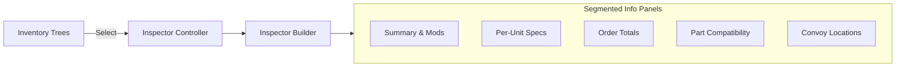

# UI Components: Trees & Inspector

The Vendor Panel UI is split into two main sections: the **Inventory Trees** and the **Segmented Inspector**.

## UI Layout

## Inventory Trees
Managed by `tree_builder.gd`.
- **Atomic Population**: Trees are wiped and rebuilt entirely during an authoritative refresh.
- **Metadata**: Every row stores its aggregated data dictionary in `TreeItem.metadata[0]` for easy access by controllers.
- **Visuals**: Icons and bold fonts are used to distinguish resources from standard cargo.

## Segmented Inspector
The middle column is built dynamically based on the selected item type. This avoids hardcoded UI positions and allows for flexible content.

### Standard Sections:
1. **Summary Panel**: Mission destination, vehicle base stats, or part modifiers.
2. **Per-Unit Panel**: Weight/Volume specs for a single item.
3. **Total Order Panel**: Aggregate Weight/Volume deltas for the selected quantity.
4. **Fitment Panel**: (For Parts) Shows real-time compatibility for all convoy vehicles.
5. **Locations Panel**: (For Convoy Items) Shows which vehicle currently holds the selected item.

## Controllers & Builders
- `vendor_panel_inspector_controller.gd`
- `inspector_builder.gd`
- `tree_builder.gd`
