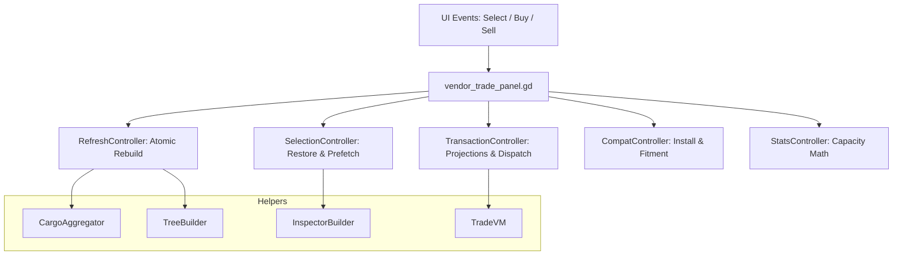

# Vendor Trade Panel: High-Level Overview

The Vendor Trade Panel is the central UI for trading goods, managing vehicle parts, and viewing settlement/vendor inventory.

## Design Goals: "Thin Panel, Fat Controllers"
The panel script (`vendor_trade_panel.gd`) is intentionally a **wiring and state shell**. Complex logic lives in specialized controller modules (mostly `RefCounted` with static methods). This ensures:
- **Modular Testing**: Individual systems (like pricing or capacity math) can be tested in isolation.
- **Maintenance**: Changes to the inspector don't risk breaking the transaction logic.
- **Strict Linting**: Typed accessors prevent common GDScript errors.

## High-Level Mental Model

The panel drives five primary UI areas (the **desktop** 3-column form; mobile reflows them — see below):
1. **Vendor Inventory List** (Left) — `VendorItemList` (`vendor_item_list.gd`), a custom VBox-of-rows list. Replaced the Godot `Tree`; the `%VendorItemTree` / `%ConvoyItemTree` node names are kept but they are `VendorItemList` instances.
2. **Convoy Inventory List** (Left/Middle) — same widget, `list_mode = "sell"`.
3. **Inspector** (Middle): Rich item info, fitment, and mission details. In **portrait** this becomes an inline-expanding body inside the selected list row (`inline_expand_enabled`).
4. **Transaction Controls** (Right): Quantity, Price, and Buy/Sell/Install actions. On mobile this is a pinned, non-scrolling footer.
5. **Convoy Stats** (Bottom): Volume and weight capacity feedback.

> **Responsive layout:** `_make_panels_responsive()` reparents these areas per `get_layout_mode()` — desktop 3-column, landscape 2-pane, portrait single stack with a pinned footer. The vendor-type dropdown is mounted into the panel's control row on mobile. See [Responsive Refactor](ResponsiveRefactor.md) §10 for the shipped design.

## System Interaction

## Primary Files
- **Logic Shell**: [vendor_trade_panel.gd](../../../Scripts/Menus/vendor_trade_panel.gd)
- **Controllers**: Located in `Scripts/Menus/VendorPanel/`
- **Tests**: [test_vendor_panel_convoy_stats_controller.gd](../../../Tests/test_vendor_panel_convoy_stats_controller.gd)

## Detailed References
- [**Responsive Refactor — Audit & Requirements**](ResponsiveRefactor.md) ⭐ *(shipped — see §10)*: Screenshot audit, locked-in requirements, the 1→2→3-column responsive design, and the final nav bar / vendor-dropdown / button-language design.
- [**Transaction Controller**](Transactions.md): Projections, price math, and execution. **Includes the lazy-fetch part pricing architecture** — read before touching price display code.
- [**UI Inspector**](UI_Inspector.md): Dynamic item cards and mobile scaling in the middle pane.
- [**Fitment Compatibility**](Mechanics.md): Rules for installing vehicle parts.
- [**Convoy Stats Feed**](ConvoyStats.md): Continuous volume/weight capacity calculations.
- [**Panel Lifecycle**](Lifecycle.md): Initialization sequence, state cleanup, and event bindings.
- [**Checklist & Verification**](Checklist.md): Quality checklist for adding new vendor types.
- [**Data Models**](Data.md): JSON structures and parsing rules for vendors.

