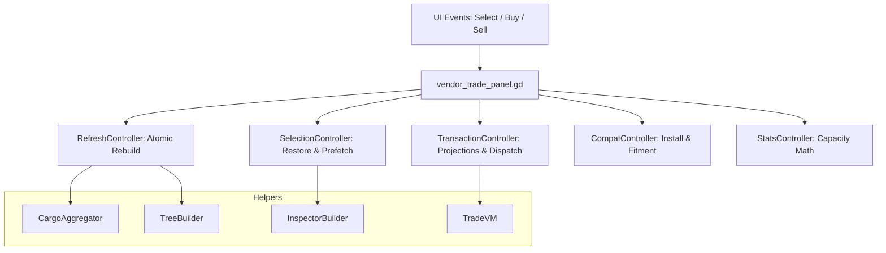

# Vendor Trade Panel: High-Level Overview

The Vendor Trade Panel is the central UI for trading goods, managing vehicle parts, and viewing settlement/vendor inventory.

## Design Goals: "Thin Panel, Fat Controllers"
The panel script (`vendor_trade_panel.gd`) is intentionally a **wiring and state shell**. Complex logic lives in specialized controller modules. This ensures:
- **Modular Testing**: Individual systems (like pricing or capacity math) can be tested in isolation.
- **Maintenance**: Changes to the inspector don't risk breaking the transaction logic.
- **Strict Linting**: Typed accessors prevent common GDScript errors.

### The controllers are static namespaces, not objects

*(Measured 2026-07-31 across all 23 modules in `Scripts/Menus/VendorPanel/`.)*

This is stronger than "mostly static", and the exact form matters:

- **Every controller is 100 % `static func`.** The only file in the folder with instance methods is
  `vendor_item_list.gd`, which is a real `ScrollContainer` node, not a controller.
- **Not one is ever instantiated.** A repo-wide search for `.new()` on any of these classes returns
  nothing. They are called as `VendorPanelTransactionController.dispatch_buy(panel, …)`.
- **Every one takes the panel as its first argument** (`panel: Object`) and reads/writes state *on the
  panel*. They are, in effect, `vendor_trade_panel.gd` split across files for readability.
- `extends` is inconsistent and **meaningless here** — some say `RefCounted`, some `Node`, and
  `vendor_trade_vm.gd` declares no `extends` at all. Since nothing is instantiated, the base type is
  never used. Don't read intent into it.

> [!IMPORTANT]
> **The consequence: a controller cannot hold state.** Anything that must survive across calls has to
> live either on the panel instance or in a `static` registry — and **the panel instance is not durable**.
> `convoy_settlement_menu` can free and rebuild the panel (see [Lifecycle](Lifecycle.md), TODO S13-13),
> which is precisely why two subsystems keep their state in static registries *outside* the panel rather
> than as controller fields:
> - `VendorOptimisticStock` — pending stock deltas, keyed by `vendor_id`
> - `VendorTransactionWatchdog` — in-flight transactions, so a reply outliving its panel is still resolved
>
> If you add state to this subsystem, decide up front which of the three homes it belongs in. "A field on
> the controller" is not one of them.

## High-Level Mental Model

The panel drives five primary UI areas (the **desktop** 3-column form; mobile reflows them — see below):
1. **Vendor Inventory List** (Left) — `VendorItemList` (`vendor_item_list.gd`), a custom VBox-of-rows list. Replaced the Godot `Tree`; the `%VendorItemTree` / `%ConvoyItemTree` node names are kept but they are `VendorItemList` instances.
2. **Convoy Inventory List** (Left/Middle) — same widget, `list_mode = "sell"`.
3. **Inspector** (Middle): Rich item info, fitment, and mission details. In **portrait** this becomes an inline-expanding body inside the selected list row (`inline_expand_enabled`).
4. **Transaction Controls** (Right): Quantity, Price, and Buy/Sell/Install actions. On mobile this is a pinned, non-scrolling footer.
5. **Convoy Stats** (Bottom): Volume and weight capacity feedback.

> **Responsive layout:** `_make_panels_responsive()` reparents these areas per `get_layout_mode()` — desktop 3-column, landscape 2-pane, portrait single stack with a pinned footer. The vendor-type dropdown is mounted into the panel's control row on mobile. See [Responsive Refactor](ResponsiveRefactor.md) §10 for the shipped design.

## System Interaction

```mermaid
graph TD
    UI[UI Events: Select / Buy / Sell] --> Panel[vendor_trade_panel.gd]
    
    Panel --> Refresh[RefreshController: Atomic Rebuild]
    Panel --> Select[SelectionController: Restore & Prefetch]
    Panel --> Txn[TransactionController: Projections & Dispatch]
    Panel --> Compat[CompatController: Install & Fitment]
    Panel --> Stats[StatsController: Capacity Math]
    
    subgraph Helpers
    Agg[CargoAggregator]
    Tree[TreeBuilder]
    Insp[InspectorBuilder]
    VM[TradeVM]
    end
    
    Refresh --> Agg
    Refresh --> Tree
    Select --> Insp
    Txn --> VM
```

## Module inventory

*(Complete as of 2026-07-31 — every `.gd` in `Scripts/Menus/VendorPanel/`. Five of these had no mention
anywhere in the VendorPanel doc set before this pass; they are marked ★.)*

| Module | Role | Deep-dive |
|---|---|---|
| `vendor_panel_refresh_controller.gd` | Atomic rebuild, transaction-error state repair | [Lifecycle](Lifecycle.md) |
| `vendor_panel_refresh_scheduler_controller.gd` | Debounce/coalescing of refresh requests | [Lifecycle](Lifecycle.md) |
| `vendor_panel_selection_controller.gd` | Selection restore, quantity clamping | [Transactions](Transactions.md) |
| `vendor_panel_transaction_controller.gd` | Projections, Max planning, buy/sell dispatch | [Transactions](Transactions.md) |
| `vendor_panel_vehicle_sell_controller.gd` | Vehicle-specific sell path | [Transactions](Transactions.md) |
| `vendor_panel_compat_controller.gd` | Part install / fitment flow | [Mechanics](Mechanics.md) |
| `vendor_panel_inspector_controller.gd` | Inspector population | [UI_Inspector](UI_Inspector.md) |
| `vendor_panel_convoy_stats_controller.gd` | Capacity + weight math | [ConvoyStats](ConvoyStats.md) |
| `vendor_optimistic_stock.gd` | **Static registry** — pending stock deltas per `vendor_id` | [Lifecycle](Lifecycle.md) |
| `vendor_transaction_watchdog.gd` | **Static registry** — in-flight transaction timeouts | [Transactions](Transactions.md) |
| `cargo_fill_planner.gd` | Per-vehicle packing simulation; mirrors the server allocator | [Transactions](Transactions.md) |
| `cargo_aggregator.gd` | Groups raw inventory into display buckets | [Data](Data.md) |
| `tree_builder.gd` | Builds list rows from buckets | [Data](Data.md) |
| `inspector_builder.gd` | Builds inspector content | [UI_Inspector](UI_Inspector.md) |
| `selection_manager.gd` | Lower-level selection bookkeeping | [Data](Data.md) |
| `price_util.gd` | Price derivation helpers | [Transactions](Transactions.md) |
| `vendor_trade_vm.gd` | View-model coercion helpers (no `extends`) | [Data](Data.md) |
| `vendor_item_list.gd` | **The one real node** — custom `ScrollContainer` list widget | [UI_Inspector](UI_Inspector.md) |
| ★ `vendor_panel_context_controller.gd` | Settlement/vendor resolution for the panel; `get_vendor_name_for_recipient()` powers delivery-destination labels | — |
| ★ `vendor_panel_tutorial_controller.gd` | Tutorial hooks: `focus_buy_tab()`, action-button node, `get_vendor_item_rect_by_text_contains()` for highlight rects | [TutorialSystem](../../03_Systems/TutorialSystem/TutorialSystemOverview.md) |
| ★ `compat_adapter.gd` | `VendorCompatAdapter` — install-slot predicates, compat cache keys, part-modifier lookup | [Mechanics](Mechanics.md) |
| ★ `number_format.gd` | `NumberFormat` — `format_money`, `fmt_qty`, `to_f`/`to_i` coercion | *see note below* |
| ★ `top_up_planner.gd` | `TopUpPlanner` — cheapest-vendor Fuel/Water/Food allocation plan | *see note below* |

> [!NOTE]
> **Two of these are not vendor-panel code and are filed here by accident of history.**
> - **`NumberFormat` is used by 18 files across the whole project** — the top bar
>   (`user_info_display.gd`), `warehouse_menu`, `convoy_menu`, `mechanics_menu`, `convoy_journey_menu`,
>   `cargo_sorter`, and more. It is a general formatting utility living in a feature folder.
> - **`TopUpPlanner`** is consumed by `convoy_menu.gd`, `convoy_settlement_menu.gd`, and
>   `settlement_overview_menu.gd`; its own docstring says it exists so "any other surface can reuse it."
>
> Both work fine where they are — this is a **discoverability** problem, not a bug: someone looking for
> the project's money formatter will not think to look under `VendorPanel/`. Moving them would touch
> ~20 files' preloads, so it is worth doing deliberately rather than in passing.

## Primary Files
- **Logic Shell**: [vendor_trade_panel.gd](../../../Scripts/Menus/vendor_trade_panel.gd)
- **Controllers**: Located in `Scripts/Menus/VendorPanel/`
- **Tests**: [test_vendor_panel_convoy_stats_controller.gd](../../../Tests/test_vendor_panel_convoy_stats_controller.gd)

## Detailed References
- [**Responsive Refactor — Audit & Requirements**](ResponsiveRefactor.md) ⭐ *(shipped — see §10)*: Screenshot audit, locked-in requirements, the 1→2→3-column responsive design, and the final nav bar / vendor-dropdown / button-language design.
- [**Transaction Controller**](Transactions.md): Projections, price math, and execution. **Includes the lazy-fetch part pricing architecture** — read before touching price display code.
- [**UI Inspector**](UI_Inspector.md): Dynamic item cards and mobile scaling in the middle pane.
- [**Fitment Compatibility**](Mechanics.md): Rules for installing vehicle parts.
- [**Convoy Stats Feed**](ConvoyStats.md): Continuous volume/weight capacity calculations.
- [**Panel Lifecycle**](Lifecycle.md): Initialization sequence, state cleanup, and event bindings.
- [**Checklist & Verification**](Checklist.md): Quality checklist for adding new vendor types.
- [**Data Models**](Data.md): JSON structures and parsing rules for vendors.

