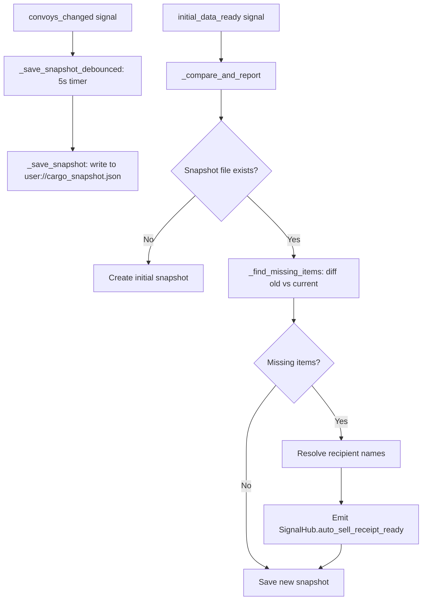

# Auto-Sell System

The Auto-Sell System detects when cargo items disappear between sessions (because the backend sold them during a completed journey) and shows the player a receipt modal summarising what was sold and the credits earned.

> [!NOTE]
> This is a **client-side detection** system. The backend performs the actual sale automatically when a convoy arrives. The client simply diffs a local snapshot to discover what changed while the app was closed.

---

## How It Works

### The Snapshot Cycle



1. **Snapshot Save**: Every time `GameStore.convoys_changed` fires, `AutoSellService` schedules a debounced snapshot write (5 second delay). Snapshot is written to `user://cargo_snapshot.json` as a flat list of all cargo items across all convoys and vehicles.
2. **Comparison**: On `SignalHub.initial_data_ready` (once per session start), the service compares the saved snapshot against the *current* cargo list.
3. **Detection**: Any item in the snapshot that has a lower quantity (or is absent) in the current cargo is considered "auto-sold". Quantity diffs are tracked per `cargo_id` / `part_uid`.
4. **Receipt Emission**: If missing items are found, `SignalHub.auto_sell_receipt_ready` is emitted with a `receipt_payload` dictionary.

---

## The Receipt Payload

```gdscript
{
    "items": [
        {
            "name": "Iron Ingots",
            "quantity": 12,
            "delivery_reward": 4800.0,
            "resolved_recipient": "Fort Ironhold"  # Injected by AutoSellService
        }
    ],
    "total_credits": 4800.0
}
```

`resolved_recipient` is resolved by `_resolve_recipient_name()`, which tries, in order:
1. Direct name fields (`recipient_settlement_name`, `destination_settlement_name`, ...)
2. Recipient/destination *block* objects (nested dictionaries)
3. Raw vendor IDs (looked up against `_latest_settlements`)
4. Settlement IDs (looked up against `_latest_settlements`)
5. Coordinate fallback: `"Coord (12, 34)"`

---

## Display: The Receipt Modal

`MainScreen` subscribes to `SignalHub.auto_sell_receipt_ready` and instantiates `Scenes/UI/AutoSellReceiptModal.tscn` inside `SafeRegionContainer/ModalLayer/DialogHost`.

### Suppression Conditions

The modal is **suppressed** (not shown) if:
- `TutorialManager.is_tutorial_active()` is `true`, OR
- `user.metadata.tutorial` is between 1 and 7 (inclusive), OR
- The receipt payload has no items.

This prevents the receipt from interrupting new player onboarding.

---

## Important Signals

| Signal | Direction | Description |
|---|---|---|
| `SignalHub.auto_sell_receipt_ready(receipt_data)` | Service → MainScreen | Carries the receipt payload when auto-sold items are detected |
| `SignalHub.map_changed(tiles, settlements)` | Hub → Service | Used to keep `_latest_settlements` up to date for recipient name resolution |
| `GameStore.convoys_changed(convoys)` | Store → Service | Triggers debounced snapshot save |

---

## Gotchas

> [!WARNING]
> The snapshot comparison uses `cargo_id` as the key for stackable cargo and `part_uid` for unique parts. If the backend changes a `cargo_id` (which can happen when stacks are split or merged), items may be incorrectly flagged as "sold". This is an accepted limitation; false positives show items as "auto-sold" when they weren't.

> [!TIP]
> To manually trigger a simulated auto-sell during development, call `AutoSellService.simulate_autosell()`. This injects fake items into the snapshot and runs the comparison immediately.

---

## Primary Files

- **Service**: `Scripts/System/Services/auto_sell_service.gd`
- **Modal Script**: `Scripts/UI/auto_sell_receipt_modal.gd`
- **Modal Scene**: `Scenes/UI/AutoSellReceiptModal.tscn`
- **Snapshot Path**: `user://cargo_snapshot.json`
- **MainScreen handler**: `_on_auto_sell_receipt_ready()` in `Scripts/UI/main_screen.gd`
- **Related**: [Items & Missions](ItemsAndMissions.md), [Game Lifecycle](GameLifecycle.md)
