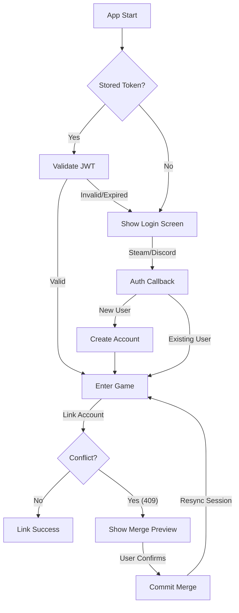
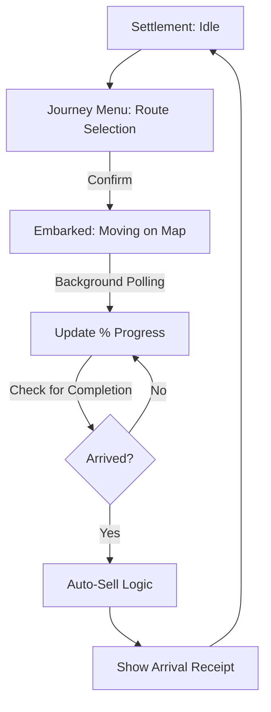
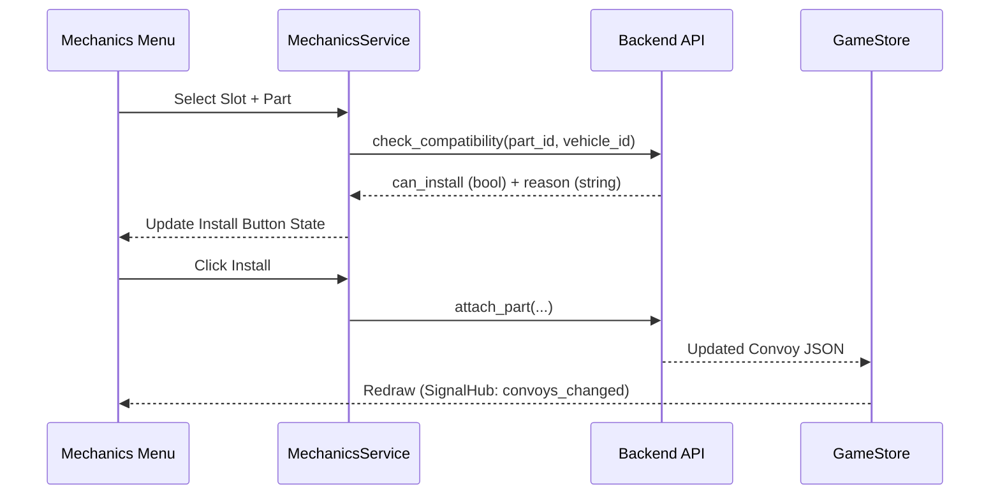

# Game Lifecycle & State Machines

This document visualizes the high-level logic flows for the most critical systems in *Desolate Frontiers*.

## 1. Authentication & Session Lifecycle

The authentication system handles silent login, multi-provider linking, and account merging.

---

## 2. Convoy Journey Lifecycle

Convoys transition through several states during a journey. Because this is an idle game, transitions often occur on the backend while the client is offline.

---

## 3. Part Installation Flow (Mechanics)

The mechanics system uses a request-response pattern to ensure part compatibility.

---

## 4. Onboarding & Tutorial Lifecycle

The tutorial is gated by the `metadata.tutorial` field on the user object.

1. **Bootstrap**: `TutorialManager` waits for `initial_data_ready`.
2. **Evaluation**: Checks `user.metadata.tutorial`. If level is < `MAX_TUTORIAL_LEVEL`, it builds the step list.
3. **Execution**: Runs steps sequentially. If a step requires a UI action (e.g., `await_menu_open`), it blocks progress until the signal is received.
4. **Completion**: After the final step of a level, it calls `APICalls.update_user_metadata` to persist the next level to the server.
