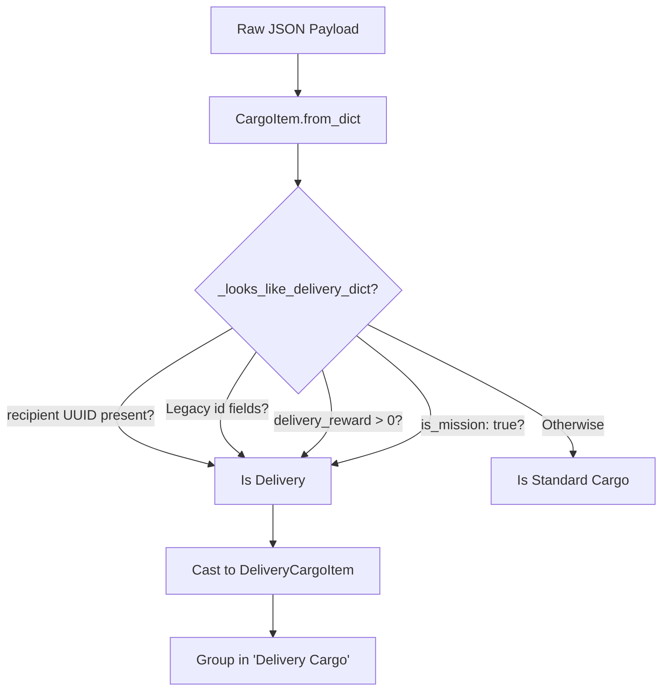
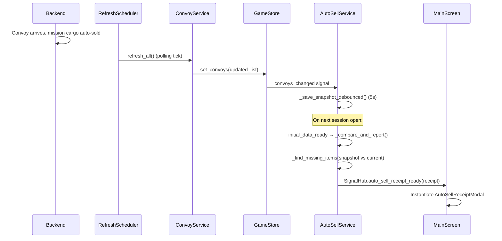

# Items & Mission Domain

Desolate Frontiers uses a **Unified Item Model**. "Missions" are not a separate engine system; they are specialized Cargo Items that represent a delivery obligation.

## 1. The Unified Model (`CargoItem`)

All cargo in the game (Convoys, Vendors, Warehouses) is parsed into `CargoItem` objects. This provides type safety and standardizes units (Weight/Volume).

### Sub-Classes
- **`PartItem`**: Items with a `.slot` (e.g., "Engine", "Tires"). They contain `modifiers` that affect vehicle performance.
- **`ResourceItem`**: Consumables like `fuel`, `water`, and `food`.
- **`VehicleItem`**: Complete vehicle records (typically found in Vendor inventories).
- **`DeliveryCargoItem`**: Delivery cargo (see below). `MissionItem` is a deprecated compatibility alias that extends `DeliveryCargoItem`.

---

## 2. Mission Detection Logic

A `CargoItem` is classified as a **Delivery** if it passes the check in `Items.gd`.

### Criteria for Delivery Detection
`DeliveryCargoItem._looks_like_delivery_dict()` checks (in order):
1. **Primary Recipient Field**: `recipient` is present, non-null, and not the null UUID (`00000000-...`).
2. **Compatibility fallbacks** (legacy/mock payloads): any of `mission_id`, `mission_vendor_id`, `recipient_vendor_id`, `destination_vendor_id`, `dest_vendor_id`, `recipient_settlement_name`, `destination_settlement_name`, `dest_settlement`, `destination_name`.
3. **Delivery Reward**: `delivery_reward > 0` or `unit_delivery_reward > 0`.
4. **Explicit Flag**: `is_mission: true`.

### Detection Logic



### Data Signature
```json
{
  "cargo_id": "uuid",
  "name": "Emergency Medical Supplies",
  "recipient": "vendor-uuid",
  "delivery_reward": 500
}
```

---

## 3. UI Display Patterns

### Convoy Cargo Menu
Missions are always grouped at the top of the cargo list under the **"Delivery Cargo"** section. This ensures players can easily distinguish between their own property and items they are being paid to transport.

### Vendor Trade Panel
When trading with a vendor who is the **recipient** of a mission item:
- The UI highlights the item in the "Delivery" bucket.
- The "Sell" action is replaced with "Deliver".
- The value displayed is the `delivery_reward`, not the market price.

---

## 4. Implementation Guidelines

- **Adding a new Part**: Ensure it has a `slot` property and `modifiers` (e.g., `top_speed_add`).
- **Adding a new Mission**: Ensure the backend payload includes a `recipient` field (UUID). The client will automatically categorize it as delivery cargo. `recipient_vendor_id` still works as a compatibility fallback but `recipient` is the primary field.
- **Data Safety**: Always use `CargoItem.from_dict(raw)` to ensure units and categories are normalized before using them in UI math.

---

## 5. The Delivery Lifecycle: What Happens After Arrival

When a convoy completes a journey to a settlement that is the recipient of a mission item, the following sequence occurs:



### Key Points
1. **The backend sells the cargo** — the client doesn't explicitly trigger the sale. The convoy just arrives.
2. **Detection is session-boundary based**. The comparison runs at `initial_data_ready`, which fires once per session after both map and convoy data are loaded. This means the receipt modal appears at the **start of the next session** after a delivery, not in real time.
3. **The snapshot is the source of truth for detection**. If `user://cargo_snapshot.json` is deleted or corrupted, the detection fails silently and a new baseline snapshot is written instead.
4. **Tutorial suppression**: The receipt modal is suppressed if `user.metadata.tutorial` is between 1 and 7 (inclusive) to avoid interrupting onboarding.
5. **Money refresh**: After delivery, `GameStore.set_user()` will reflect the updated balance when the next convoy refresh arrives. Money is on the `User` object, not the `Cargo` item.

### The `delivery_reward` Field
Delivery items carry a `delivery_reward` field that specifies the credits awarded on delivery:
```json
{
    "cargo_id": "uuid",
    "name": "Emergency Medical Supplies",
    "delivery_reward": 500,
    "recipient": "vendor-uuid"
}
```
`AutoSellService` sums `delivery_reward` across all detected missing items to calculate `receipt_payload.total_credits`.

> [!NOTE]
> A `delivery_reward` of `null` is handled defensively — `AutoSellService._compare_and_report()` guards with `if reward != null` before adding to the total.

