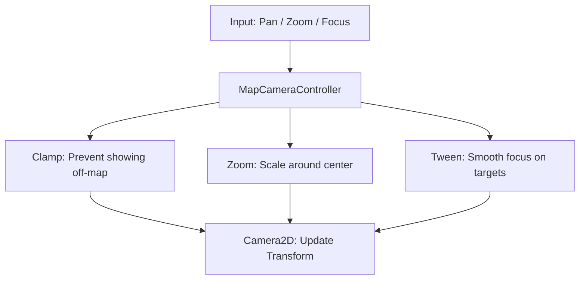

# Camera: Navigation & Focus

The `MapCameraController` (MCC) is the authoritative manager for the player's view into the world. It handles the complexities of viewport clamping, smooth focusing, and mobile-friendly zooming.

## Core Responsibilities

## Viewport Clamping (The Safety Rail)
The MCC ensures that the camera center never moves so far that the player sees the "gray void" outside the hex grid.
- **Dynamic Limits**: Limits are re-calculated every time the zoom level changes.
- **Occlusion Awareness**: If a UI menu is open (covering the right 40% of the screen), the camera "biases" its center so the visible portion of the map remains centered in the remaining 60%.
- **Loose Mode**: Used during journey planning to allow the camera to temporarily move outside bounds to show a full route.

## Viewport Sizing (Why Aspect Ratio Matters)
All clamp math is computed against the **SubViewport render size** (`sub_viewport_node.size`), which the MCC keeps synced to the on-screen `MapDisplay` control via `update_map_viewport_rect()`. The fit/clamp logic therefore assumes the render surface is the *same shape* as the area the player actually sees.

- **COVER fit** picks `max(zoom_x, zoom_y)` so the map fills the viewport; the "binding" axis (the one that exactly fills) gets little pan headroom by design.
- If the SubViewport's aspect ratio does **not** match the visible window's aspect ratio, the camera fits the wrong shape: it under-zooms, pins the binding axis to ~zero pan range, and renders part of the map outside the visible window — making it feel like a hard pan limiter.

> [!warning] Resolved bug — "can't pan to the bottom of the map"
> **Symptom:** At default zoom the camera could not pan down to the map's bottom edge (only reachable after zooming in); it felt like an artificial limiter rather than a zoom issue.
>
> **Root cause:** The `MapDisplay` `TextureRect` used the default `expand_mode = EXPAND_KEEP_SIZE`. That makes a TextureRect's *minimum size equal to its texture's native size* — here the SubViewport texture's `2650×1790`. That minimum propagated up through the `MainScreen` containers and forced the entire `MapView` node to `2650×1790`, larger than the real `2556×1179` window. Because `Main` has `clip_contents = true`, the bottom ~611px was clipped off-screen, and the MCC (syncing its clamp viewport to that control) was fitting a `1.48` aspect rectangle while the player viewed through a `2.17` window. The map's bottom was literally rendered below the visible screen.
>
> **Fix:** Set `MapDisplay.expand_mode = EXPAND_IGNORE_SIZE` (in `main.gd` after reparenting, and in `MapView.tscn`). The control now shrinks to fill the real window, the SubViewport syncs to the true `2556×1179` size, the camera fits the correct aspect, and the binding axis regains a healthy pan range so the bottom edge is reachable at any zoom.
>
> **Diagnostic tip:** The `[CLAMP]` log line prints `sub_aspect` vs `win_aspect`. If they diverge, the render surface is mis-sized — look at control sizing/`expand_mode`, not the clamp math.

## Movement Logic
- **Panning**: Linear translation based on mouse drag or touch drag. MCC uses `camera_pan_sensitivity` to normalize movement across different resolutions.
- **Zooming**: MCC supports "Zoom-at-Point" (scaling around the cursor/pinch center) rather than just zooming into the screen center.
- **Smoothing**: MCC uses Godot's built-in `Camera2D` smoothing for manual panning, but switches to **Tweens** (`TRANS_SINE`) for high-precision focusing (e.g., clicking "Focus on Convoy").

## Mobile & Touch
MCC is optimized for mobile touch interaction:
- **Pinch-to-Zoom**: Handled by the `InputEventPinchGesture` which MCC translates into delta-zoom steps.
- **Friction/Inertia**: MCC relies on the `MainScreen` input router to provide smooth, decelerating pan deltas for that "premium" mobile feel.

## Controllers
- `map_camera_controller.gd`
