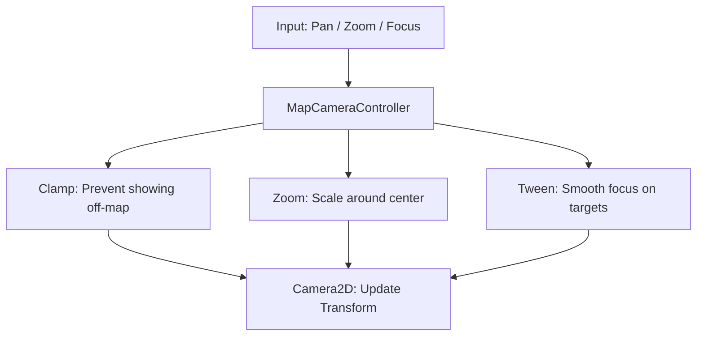

# Camera: Navigation & Focus

The `MapCameraController` (MCC) is the authoritative manager for the player's view into the world. It handles the complexities of viewport clamping, smooth focusing, and mobile-friendly zooming.

## Core Responsibilities

## Viewport Clamping (The Safety Rail)
The MCC ensures that the camera center never moves so far that the player sees the "gray void" outside the hex grid.
- **Dynamic Limits**: Limits are re-calculated every time the zoom level changes.
- **Occlusion Awareness**: If a UI menu is open (covering the right 40% of the screen), the camera "biases" its center so the visible portion of the map remains centered in the remaining 60%.
- **Loose Mode**: Used during journey planning to allow the camera to temporarily move outside bounds to show a full route.

## Movement Logic
- **Panning**: Linear translation based on mouse drag or touch drag. MCC uses `camera_pan_sensitivity` to normalize movement across different resolutions.
- **Zooming**: MCC supports "Zoom-at-Point" (scaling around the cursor/pinch center) rather than just zooming into the screen center.
- **Smoothing**: MCC uses Godot's built-in `Camera2D` smoothing for manual panning, but switches to **Tweens** (`TRANS_SINE`) for high-precision focusing (e.g., clicking "Focus on Convoy").

## Mobile & Touch
MCC is optimized for mobile touch interaction:
- **Pinch-to-Zoom**: Handled by the `InputEventPinchGesture` which MCC translates into delta-zoom steps.
- **Friction/Inertia**: MCC relies on the `MainScreen` input router to provide smooth, decelerating pan deltas for that "premium" mobile feel.

## Controllers
- `map_camera_controller.gd`
