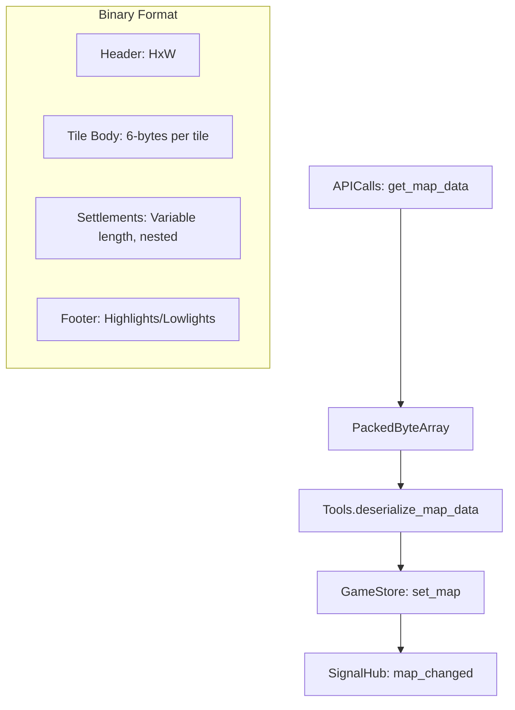

# Data: Payload & Parsing

The Map Data is the largest payload in the game (averaging 4MB for a full world). To keep network transit efficient, the backend sends this as a **Binary Packed Stream** rather than raw JSON.

## Parsing Pipeline

## The Binary Format (Big-Endian)
The parser in `tools.gd` reads the `PackedByteArray` using strict byte offsets:

1.  **Header (4 bytes)**:
    - Height: `u16`
    - Width: `u16`
2.  **Tile Data (6 bytes per tile)**:
    - Terrain Difficulty: `u8`
    - Region: `u8`
    - Weather: `u8`
    - Special: `u8`
    - Settlement Count: `u16`
3.  **Settlements (Nested)**:
    - If `settlement_count > 0`, the parser recursively calls `deserialize_settlement`.
    - Settlements contain fixed-length strings (null-padded) for IDs, names, and descriptions.

## Data Derivation (The Settlement Flattening)
The binary payload nests settlements *inside* their respective tiles. However, most UI systems (like the search bar or settlement menu) require a flat list of all settlements.
- **`GameStore._derive_settlements_from_tiles`**: This function iterates through the 2D tile array once upon receipt and creates a deduplicated flat list of settlement dictionaries, storing them in `GameStore._settlements`.

## Efficiency Strategies
- **Binary vs JSON**: The binary format reduces the 4MB JSON equivalent to ~500KB of compressed transit data.
- **Snapshot Caching**: Map data is only requested once per session (or when a major region change occurs). The `GameStore` retains this snapshot to avoid redundant re-parsing.

## Related Files
- **Binary Parser**: [tools.gd](../../../Scripts/System/tools.gd)
- **Data Holder**: [game_store.gd](../../../Scripts/System/Services/game_store.gd)
