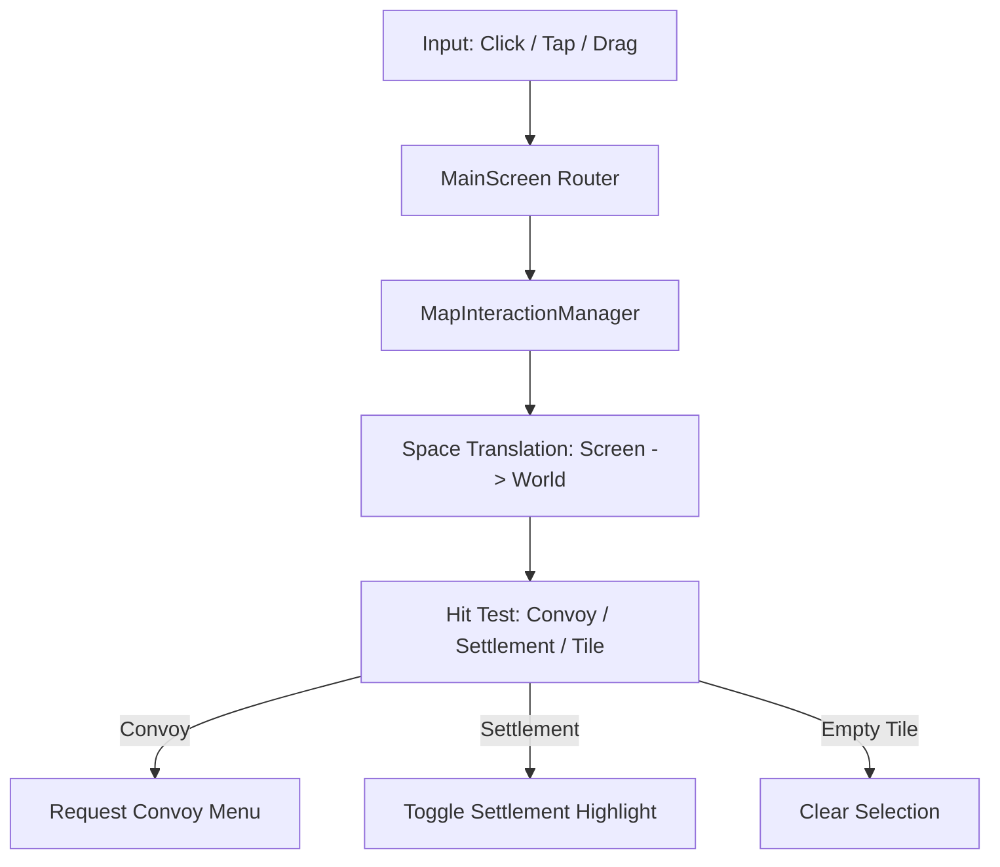

# Interactions: Clicks & Taps

The `MapInteractionManager` (MIM) translates raw input events into meaningful game actions like selecting a settlement or opening a convoy menu.

## Interaction Flow

## Space Translation
To determine what the player clicked, MIM must map the global screen coordinate back to the map:
1. **Viewport Inversion**: The global position is mapped into the `SubViewport` local space.
2. **Camera Inversion**: Using `camera.get_canvas_transform().affine_inverse()`, the position is projected into World Space pixels.
3. **Tile Mapping**: Finally, `tilemap.local_to_map(world_pos)` provides the integer `(x, y)` coordinate on the hex grid.

## Hit Detection (Hit-Box Math)
MIM uses "Radius-Squared" checks for efficiency:
- **Convoys**: Checked first. If the click is within `convoy_hover_radius_on_texture_sq` of any convoy icon, it's a hit.
- **Settlements**: Checked next. Uses `settlement_hover_radius_on_texture_sq`.
- **Taps vs. Pans**: MIM distinguishes between a quick "Tap" and a "Pan" by measuring the time and distance between `pressed` and `released` events.

## Mobile Control Schemes
MIM automatically detects the platform and adjusts behavior:
- **MOUSE_AND_KEYBOARD**: High-frequency hover detection and right-click panning.
- **TOUCH**: Tap-based selection only; hover detection is disabled to save performance. Hit-box radii are significantly increased (e.g., from 30px to 60px) to accommodate finger-sized touch targets.

## Controllers
- `map_interaction_manager.gd`
