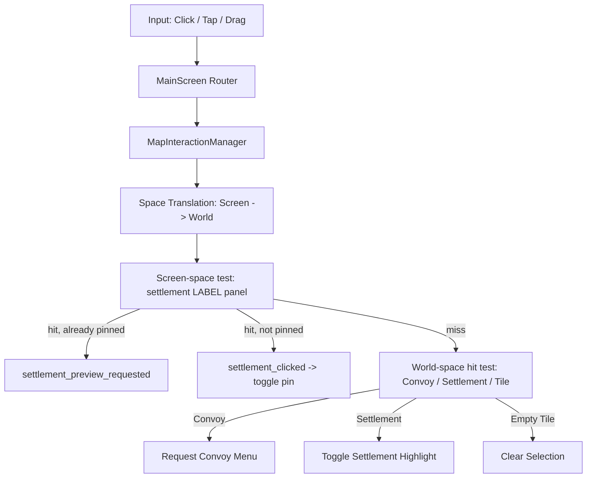

# Interactions: Clicks & Taps

The `MapInteractionManager` (MIM) translates raw input events into meaningful game actions like selecting a settlement or opening a convoy menu.

## Interaction Flow

```mermaid
graph TD
    Input[Input: Click / Tap / Drag] --> Router[MainScreen Router]
    Router --> MIM[MapInteractionManager]
    
    MIM --> Space[Space Translation: Screen -> World]
    Space --> Panel[Screen-space test: settlement LABEL panel]

    Panel -->|hit, already pinned| Preview[settlement_preview_requested]
    Panel -->|hit, not pinned| Pin[settlement_clicked -> toggle pin]
    Panel -->|miss| HitTest[World-space hit test: Convoy / Settlement / Tile]

    HitTest -->|Convoy| Menu[Request Convoy Menu]
    HitTest -->|Settlement| Select[Toggle Settlement Highlight]
    HitTest -->|Empty Tile| Clear[Clear Selection]
```

> [!IMPORTANT]
> **The label-panel test is screen-space and runs *first*.** Settlement labels are drawn offset *above*
> their tile and the panel is `MOUSE_FILTER_IGNORE`, so it cannot receive `gui_input` on a `CanvasLayer`.
> `_get_settlement_panel_at_screen_pos()` hit-tests the panel's screen rect explicitly (with a 12-unit
> grow) **before** any world-space projection. A click that lands on a label therefore never reaches the
> tile test below it.

## Space Translation
To determine what the player clicked, MIM must map the global screen coordinate back to the map:
1. **Viewport Inversion**: The global position is mapped into the `SubViewport` local space.
2. **Camera Inversion**: Using `camera.get_canvas_transform().affine_inverse()`, the position is projected into World Space pixels.
3. **Tile Mapping**: Finally, `tilemap.local_to_map(world_pos)` provides the integer `(x, y)` coordinate
   on the map's square tile grid. *(Corrected 2026-07-28 — "hex grid" was fabricated; see
   [TerrainMath](TerrainMath.md).)*

## Hit Detection (Hit-Box Math)
MIM uses "Radius-Squared" checks for efficiency:
- **Convoys**: Checked first. If the click is within `convoy_hover_radius_on_texture_sq` of any convoy icon, it's a hit.
- **Settlements**: Checked next. Uses `settlement_hover_radius_on_texture_sq`.
- **Taps vs. Pans**: MIM distinguishes between a quick "Tap" and a "Pan" by measuring the time and distance between `pressed` and `released` events.

## Pinned settlement labels: a two-state control

A settlement label is not a simple toggle. The **same click target has two meanings**, decided by
`UIManager.is_settlement_pinned()`:

| Label state | Click emits | Result |
|---|---|---|
| not pinned | `settlement_clicked` | `UIManager.toggle_settlement_pin()` — the label pins and gains a trailing `›` chevron |
| **already pinned** | `settlement_preview_requested` | `MenuManager.open_settlement_overview_menu()` — the preview opens |

The `›` is **text appended to the label**, not a Button — there is nothing to click *within* the panel, so
the whole panel is the target in both states.

> [!WARNING]
> **Touch and mouse are separate branches, and they drift.** `_handle_tap_interaction()` and
> `_handle_lmb_interactions()` each call the hit-test helpers independently. Behaviour added to one is
> **not** inherited by the other.
>
> This is not hypothetical: the pinned→preview rule above existed **only in the touch branch** until
> 2026-07-31. On desktop the click fell through to `settlement_clicked`, which *un-pinned* the label —
> and since the label was only drawn *because* it was pinned, it vanished. `settlement_preview_requested`
> was emitted from exactly one line in the entire repo, so no mouse path could ever open the preview.
>
> **When you change what a map click does, grep for both branches and update them together.**

## Mobile Control Schemes
MIM automatically detects the platform (`OS.get_name()` is `Android`/`iOS`) and adjusts behavior:
- **MOUSE_AND_KEYBOARD**: High-frequency hover detection and right-click panning.
- **TOUCH**: Tap-based selection only; hover detection is disabled to save performance
  (`_touch_hover_enabled()` returns `false`). Hit-box radii are increased for finger-sized targets —
  settlements **30px → 60px**, convoys **40px → 70px** (stored squared, e.g. `3600.0`).
  Note this bump applies to the **world-space** convoy/settlement radii only; the label-panel rect above
  uses the same 12-unit grow on both platforms.

## Controllers
- `map_interaction_manager.gd`

## Related

- **See also:** [Camera](Camera.md) — pan/zoom target
- **See also:** [SettlementOverlay](SettlementOverlay.md) — tap-to-reveal label behaviour
- **See also:** [MapSystemOverview](MapSystemOverview.md)
