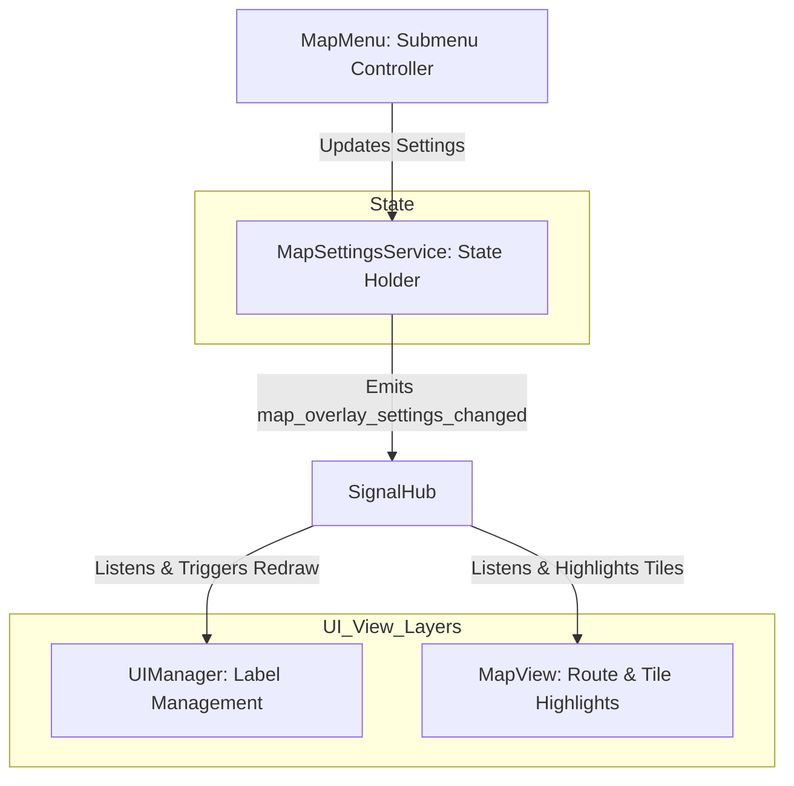

# Map Menu System: Design & Architecture

The **Map Menu System** provides the user interface and logic to toggle spatial overlays and label systems on the main map. It allows players to manage map-specific settings and visual layers (such as delivery targets, warehouse locations, and labels) using a clean, unidirectional data flow that integrates seamlessly with existing systems.

---

## 1. System Architecture

The Map Menu follows the **Desolate Frontiers Five Laws of Development**:
1. **Unidirectional Data Flow**: The Map Menu UI does not directly manipulate map overlays. Instead, toggles update a centralized `MapSettingsService` state, which broadcasts change events. Visual managers (like `UIManager`) listen to these events and update their rendering.
2. **Thin Panel Law**: The Map Menu scene is a pure controller, thin and focused solely on binding UI widgets, logging diagnostics, and updating the state service.
3. **Logical Pixels**: All layout parameters use Godot's safe-region container bindings and dynamic scaling parameters, avoiding hardcoded pixel values.
4. **Diagnostic Flags**: Includes `_debug_map_menu: bool = true` for complete execution tracing.
5. **Debounced Updates**: Toggle triggers and redraw calls are debounced to prevent performance degradation during frequent state changes.



---

## 2. Core Features & Overlay Rules

The Map Menu provides a series of interactive toggles. The rules governing each overlay are defined below:

| Feature Toggle | Target Visual Effect | Data Resolution Logic |
| :--- | :--- | :--- |
| **Active Delivery Destinations** | Highlights / Pins settlement labels for the active convoy's cargo targets. | Evaluates the selected convoy's `all_cargo` array. Identifies items with a valid `recipient` or `recipient_vendor_id`. Resolves recipient UUIDs to settlement coordinates using `GameStore.get_settlements()`. |
| **Current Settlement Deliveries** | Highlights / Pins settlements that are valid delivery targets starting from the selected convoy's current location. | Conditional on the selected convoy occupying a settlement tile. Gathers all `cargo_inventory` from the current settlement's vendors, extracts their `recipient` UUIDs, and resolves them to coordinates. |
| **All Convoy Destinations** | Highlights / Pins destination labels for all active player convoys. | Scans the `journey` dictionary of all convoys in `GameStore.get_convoys()`. Extracts their destination settlement coordinates. |
| **Settlement Labels** | Global toggle for settlement nameplates. | Controls whether standard settlement label panels (e.g., "Town 🏘️ Fort Ironhold") are drawn in `UIManager.settlement_label_container`. |
| **Warehouse Labels** | Displays custom warehouse markers / labels on settlements where the player owns storage. | Scans the `user.get("warehouses", [])` array from `GameStore.get_user()`. Matches warehouse parent `sett_id` with active settlements, drawing a special warehouse indicator (`🏭`). |

---

## 3. Class Definitions & Data Flow

### A. The MapMenu Controller (`map_menu.gd`)
Inherits from `MenuBase`. Placed in `Scripts/Menus/map_menu.gd`.

- **Scene Tree Structure**:
  ```text
  MapMenu (Control, script: map_menu.gd)
  └── MainVBox (VBoxContainer)
      ├── TopBannerPanel (StyleBoxFlat) - Handled by MenuBase
      └── ScrollContainer (ScrollContainer)
          └── TogglesVBox (VBoxContainer)
              ├── ActiveDestinationsRow (HBoxContainer)
              │   ├── Label (Label)
              │   └── CheckButton (CheckButton)
              ├── CurrentSettlementDestRow (HBoxContainer)
              │   ├── Label (Label)
              │   └── CheckButton (CheckButton)
              ├── AllConvoyDestRow (HBoxContainer)
              │   ├── Label (Label)
              │   └── CheckButton (CheckButton)
              ├── SettlementLabelsRow (HBoxContainer)
              │   ├── Label (Label)
              │   └── CheckButton (CheckButton)
              └── WarehouseLabelsRow (HBoxContainer)
                  ├── Label (Label)
                  └── CheckButton (CheckButton)
  ```

- **Core Methods**:
  - `initialize_with_data(data_or_id: Variant, extra_arg: Variant = null)`: Overridden from `MenuBase`. Sets active convoy context.
  - `_update_ui(convoy: Dictionary)`: Evaluates whether the convoy is in a settlement tile to enable/disable the "Current Settlement Deliveries" toggle.
  - `_on_toggle_pressed(setting_name: String, value: bool)`: Updates `MapSettingsService` and logs the action under the `_debug_map_menu` flag.

### B. The MapSettingsService (`map_settings_service.gd`)
A lightweight, global autoloaded state container.

- **State Interface**:
  - `active_delivery_destinations: bool = true`
  - `settlement_delivery_destinations: bool = true`
  - `settlement_labels: bool = true`
  - `warehouse_labels: bool = true`
  - `all_convoy_destinations: bool = false`
- **Actions**:
  - `update_setting(setting_name: String, value: bool)`: Mutates local state and emits `map_overlay_settings_changed` through `SignalHub`.

### C. The Visual Integration (`UI_manager.gd`)
The main view layer expands its interactive label loop to incorporate settings:

```gdscript
# Inside UI_manager.gd: _draw_interactive_labels()

# 1. Fetch current settings from MapSettingsService
var active_dest_enabled = MapSettingsService.active_delivery_destinations
var curr_sett_dest_enabled = MapSettingsService.settlement_delivery_destinations
var all_convoy_dest_enabled = MapSettingsService.all_convoy_destinations
var settlement_labels_enabled = MapSettingsService.settlement_labels
var warehouse_labels_enabled = MapSettingsService.warehouse_labels

# 2. Compile list of coordinates to draw labels for
var coords_to_display: Array[Vector2i] = []

# If settlement labels are completely disabled globally, clear normal labels
if settlement_labels_enabled:
    # Add hovered, selected convoy start/end, and pinned settlement coordinates...
    
# 3. Add warehouse locations if enabled
if warehouse_labels_enabled:
    var warehouses = GameStore.get_user().get("warehouses", [])
    for wh in warehouses:
        var sett_coords = _resolve_settlement_coords(wh.get("sett_id"))
        if not coords_to_display.has(sett_coords):
            coords_to_display.append(sett_coords)

# 4. Add delivery destination coordinates based on toggles
if active_dest_enabled:
    var active_targets = _get_active_convoy_delivery_coords()
    for coords in active_targets:
        if not coords_to_display.has(coords):
            coords_to_display.append(coords)
            
# 5. Draw and style matching panels, injecting dynamic indicators (e.g., 📦, 🏭, 🎯)
```

---

## 4. Signal Wiring Specification

The Map Menu integration relies on these unified signal paths:

1. **Toggle Switch in MapMenu**:
   `CheckButton.toggled(value)` ➔ `MapMenu._on_toggle_pressed(...)` ➔ `MapSettingsService.update_setting(...)`
2. **State Broadcaster**:
   `MapSettingsService.update_setting(...)` ➔ `SignalHub.map_overlay_settings_changed.emit(settings_dict)`
3. **View Synchronization**:
   `SignalHub.map_overlay_settings_changed` ➔ `UIManager.queue_redraw_labels()` ➔ `UIManager._draw_interactive_labels()`

---

## 5. UI Polishing & Aesthetics

To maintain a highly premium look and feel, the Map Menu will implement:
- **Curated Glassmorphism Style**: Panels styled with semi-transparent background colors (`#25282adc` with `0.86` alpha) and soft accent borders matching Oori system aesthetics.
- **Dynamic CheckButton States**: Custom icons for on/off states instead of default checkbox ticks.
- **Micro-Animations**: Smooth slide-in animations when the Map Menu submenu is opened.
- **Clear Indicators**: High-contrast icon overlays added to label nameplates (e.g., target destinations receive a subtle gold target `🎯` or cargo package `📦` icon next to their name).
