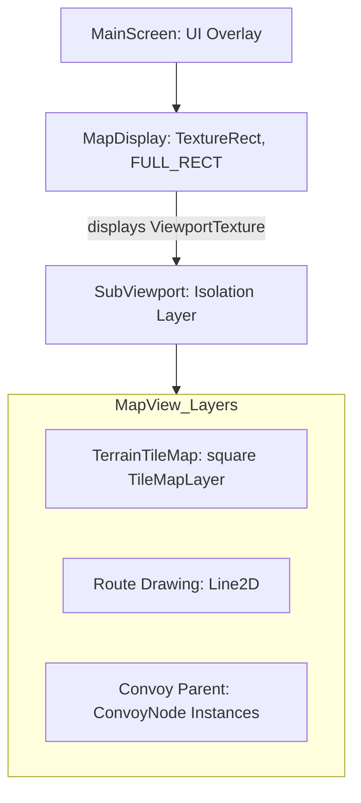

# Map System: High-Level Overview

The Map System is the core spatial engine of *Desolate Frontiers*, responsible for rendering the **square**
tile grid, managing the camera, and handling player interactions with settlements and convoys.

> [!NOTE]
> **Corrected 2026-07-28.** This doc previously said "hex grid" and described post-processing "like Fog
> of War." Neither exists: `MapView.tscn`'s `TerrainTileMap` uses the default square tile shape (no
> `tile_shape` override in `Assets/tiles/tile_set.tres`), and there is no fog node anywhere in the scene
> or `Scripts/`. See [TerrainMath](TerrainMath.md), rewritten the same day for the same reason.

## Architecture

The map is rendered within a dedicated **SubViewport** to isolate its 2D world space from the primary UI overlay. This allows for independent scaling and clean coordinate translation. Rather than a `SubViewportContainer`, the SubViewport's `ViewportTexture` is shown through a `MapDisplay` `TextureRect` that is stretched to fill the window (see [Rendering](Rendering.md) for why `expand_mode` matters here).

## Coordinate Systems

Understanding the relationship between these three spaces is critical for interaction logic:

1.  **Map Space (Tiles)**: Integer `Vector2i(x, y)` square-grid coordinates. The origin `(0, 0)` is at the top-left.
2.  **World Space (Pixels)**: Local coordinates within the `MapView`. Calculated via `tilemap.map_to_local(tile_coords)`.
3.  **Screen Space (Global Pixels)**: Raw viewport coordinates. Translated to World Space via the `Camera2D` canvas transform and the `SubViewport` offset.

## Primary Controllers
- **[MapCameraController](Camera.md)**: Manages zoom, pan, and smoothing.
- **[MapInteractionManager](Interactions.md)**: Translates screen taps into map actions.
- **[ConvoyVisualsManager](Visuals.md)**: Spawns and updates convoy icons.
- **[MapService](Data.md)**: Authoritative source for map data snapshots.
- **[Map Rendering](Rendering.md)**: SubViewport configurations and visual layer details.
- **[Map Menu & Overlays](MapMenuSystem.md)**: Visual layer toggles, signals, and architectural design.
- **[Tile Coordinate Math](TerrainMath.md)**: `map_to_local` conversion and who depends on it.

## Key Files
- **Scene**: [MapView.tscn](../../../Scenes/MapView.tscn)
- **Service**: [map_service.gd](../../../Scripts/System/Services/map_service.gd)
- **Data Model**: [Tools.gd](../../../Scripts/System/tools.gd) (`deserialize_map_data`)
