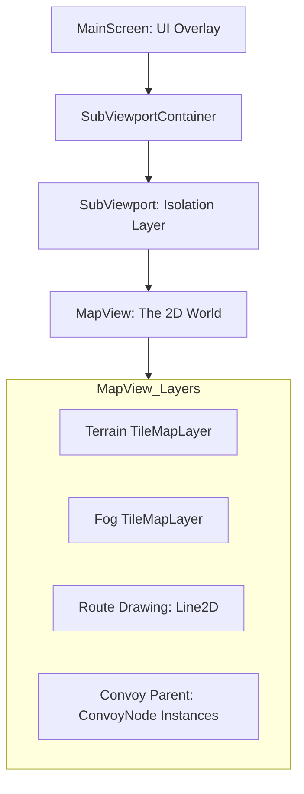

# Map System: High-Level Overview

The Map System is the core spatial engine of *Desolate Frontiers*, responsible for rendering the hex grid, managing the camera, and handling player interactions with settlements and convoys.

## Architecture

The map is rendered within a dedicated **SubViewport** to isolate its 2D world space from the primary UI overlay. This allows for independent scaling, post-processing (like Fog of War), and clean coordinate translation.

## Coordinate Systems

Understanding the relationship between these three spaces is critical for interaction logic:

1.  **Map Space (Tiles)**: Integer coordinates `(x, y)` representing hex positions. The origin `(0, 0)` is at the top-left.
2.  **World Space (Pixels)**: Local coordinates within the `MapView`. Calculated via `tilemap.map_to_local(tile_coords)`.
3.  **Screen Space (Global Pixels)**: Raw viewport coordinates. Translated to World Space via the `Camera2D` canvas transform and the `SubViewport` offset.

## Primary Controllers
- **[MapCameraController](Camera.md)**: Manages zoom, pan, and smoothing.
- **[MapInteractionManager](Interactions.md)**: Translates screen taps into map actions.
- **[ConvoyVisualsManager](Visuals.md)**: Spawns and updates convoy icons.
- **[MapService](Data.md)**: Authoritative source for map data snapshots.

## Key Files
- **Scene**: [MapView.tscn](../../../Scenes/MapView.tscn)
- **Service**: [map_service.gd](../../../Scripts/System/Services/map_service.gd)
- **Data Model**: [Tools.gd](../../../Scripts/System/tools.gd) (`deserialize_map_data`)
