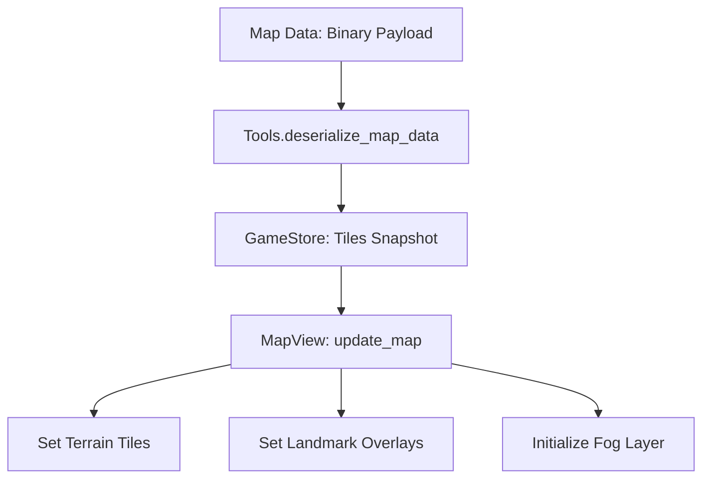

# Rendering: TileMaps & Fog of War

The map uses Godot 4's `TileMapLayer` nodes to efficiently render thousands of hexes and dynamic visibility masks.

## Display Pipeline (SubViewport → TextureRect)

The map is rendered into a `SubViewport` (`MapContainer/SubViewport`) and displayed through a `TextureRect` (`MapDisplay`) whose texture is that SubViewport's `ViewportTexture`. At startup `main.gd` reparents `MapDisplay` to the `MapView` root and stretches it to `PRESET_FULL_RECT` so it fills the visible window.

> [!important] `MapDisplay` must use `expand_mode = EXPAND_IGNORE_SIZE`
> A `TextureRect` left on the default `EXPAND_KEEP_SIZE` adopts its texture's native size as its **minimum size**. Because the SubViewport texture is large (e.g. `2650×1790`), that minimum would force the whole `MapView` (and its container chain) to that size — larger than the actual window — clipping the map and breaking camera clamping. `IGNORE_SIZE` lets the control shrink to the real window. The MCC then syncs `SubViewport.size` to this control via `update_map_viewport_rect()`, keeping render size, display size, and clamp math in agreement. See [[Camera]] for the full incident write-up.

## Layer Stack

The `MapView` contains several layers ordered by Z-index:

| Layer | Node Type | Purpose |
| :--- | :--- | :--- |
| **Terrain** | `TileMapLayer` | Base hex grid (Sand, Rock, Water). |
| **Overlay** | `TileMapLayer` | Landmarks and location markers. |
| **Fog** | `TileMapLayer` | Semi-transparent "Unexplored" mask. |
| **Routes** | `Node2D` | `Line2D` nodes for active journey paths. |
| **Convoys** | `Node2D` | Parent for all `ConvoyNode` instances. |

## Tile Generation Flow

## Fog of War

The **FogTileMap** acts as a shroud over the entire map.
- **Initialization**: Every tile starts as "Unexplored" (typically a dark, semi-transparent hex).
- **Clearing**: As the player's convoy moves, the `FogManager` updates the TileMap at the convoy's current coordinates to "Explored" (null or transparent tile).
- **Persistence**: Fog state is currently managed by the client but is based on the `explored` flags in the backend map payload.

## Route Visualization
Journey routes are drawn using **`Line2D`** nodes.
- **Interpolation**: The line follows the exact path of tiles returned by the `RouteService`.
- **Styling**: Colors change based on convoy status (e.g., active journey vs. previewed route).
- **Anti-Aliasing**: Map routes use standard Godot anti-aliasing to maintain clarity at high zoom levels.
