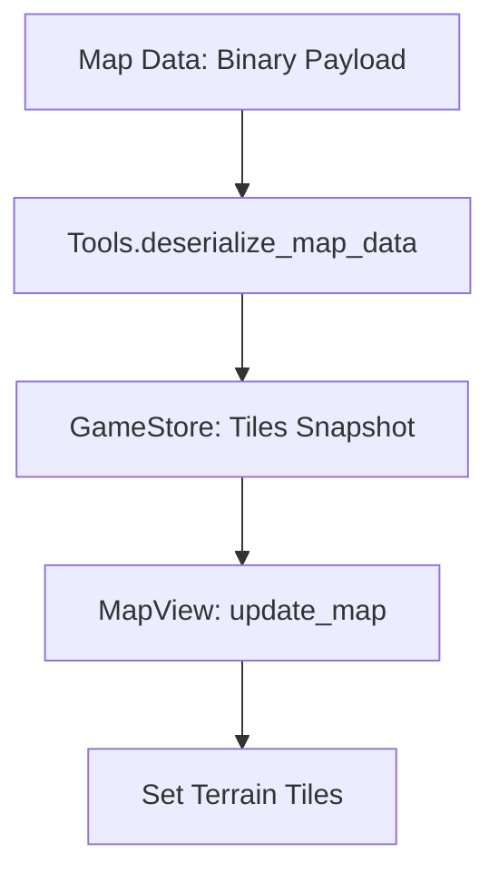

# Rendering: TileMap & SubViewport Display

The map uses a single Godot 4 `TileMapLayer` node on a square grid, displayed through a `SubViewport` → `TextureRect` pipeline.

> [!NOTE]
> **Rewritten 2026-07-28.** This doc previously described a hex grid, a separate "Overlay" TileMapLayer,
> and a full "Fog of War" system (`FogTileMap`, `FogManager`, an `explored` payload flag). None of that
> exists: `MapView.tscn` has exactly **one** `TileMapLayer` (`TerrainTileMap`), no fog node anywhere in
> the scene or `Scripts/`, and no `explored` field anywhere in the map payload parser. Only the
> SubViewport/`EXPAND_IGNORE_SIZE` section below was accurate and is unchanged. See
> [TerrainMath](TerrainMath.md) and [Camera § hex-grid correction](Camera.md), rewritten the same day
> for the same reason.

## Display Pipeline (SubViewport → TextureRect)

The map is rendered into a `SubViewport` (`MapContainer/SubViewport`) and displayed through a `TextureRect` (`MapDisplay`) whose texture is that SubViewport's `ViewportTexture`. At startup `main.gd` reparents `MapDisplay` to the `MapView` root and stretches it to `PRESET_FULL_RECT` so it fills the visible window.

> [!important] `MapDisplay` must use `expand_mode = EXPAND_IGNORE_SIZE`
> A `TextureRect` left on the default `EXPAND_KEEP_SIZE` adopts its texture's native size as its **minimum size**. Because the SubViewport texture is large (e.g. `2650×1790`), that minimum would force the whole `MapView` (and its container chain) to that size — larger than the actual window — clipping the map and breaking camera clamping. `IGNORE_SIZE` lets the control shrink to the real window. The MCC then syncs `SubViewport.size` to this control via `update_map_viewport_rect()`, keeping render size, display size, and clamp math in agreement. See [Camera](Camera.md) for the full incident write-up.

## Layer Stack

`MapContainer/SubViewport`'s actual children, in scene order (`Scenes/MapView.tscn`):

| Node | Type | Purpose |
| :--- | :--- | :--- |
| **TerrainTileMap** | `TileMapLayer` | The only tilemap — base terrain, square grid. |
| **MapCamera** | `Camera2D` | See [Camera](Camera.md). |
| **SettlementLabelContainer** | `Node2D` | Settlement labels + the overlay-draw nodes (tails, outlines, focus pins, route arcs) — see [SettlementOverlay](SettlementOverlay.md). |
| **ConvoyLabelContainer** | `Node2D` | Convoy name labels. |
| **ConvoyIconContainer** | `Node2D` | Parent for all `ConvoyNode` instances. |
| **ConvoyConnectorLinesContainer** | `Node2D` | Lines connecting labels to their tiles. |
| **CameraDebugOverlay** | `Node2D` | Debug-only diagnostics. |

## Tile Generation Flow

```mermaid
graph TD
    Data[Map Data: Binary Payload] --> Parser[Tools.deserialize_map_data]
    Parser --> Store[GameStore: Tiles Snapshot]
    Store --> MapView[MapView: update_map]
    MapView --> Terrain[Set Terrain Tiles]
```

## Route Visualization

Routes are **not** `Line2D` nodes. They are hand-drawn in `_draw()` by the same custom overlay system
documented in [SettlementOverlay § arc_data](SettlementOverlay.md) — `settlement_overlay_draw.gd`
renders arcs from `arc_data` entries — plus dedicated route-line drawing code in `UI_manager.gd`
(`route_line_outline_extra_width` and related constants govern styling; see
`UI_manager.gd` around the preview-line and connector-line draw calls).
- **Interpolation**: The line follows the exact tile path returned by `RouteService`.
- **Styling**: Colors change based on convoy status (active journey vs. previewed route).
