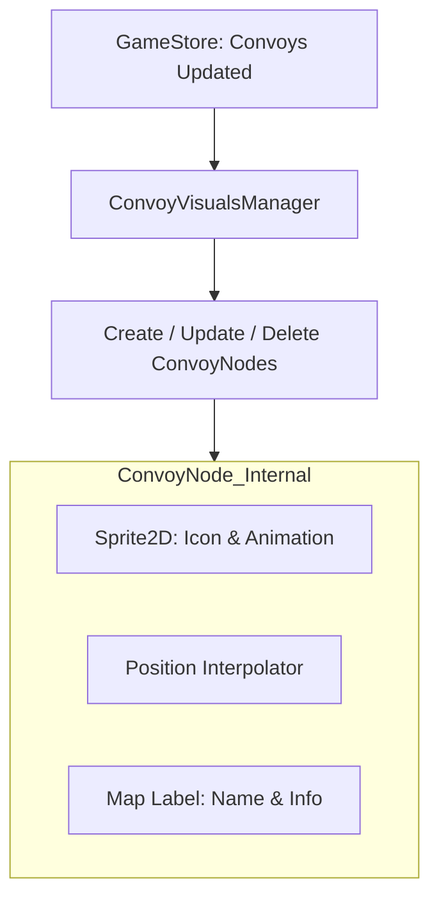

# Visuals: Convoys & Labels

This system manages the life-cycle of dynamic map elements like convoy icons, movement interpolation, and screen-space labels.

## Convoy Node Architecture

Every active convoy on the map is represented by a **`ConvoyNode`**.

## Movement Interpolation
Convoys do not teleport between tiles. Instead, they smoothly interpolate their world position:
1. **Segment Progress**: The backend provides `_current_segment_start_idx` and `_progress_in_segment` (0.0 to 1.0).
2. **LERP**: The `ConvoyNode` calculates the World Space positions of the start and end tiles of the current segment and uses `lerp()` to find its current pixel position.
3. **Lane Offsetting**: When multiple convoys occupy the same road segment, the `ConvoyVisualsManager` applies a lateral "Lane Offset" to prevent icons from overlapping.

## Map Labels (MSDF)
Map labels are built to stay readable at all zoom levels and prevent UI clutter.
- **MSDF (Multi-Channel Signed Distance Field)**: We use MSDF fonts so text remains sharp even when zoomed in 500% or out 50%.
- **Anti-Collision**: `convoy_label_manager.gd` calculates the screen-space bounding boxes of all labels. If two labels overlap, it applies a vertical offset (stacking) to keep them both readable.
- **Scaling**: Labels dynamically scale based on camera zoom to avoid overwhelming the map view at high altitudes.

## Controllers
- `convoy_visuals_manager.gd`
- `convoy_label_manager.gd`
- [ConvoyNode.gd](../../../Scripts/Map/ConvoyNode.gd)
