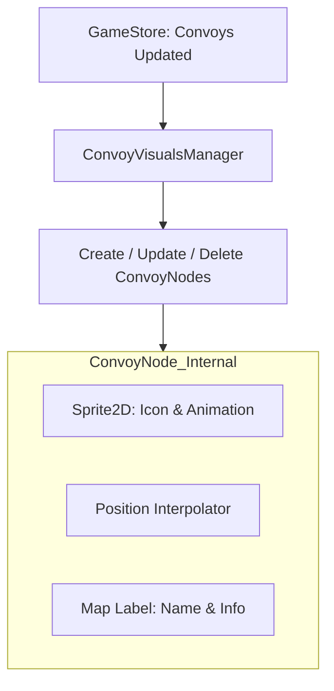

# Visuals: Convoys & Labels

This system manages the life-cycle of dynamic map elements like convoy icons, movement interpolation, and screen-space labels.

## Convoy Node Architecture

Every active convoy on the map is represented by a **`ConvoyNode`**.

```mermaid
graph TD
    Store[GameStore: Convoys Updated] --> CVM[ConvoyVisualsManager]
    CVM --> Sync[Create / Update / Delete ConvoyNodes]
    
    subgraph ConvoyNode_Internal
    Sprite[Sprite2D: Icon & Animation]
    Interpolate[Position Interpolator]
    Label[Map Label: Name & Info]
    end
    
    Sync --> ConvoyNode_Internal
```

## Movement Interpolation
Convoys do not teleport between tiles. Instead, they smoothly interpolate their world position:
1. **Segment Progress**: The backend provides `_current_segment_start_idx` and `_progress_in_segment` (0.0 to 1.0).
2. **LERP**: The `ConvoyNode` calculates the World Space positions of the start and end tiles of the current segment and uses `lerp()` to find its current pixel position.
3. **Lane Offsetting**: When multiple convoys occupy the same road segment, the `ConvoyVisualsManager` applies a lateral "Lane Offset" to prevent icons from overlapping.

## Map Labels
Map labels are built to stay readable at all zoom levels and prevent UI clutter.
- **MSDF (Multi-Channel Signed Distance Field)**: the intended design — labels zoom with `Camera2D`
  across a wide range, which is exactly the case MSDF exists for. ⚠️ *Corrected 2026-07-28: not actually
  enabled today* — `Assets/Lexend Light.ttf` imports with `multichannel_signed_distance_field=false`.
  Treat this as aspirational until that changes; see [AI_Guidelines § 3](../../04_Technical/AI_Guidelines.md).
- **Anti-Collision**: `convoy_label_manager.gd` calculates the screen-space bounding boxes of all labels. If two labels overlap, it applies a vertical offset (stacking) to keep them both readable.
- **Scaling**: Labels dynamically scale based on camera zoom to avoid overwhelming the map view at high altitudes.

## Settlement Overlay

A separate overlay system annotates settlement tiles with callout tails, tile outlines, focus pins, and route arcs. See [SettlementOverlay](SettlementOverlay.md) for full details.

**Key points:**
- Drawn by `settlement_overlay_draw.gd` (a `Node2D` with a custom `_draw()` implementation).
- Two instances are created at runtime — one at `z_index = -1` (tails, outlines, arcs behind panels) and one at `z_index = 10` (pins in front of panels).
- All sizes are specified in screen-pixels and divided by zoom so they stay constant regardless of camera zoom.
- Route arcs use quadratic Bézier curves bowing left of the travel direction.
- Color coding and alpha dimming communicate which settlements correlate to which convoy.

## Controllers
- `convoy_visuals_manager.gd`
- `convoy_label_manager.gd`
- `settlement_overlay_draw.gd`
- [ConvoyNode.gd](../../../Scripts/Map/convoy_node.gd)
