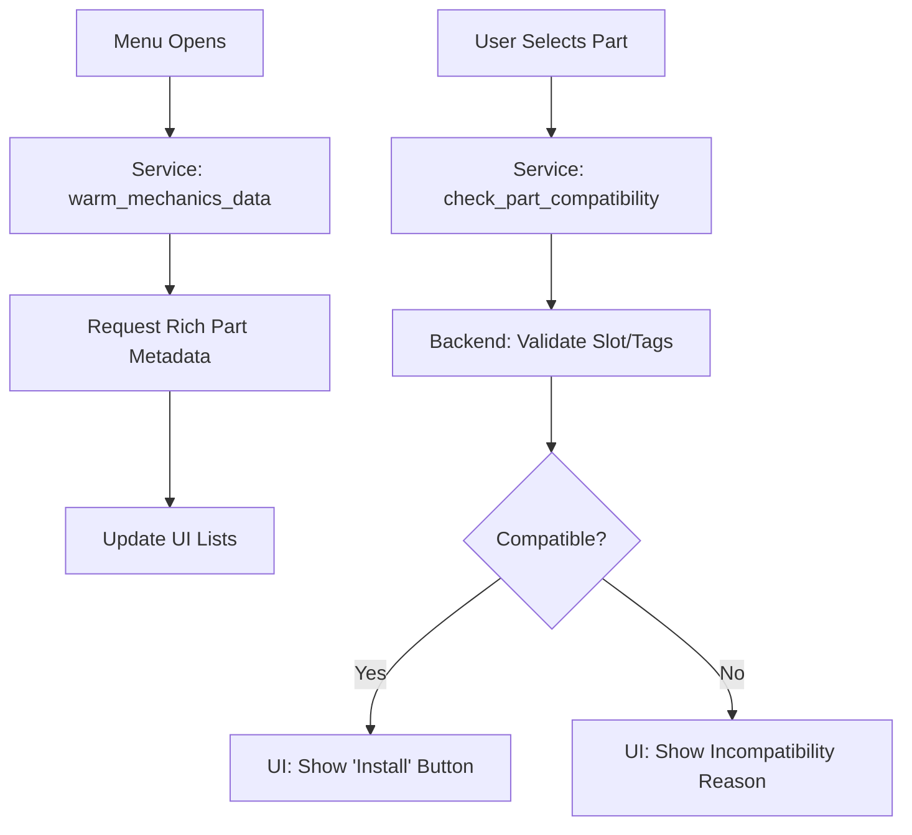

# Mechanics & Parts System

The Mechanics system in *Desolate Frontiers* governs the customization and repair of vehicles. It manages the lifecycle of **Parts**—how they are discovered, purchased, attached, and swapped.

## Core Concepts

### 1. Vehicles
- A vehicle is a dictionary that contains a list of **Slots** (e.g., `engine`, `wheels`, `cargo_rack`).
- Each slot can hold exactly one **Part**.
- Vehicles are part of a `convoy` and are refreshed via the `ConvoyService`.

### 2. Parts
- A part is a special type of **Cargo Item** that has additional metadata:
  - `slot`: The type of slot it can be installed in.
  - `part_type`: The category of the part.
  - `part_modifiers`: The stats it provides (e.g., `mass_limit_bonus`, `fuel_efficiency`).
- Parts can be found in a vendor's inventory or in a convoy's cargo manifest.

### 3. Compatibility
- Not every part fits every vehicle. The **MechanicsService** provides a `check_part_compatibility` flow that asks the backend for a detailed breakdown of whether a part fits and, if not, why (e.g., "Incompatible Chassis").

### Logic Flow

---

## The `MechanicsService`

This service acts as the bridge between the UI and the backend for all technical operations.

### Key Operations
- **`attach_part(convoy_id, vehicle_id, part_id)`**: Installs a part from the convoy's cargo into the vehicle.
- **`detach_part(convoy_id, vehicle_id, part_id)`**: Removes a part from a vehicle and places it back into the convoy's cargo.
- **`add_part_from_vendor(...)`**: A combined operation that buys a part from a vendor and installs it directly into a vehicle.
- **`apply_swaps(...)`**: Processes a batch of attach/detach operations (e.g., when clicking "Apply Changes" in the Mechanics menu).

### Data Enrichment (The "Warming" Pattern)
Because map snapshots often contain minimal vendor data, the `MechanicsService` uses a **Warmup** pattern:
- When a menu opens, it calls `warm_mechanics_data_for_convoy()`.
- The service scans the current settlement for vendors.
- For each vendor, it requests "Rich" details (including full part metadata) via the `VendorService`.
- This ensures the UI can show available parts and their stats immediately.

---

## Important Signals

- **`SignalHub.vendor_updated`**: Fired when a vendor's inventory is refreshed (essential for parts lists).
- **`APICalls.part_compatibility_checked`**: Returns the `can_install` boolean and `incompatibility_reason` string.
- **`APICalls.cargo_data_received`**: Fired when a specific part's detailed metadata is fetched (enrichment).

---

## UI Patterns

### The Mechanics Menu
- Extends `MenuBase`.
- Uses a **Two-Column Layout**: Current parts on the left, available parts/inventory on the right.
- Uses **Persistence**: Often sets `persistence_enabled = true` to maintain part selections while navigating.
- **Selection Flow**: Selecting a slot highlights compatible parts in the inventory; selecting a part shows its stats compared to the current part.
