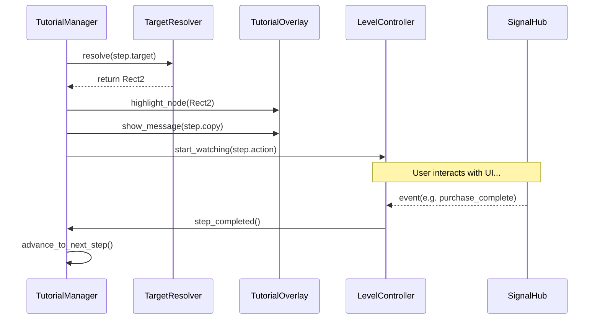

# Architecture: The Step Loop

The Tutorial System operates on a sequential "Step Loop". Each step must be completed before the next is shown.

## The Step Lifecycle

## Input Gating (The Mask)
The `TutorialOverlay` uses a series of invisible blocker controls to gate input based on the current step's `lock` property:

- **GATING_NONE**: The player can click anything. The highlight is purely visual.
- **GATING_SOFT**: Input is blocked everywhere **except** the highlight "hole". The player must interact with the target element to proceed.
- **GATING_HARD**: All input is blocked. The player must click a "Continue" button on the tutorial message to proceed.

## Viewport Resilience
The `TargetResolver` is designed to handle dynamic UI changes:
1.  **Resolution Retries**: If a node is found but its size is `(0,0)` (common in the first frame of a menu opening), the resolver will retry after a short delay.
2.  **Parent Matching**: If an exact button cannot be found, the resolver can highlight the parent container (e.g., the whole "Market Tab") to provide a general hint.
3.  **Top-Level Safety**: Highlights are rendered on a high Z-index layer to ensure they appear above all other menus.
