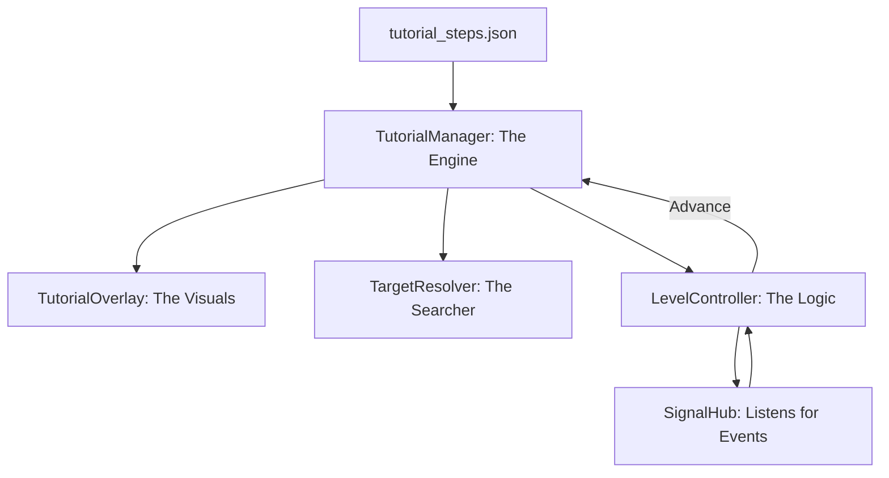

# Tutorial System: Modular Overhaul

The Tutorial System guides new players through the core loops of *Desolate Frontiers*. It is designed to be **event-driven**, ensuring the tutorial remains synchronized even if the player navigates menus faster than expected.

## Mental Model
The system is built on three pillars:
1.  **The Content**: Step definitions (id, instructional copy, action, target). These are **hardcoded in
    `tutorial_manager.gd::_build_level_steps()`** — *not* an external JSON. The old `res://Data/tutorial_steps.json`
    loader is disabled (it drifted out of sync); edit the function, not a data file.
2.  **The Highlight**: A full-screen overlay that masks the UI, creating a "hole" over the target element to focus the player's attention.
3.  **The Watcher**: Level-specific logic that listens to `SignalHub` to determine when a step is successfully completed.

## Architecture: "The Engine & The Controller"

## System Components
- **[Architecture & Flow](Architecture.md)**: How the manager and controllers interact.
- **[Step Schema](StepSchema.md)**: Defining the JSON contract for steps.
- **[Level Controllers](Controllers.md)**: How to write logic for a new tutorial level.
- **[Target Resolution](TargetResolution.md)**: Resolving string identifiers to UI nodes.

## Primary Files
- **Manager**: `Scripts/UI/tutorial_manager.gd`
- **Steps (content)**: `Scripts/UI/tutorial_manager.gd::_build_level_steps()` — hardcoded, not JSON
- **Visuals**: `Scripts/UI/tutorial_overlay.gd`
- **Resolver**: `Scripts/UI/target_resolver.gd`
