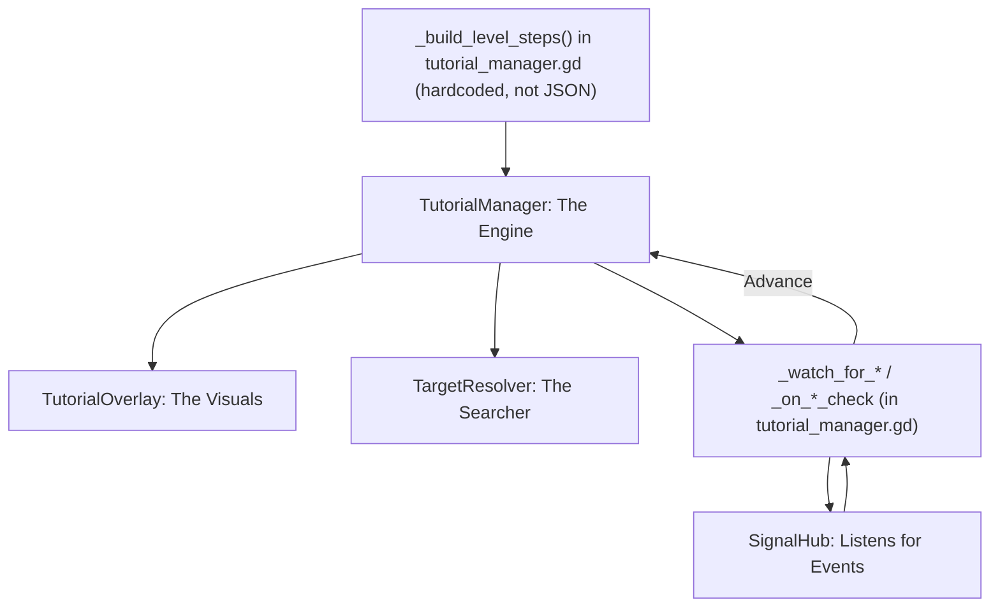

# Tutorial System: Modular Overhaul

The Tutorial System guides new players through the core loops of *Desolate Frontiers*. It is designed to be **event-driven**, ensuring the tutorial remains synchronized even if the player navigates menus faster than expected.

## Mental Model
The system is built on three pillars:
1.  **The Content**: Step definitions (id, instructional copy, action, target). These are **hardcoded in
    `tutorial_manager.gd::_build_level_steps()`** — *not* an external JSON. The old `res://Data/tutorial_steps.json`
    loader is disabled (it drifted out of sync); edit the function, not a data file.
2.  **The Highlight**: A full-screen overlay that masks the UI, creating a "hole" over the target element to focus the player's attention.
3.  **The Watcher**: Level-specific logic that listens to `SignalHub` to determine when a step is successfully completed.

## Architecture: "The Engine & The Controller"

## System Components
- **[Architecture & Flow](Architecture.md)**: How the manager, overlay, resolver, and watchers interact.
- **[Step Schema](StepSchema.md)**: The step dictionary shape (id / copy / action / lock / target) — hardcoded, not JSON.
- **[Level Logic: Actions & Watchers](Controllers.md)**: How to add a level/step and wire its completion watcher (all in `tutorial_manager.gd`).
- **[Target Resolution](TargetResolution.md)**: Resolving string identifiers to UI nodes by content identity.

## Primary Files
- **Manager**: `Scripts/UI/tutorial_manager.gd`
- **Steps (content)**: `Scripts/UI/tutorial_manager.gd::_build_level_steps()` — hardcoded, not JSON
- **Visuals**: `Scripts/UI/tutorial_overlay.gd`
- **Resolver**: `Scripts/UI/target_resolver.gd`

## Content gotcha: "Jerry Cans" ≠ "Water Jerry Cans"

> [!WARNING]
> The vendor stocks **two different, similarly-named cargo types**: plain **Jerry Cans** (a *fuel* container) and **Water Jerry Cans** (a *water* container). They are **not** the same item.

The **Level 2 supply-purchase step** (`l2_buy_supplies`, `action = "await_supply_purchase"`) must prompt the player for **Water Jerry Cans specifically** — the copy reads *"Purchase 2 MRE Boxes and 2 Water Jerry Cans."* Do **not** write "Jerry Cans" in this step; a player buying plain (fuel) Jerry Cans has bought the wrong thing and must not complete the step.

The completion watcher enforces this: it counts an item toward the "water" total only when the lowercased name contains **both** `water` **and** `jerry` (`tutorial_manager.gd` ~L1405 in `_on_supply_check`, and ~L1606 in the purchase handler). When editing this level:
- Keep the step copy explicit about **Water** Jerry Cans.
- Never loosen the match to bare `jerry` — that would let plain fuel Jerry Cans satisfy a water requirement.

See the [Glossary → Items & Cargo](../../99_Reference/Glossary.md#items--cargo) entry for the fuel-vs-water field distinction.
