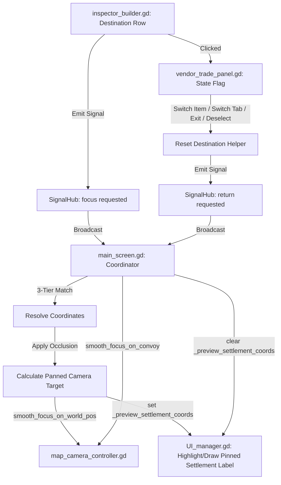

# Cargo Destination Preview & Camera Navigation

This technical document details the architectural design and actual implementation of the **Cargo Destination Button** feature. This feature enables direct map navigation for delivery cargo by adding a clickable "Preview: Destination" button in the cargo inspector panel, temporarily focusing the map camera on the recipient settlement with a layout-aware offset, and returning back to the primary convoy once focus shifts or the menu exits.

---

## 🏗️ Architecture & Signal Flow

The implementation strictly follows the **Unidirectional Data Flow** and **Thin Panel, Fat Controller** principles. By decoupling the inspector panel from the main coordination system, we utilize `SignalHub` to broadcast map events and `MainScreen` as the central coordinator.



---

## 🛠️ Implementation Details

### 1. Global Signals (`SignalHub.gd`)
Two new global events were added to standardise map navigation and lifecycle under the **Map and Settlements** section:
```gdscript
# Scripts/System/Services/signal_hub.gd
signal map_camera_focus_settlement_requested(settlement_name: String)
signal map_camera_return_to_convoy_requested()
```

### 2. Touch-Friendly Interactive Button (`inspector_builder.gd`)
In `inspector_builder.gd`, the `"Destination"` row is rendered as an interactive, styled, touch-friendly `Button` conforming to the mobile tactile target rules:
- **Minimum Target Height**: **70px** for mobile portrait/landscape, and **40px** for desktop layout.
- **Visuals**: Styled with a rounded flat theme, matching custom borders, hover, and press states.
- **Robust Trade Panel Lookup**: Features a recursive scene tree script search (`_find_vendor_trade_panel`) to reliably locate the active `VendorTradePanel` instance regardless of auto-generated node name indexes or casing, successfully setting `_is_previewing_destination = true` on click.

### 3. Unified Preview State & Reset Lifecycle (`vendor_trade_panel.gd`)
In `vendor_trade_panel.gd`, we added `_is_previewing_destination: bool = false` state and a central debouncing helper method:
```gdscript
func _reset_destination_preview_if_active() -> void:
	if _is_previewing_destination:
		_is_previewing_destination = false
		if is_instance_valid(_hub) and _hub.has_signal("map_camera_return_to_convoy_requested"):
			_hub.emit_signal("map_camera_return_to_convoy_requested")
```
This helper is wired to all focus-shifting triggers to ensure the camera returns to the convoy when:
*   An item is deselected or focus is cleared (`_clear_inspector()`).
*   A new item is selected (`_handle_new_item_selection()`).
*   Trading mode tabs are switched (`_on_tab_changed()`).
*   The vendor menu is closed (`_exit_tree()`).

### 4. 3-Tier Settlement Matching & Resolution (`main_screen.gd`)
In `main_screen.gd`, the `_on_map_camera_focus_settlement_requested` handler normalizes composite recipient strings (e.g. `"Oasis (Oasis Dealership)"` to `"Oasis"`) and processes matching in a highly robust 3-tier sequence:
1.  **Direct Match**: Exact, case-insensitive match on settlement name.
2.  **Inner-Vendor Match**: Scans every settlement's active vendor array for matching vendor names or vendor IDs.
3.  **Partial Match**: Substring matching as a fallback.

### 5. Layout-Aware Occlusion Shifting (`main_screen.gd`)
When centering on the target settlement, standard centering would place the coordinate under the open trading panels. To resolve this, `MainScreen` pulls the dynamic horizontal (`_overlay_occlusion_px_x`) and vertical (`_overlay_occlusion_px_y`) viewport occlusions from `map_camera_controller` and shifts the focus coordinate:
$$\text{Shift} = \frac{\text{Occlusion}}{\text{Zoom}} \times 0.5$$
This centers the settlement perfectly in the remaining visible slot of the map.

### 6. Settlement Label Highlighting during Preview (`UI_manager.gd`)
We declared `_preview_settlement_coords: Variant = null` in `UIManager`. During active previews, `MainScreen` assigns the destination coordinates to this field. Inside `_draw_interactive_labels`, the coordinates are forced into the map label rendering pipeline. This displays the target settlement's custom interactive label on the map overlay for the duration of the preview, and removes it cleanly once return to convoy is triggered.

---

## 📝 Diagnostic Logs for Verification
Detailed developer-facing print lines are active to trace interaction:
*   `[VendorInspectorBuilder] Successfully located active VendorTradePanel. Setting _is_previewing_destination = true.`
*   `[MainScreen] Received focus request for settlement/destination: '<name>'`
*   `[MainScreen] Focusing map camera (with occlusion shift <vector>) -> world pos: <pos>`
*   `[VendorTradePanel] _reset_destination_preview_if_active: Emitting map_camera_return_to_convoy_requested to SignalHub`
*   `[MainScreen] _on_map_camera_return_to_convoy_requested: Focusing camera smoothly on convoy.`
