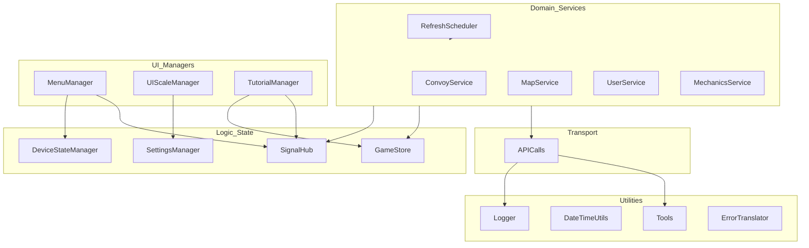

# Autoload Dependency Graph

This document visualizes how the global singletons (Autoloads) depend on each other. Understanding this graph is critical to avoiding circular dependencies and ensuring a clean initialization order.

## High-Level Dependency Flow

The project follows a "Downward-Only" dependency pattern:
**Utilities -> Transport -> Domain Services -> UI Managers**

## Dependency Rules

1. **Don't depend on Managers from Services**: A service (like `ConvoyService`) should never call `MenuManager`. It should emit a signal via `SignalHub`, and the `MenuManager` can choose to react to it.
2. **APICalls is the Foundation**: Almost every service depends on `APICalls`. `APICalls` must never depend on a domain service.
3. **SignalHub is the Bridge**: Use signals to talk "up" the stack (from Service to UI) and direct method calls to talk "down" the stack (from UI to Service).

---

## Circular Dependency Prevention

If you find yourself needing to call a Service from `APICalls` or a UI Manager from a Service, you are likely missing a signal in `SignalHub`.

- **Bad**: `convoy_service.gd` calls `MenuManager.close_all_menus()`
- **Good**: `convoy_service.gd` calls `SignalHub.convoy_lost.emit()`. `MenuManager` connects to this signal and closes the menus.
