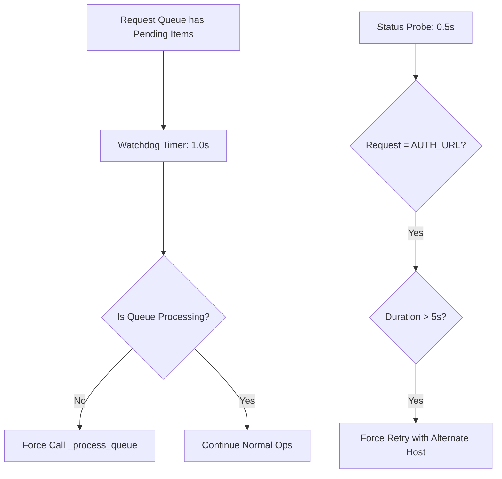

# Diagnostics & Troubleshooting

This guide provides a runbook for debugging network issues, UI stalls, and application crashes.

## 1. Logging System (`Logger.gd`)

The centralized `Logger` autoload manages all application output. 

### Log Levels
You can set the log level in `res://app_config.cfg`:
```ini
[logging]
level = "debug" ; Options: debug, info, warn, error
http_trace = true ; Enables full request/response body logging
```

### Accessing Recent Logs
The logger maintains a **ring buffer** of the last 400 lines in memory. This is used for generating bug reports:
- `Logger.get_recent_lines(count)`
- `Logger.get_recent_lines_since(window_seconds)`

---

## 2. Network Diagnostics (`APICalls.gd`)

The `APICalls` system contains built-in self-healing and monitoring tools.

### Queue Watchdog (`QueueWatchdogTimer`)
If the HTTP queue stops processing but still has pending requests (a "stall"), the watchdog will force-trigger `_process_queue()` every 1.0s. 
- **Check the logs for**: `[APICalls][Watchdog] Detected pending requests...`

### Request Probe (`HTTPRequestStatusProbe`)
Every 0.5s, the system probes the status of the active `HTTPRequest` node.
- **Stall Detection**: If a request (especially `AUTH_URL`) stays in `STATUS_RESOLVING` or `STATUS_CONNECTING` for more than 5s, the probe will force a retry with an alternate host.
- **Log pattern**: `[APICalls][Probe] in_progress purpose=AUTH_URL status=1...`

### Network Self-Healing Logic



### HTTP Tracing
When `http_trace = true` is set in the config, the console will show:
- Full URL and headers for every request.
- Full JSON response bodies (formatted).
- Client-side timing (MS) for every transaction.

---

## 3. UI Diagnostics

### The "White Screen", "Black Screen", or Frozen Map
If the map fails to render or looks completely "black" or "frozen":
1.  **SubViewport Update Mode**: Verify that `SubViewport.render_target_update_mode` is set to `UPDATE_ALWAYS` (4).
2.  **Texture Assignment & Churn**: Ensure you are not dynamically re-assigning the viewport's texture inside a `_process()` loop or repetitive frame callbacks. Continuous `get_texture()` assignments will trigger GPU state-transition stalls on strict platforms (especially macOS/Apple Silicon under the GL Compatibility renderer), forcing the texture to render black.
3.  **Programmatic Instantiation Bug**: Never use `ViewportTexture.new()` programmatically at runtime. In Godot 4, runtime `ViewportTexture` resources fail to resolve their paths under the active scene context, rendering them black. Always assign `viewport.get_texture()` **once** at startup.
4.  **Layout Settling**: If the camera viewport rect sizes are incorrect at startup, ensure the scene unpausing sequence allows **two process frames** to settle Control nodes before fetching sizes.
5.  **Logs**: Check console output for `--- Main Initialization Start ---` and `[Main] Programmatically assigned pre-resolved ViewportTexture directly once.`.

### Mobile Layout Issues
If elements are clipping on mobile:
1.  Check `SafeRegionContainer` to ensure it is correctly detecting the device's safe areas.
2.  Verify the `ui_scale_manager.gd` has calculated a valid `global_ui_scale`.

---

## 4. Common Fixes

| Symptom | Probable Cause | Fix |
| :--- | :--- | :--- |
| **401 Unauthorized** | JWT session expired or `session.cfg` is corrupt. | Call `APICalls.logout()` and re-authenticate. |
| **404 Not Found (Transact)** | API endpoint mismatch (Client/Server version). | `APICalls` has built-in fallbacks (e.g., retrying `/vendor/buy` as `/vehicle/buy`). Check logs for `[Fallback]`. |
| **UI Stutter** | Too many labels or map anti-collision math. | Check `ConvoyLabelManager.debug_logging = true`. |
