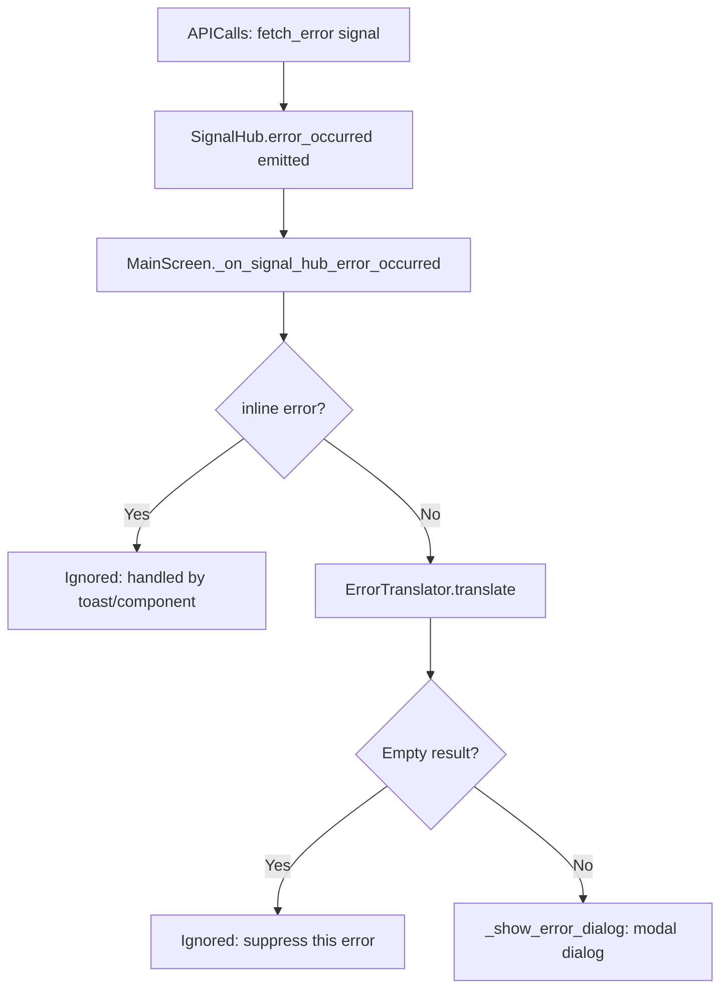

# Error Handling System

The error system is a three-layer pipeline that converts raw backend/network error strings into user-friendly messages and routes them to the correct display surface.

---

## The Pipeline



---

## Layer 1: `SignalHub.error_occurred`

All errors are centralised through this signal:

```gdscript
signal error_occurred(domain: String, code: String, message: String, inline: bool)
```

| Parameter | Meaning |
|---|---|
| `domain` | Source category: `"API"`, `"Auth"`, `"Route"`, etc. |
| `code` | Short identifier: `"FETCH_ERROR"`, `"TIMEOUT"`, etc. |
| `message` | The raw technical error string from `APICalls` or a service |
| `inline` | If `true`, the error is a soft "toast" class and should NOT show a blocking modal |

Services emit this signal rather than showing errors directly, keeping error display logic out of domain code.

---

## Layer 2: `ErrorTranslator`

`ErrorTranslator` is an Autoload (`Scripts/System/error_translator.gd`) with three behaviours:

### 1. Ignored errors (`IGNORED_SUBSTRINGS`)
Some raw messages are routine and should never surface to the user:
- `"Logged out."` — Normal logout event
- `"Unauthorized"` / `"Not authenticated"` — Auth challenges (auth flow handles them)
- `"Map request HTTP 401"` — Expected before login

`translate()` returns `""` for these, and `MainScreen` silently drops them.

### 2. Inline errors (`INLINE_ERROR_KEYS`)
Soft errors that should be shown as a toast/inline notice rather than a blocking dialog:
- `"Item no longer sold by vendor"`
- `"Vendor does not have enough stock"`
- `"not found in the vendor's inventory"`

`is_inline_error(raw_message)` is called by services before emitting `error_occurred` to set the `inline` flag correctly.

### 3. Translated errors (`ERROR_MAP`)
All other errors are matched against a priority-ordered dictionary. Matches are checked with `find()` (substring, not exact). Two formats:

```gdscript
# Full replacement:
"Not enough money": "You do not have enough money for this transaction."

# Prefix (trailing space = append remainder of raw message):
"PATCH 'cargo_bought' failed:": "Could not buy item: "
```

If no key matches, the error is logged as `"Unhandled API Error (add to ErrorTranslator): ..."` and the user sees a generic message. In debug builds, the raw detail is appended.

---

## Layer 3: `ErrorDialog`

`MainScreen._show_error_dialog()` instantiates `ErrorDialog.tscn` inside `SafeRegionContainer/ModalLayer/DialogHost`. Key behaviours:
- **De-duplication**: If an `ErrorDialog` is already visible, subsequent errors are printed to the log but not shown (prevents stacking).
- **Auto-hide**: When the dialog is freed (`tree_exited`), `_maybe_hide_modal_layer()` hides the modal layer if no other dialogs are still visible.

---

## How to Add a New Error Translation

1. Open `Scripts/System/error_translator.gd`
2. Add the raw error substring to `ERROR_MAP`:
   ```gdscript
   "Your new raw error key": "User-friendly replacement message.",
   ```
3. Place it **above** any broader keys it might overlap with (the map is checked in order).
4. If it should be a toast (soft error), add the key to `INLINE_ERROR_KEYS` as well.
5. If it should be silently ignored, add it to `IGNORED_SUBSTRINGS` instead.

> [!TIP]
> Run the game and trigger the error in debug mode. The `"Unhandled API Error"` log line will show you the exact raw string to add.

---

## Primary Files

| File | Role |
|---|---|
| `Scripts/System/error_translator.gd` | Translation map and `is_inline_error()` helper |
| `Scripts/UI/main_screen.gd` | `_on_signal_hub_error_occurred()`, `_show_error_dialog()` |
| `Scenes/UI/ErrorDialog.tscn` | The blocking modal UI |
| `Scripts/System/Services/signal_hub.gd` | `error_occurred` signal definition |

- **Related**: [Architecture Overview](../01_Architecture/Architecture.md), [Diagnostics](Diagnostics.md)
