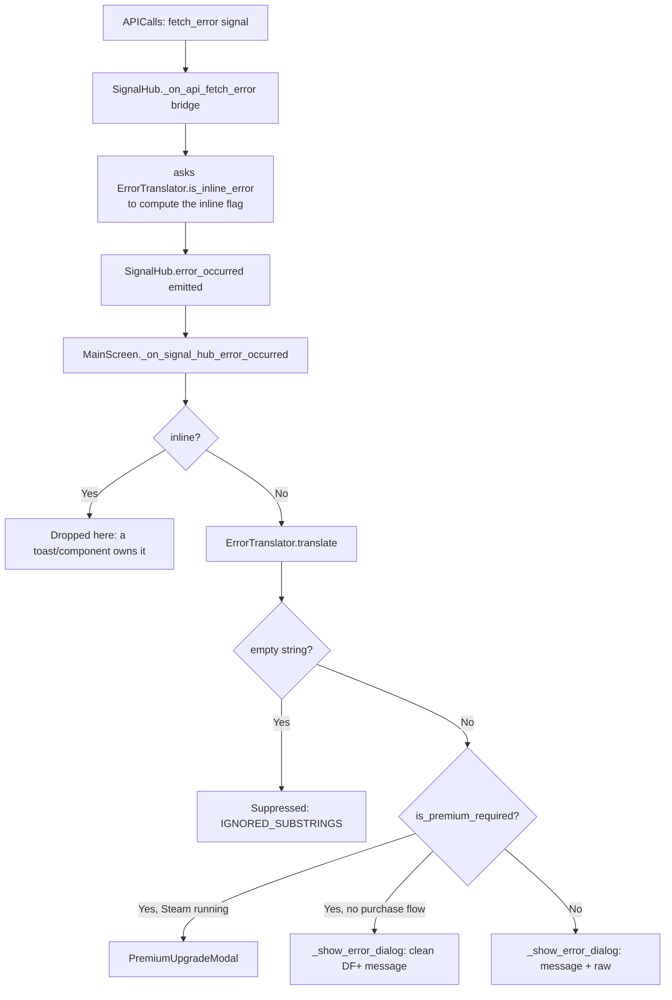

# Error Handling System

The error system is a three-layer pipeline that converts raw backend/network error strings into user-friendly messages and routes them to the correct display surface.

---

## The Pipeline


```mermaid
graph TD
    A[APICalls: fetch_error signal] --> B[SignalHub._on_api_fetch_error bridge]
    B --> B2[asks ErrorTranslator.is_inline_error<br/>to compute the inline flag]
    B2 --> C[SignalHub.error_occurred emitted]
    C --> D[MainScreen._on_signal_hub_error_occurred]
    D --> E{inline?}
    E -- Yes --> F[Dropped here: a toast/component owns it]
    E -- No --> G[ErrorTranslator.translate]
    G --> H{empty string?}
    H -- Yes --> I[Suppressed: IGNORED_SUBSTRINGS]
    H -- No --> J{is_premium_required?}
    J -- Yes, Steam running --> K[PremiumUpgradeModal]
    J -- Yes, no purchase flow --> L[_show_error_dialog: clean DF+ message]
    J -- No --> M[_show_error_dialog: message + raw]
```

> [!IMPORTANT]
> **`SignalHub` computes the `inline` flag, not the services.** `SignalHub._ready()` connects to
> `APICalls.fetch_error` and its `_on_api_fetch_error()` bridge (`signal_hub.gd:71-79`) calls
> `ErrorTranslator.is_inline_error(message)` itself before emitting `error_occurred`. A service that
> emits `error_occurred` directly is responsible for its own `inline` argument, but nothing in the
> transport path requires services to know about `INLINE_ERROR_KEYS` at all.
>
> `main_screen.gd:1228` has a second, **legacy** entry point — `_on_api_fetch_error()`, for anything still
> wired straight to `APICalls` rather than through the hub. It recomputes the flag the same way and
> forwards into the normal handler. Its own comment says there should be none; treat a hit there as a
> wiring bug, not a supported path.

---

## Layer 1: `SignalHub.error_occurred`

All errors are centralised through this signal:

```gdscript
signal error_occurred(domain: String, code: String, message: String, inline: bool)
```

| Parameter | Meaning |
|---|---|
| `domain` | Source category: `"API"`, `"Auth"`, `"Route"`, etc. |
| `code` | Short identifier: `"FETCH_ERROR"`, `"TIMEOUT"`, etc. |
| `message` | The raw technical error string from `APICalls` or a service |
| `inline` | If `true`, the error is a soft "toast" class and should NOT show a blocking modal |

Services emit this signal rather than showing errors directly, keeping error display logic out of domain code.

---

## Layer 2: `ErrorTranslator`

`ErrorTranslator` is an Autoload (`Scripts/System/error_translator.gd`) with **four** public entry points
— `is_inline_error()`, `is_premium_required()`, `translate()`, and the debug-detail behaviour `translate()`
falls back to. All matching is **substring** (`String.find()`), never exact:

### 1. Ignored errors (`IGNORED_SUBSTRINGS`)
Some raw messages are routine and should never surface to the user:
- `"Logged out."` — Normal logout event
- `"Unauthorized"` / `"Not authenticated"` — Auth challenges (auth flow handles them)
- `"Map request HTTP 401"` — Expected before login

`translate()` returns `""` for these, and `MainScreen` silently drops them.

### 2. Inline errors (`INLINE_ERROR_KEYS`)
Soft errors that should be shown as a toast/inline notice rather than a blocking dialog:
- `"Item no longer sold by vendor"`
- `"Vendor does not have enough stock"`
- `"not found in the vendor's inventory"`

`is_inline_error(raw_message)` is called by **`SignalHub`'s `APICalls.fetch_error` bridge** (and by the
legacy `main_screen` fallback) to set the `inline` flag — see the callout under the pipeline diagram.
`MainScreen` then drops anything flagged `inline` **before translating it**, so an inline error never
reaches `ERROR_MAP`; whichever component owns the toast is responsible for its own wording.

### 3. Translated errors (`ERROR_MAP`)
All other errors are matched against a priority-ordered dictionary. Matches are checked with `find()` (substring, not exact). Two formats:

```gdscript
# Full replacement:
"Not enough money": "You do not have enough money for this transaction."

# Prefix (trailing space = append remainder of raw message):
"PATCH 'cargo_bought' failed:": "Could not buy item: "
```

If no key matches, the error is logged as `"Unhandled API Error (add to ErrorTranslator): ..."` and the
user sees a generic message. In debug builds, the raw detail is appended — see
[§ Unknown errors and debug detail](#unknown-errors-and-debug-detail).

### 4. Premium-gated failures (`PREMIUM_REQUIRED_KEYS`)

`is_premium_required(raw_message)` detects DF+-gated backend refusals so they reach the **upgrade flow**
rather than an error modal. It is matched on **phrasing, not endpoint**, deliberately — the key list
(`"upgrade to DF+"`, `"requires DF+"`, `"DF+ required"`, `"DF+ to purchase"`) is meant to catch future
gated actions such as the vehicle cap without a code change.

Routing lives in `main_screen._on_signal_hub_error_occurred()` and is **platform-dependent**:

| Condition | Result |
|---|---|
| `is_premium_required` **and** Steam running | `MenuManager.open_premium_upgrade_menu()` — the real purchase flow |
| `is_premium_required`, no live purchase flow | `_show_error_dialog()` with the clean DF+ message |
| otherwise | normal `_show_error_dialog(message, raw)` |

`_try_show_premium_upgrade()` returns `false` unless `SteamManager.is_steam_running()`, because **Steam is
the only platform with a purchase path in code today**. iOS/Android/Web therefore get a correct, clean
"requires DF+" message and **no buy button** — a known product gap, not a bug. Wiring an off-Steam
upgrade path is tracked in [TODO.md § Sprint 11](../TODO.md).

> [!WARNING]
> The warehouse entry is deliberately **verb-agnostic** (`"'warehouse_created' failed:"`, with no `POST`
> or `PATCH` prefix). It was originally written as `PATCH`-only while the device actually sent `POST`, so
> every real refusal fell through to the scary unknown-error fallback. Do not re-add a verb to it.

### 5. Network / transport failures

A request that never reaches the server has no response body to parse, so `APICalls` embeds the
`HTTPRequest.Result` code in the message (`api_calls.gd:2542`) and `ERROR_MAP` matches on that:

| Code | `HTTPRequest.Result` | Player sees |
|---|---|---|
| 2 | `RESULT_CANT_CONNECT` | Can't reach the server — check your internet connection. |
| 3 | `RESULT_CANT_RESOLVE` | *(same)* |
| 4 | `RESULT_CONNECTION_ERROR` | *(same)* |
| 5 | `RESULT_TLS_HANDSHAKE_ERROR` | A secure connection error occurred… (clock/unstable connection) |
| 10 | `RESULT_TIMEOUT` | The request timed out… |

> [!CAUTION]
> **The enum is not numbered the way it looks.** `RESULT_CHUNKED_BODY_SIZE_MISMATCH = 1` sits between
> `RESULT_SUCCESS` and `RESULT_CANT_CONNECT`, shifting every later value by one. Verify against the Godot
> 4.6 enum before adding a code — a plausible-looking guess maps to the wrong failure.
>
> Keys carry a **trailing period** (`"result code: 2."`) because matching is by substring: without it,
> `"result code: 1"` would also match `10`. Code 5's key predates this and is left un-suffixed.

Bug-report submissions get the same treatment: on `response_code == 0` the result code is substituted for
the unparseable body, so an offline report no longer surfaces as `Bug report submit failed (HTTP 0):
Unknown error.`

### Machine-readable data in an error message: strip it *before* translating

Substring matching means anything the server appends to a message **survives translation and reaches the
player**. A prefix-format entry will even paste it into the friendly text verbatim.

The one live case is the vendor buy refusal, which carries ` [fits:N/M]` — how many units would have fit
— so the client can offer the smaller order (see
[Transactions § When the server refuses anyway](../02_UI_UX/VendorPanel/Transactions.md#when-the-server-refuses-anyway-the-fit-offer)).
`CargoFillPlanner.parse_server_fit_marker()` removes it and returns the numbers.

If you add another such marker, two rules:

- **Parse and strip at the entry point of the error path**, not just before the call you happen to be
  looking at. A single message can reach the player from more than one place — this one is toasted by
  `VendorPanelRefreshController.on_api_transaction_error()` *and* rendered by the panel, so stripping in
  only one of them still leaked it.
- **Keep the message translatable with the marker gone.** The stripped text must still match its
  `ERROR_MAP` key, or the player gets the unknown-error fallback instead.

---

### Unknown errors and debug detail

When nothing matches, `_format_unknown_error()` decides how much truth the player sees:

- `_should_show_debug_details()` returns the `df/debug/show_error_details` **ProjectSetting if it is
  present** — that override wins outright. Otherwise it defaults to `true` in editor/debug builds
  (`OS.is_debug_build()` / `OS.has_feature("debug")` / `OS.has_feature("editor")`).
- **Detail shown:** `"An unexpected error occurred.\n\nDetails:\n<raw>"`, with the raw string truncated at
  **800 chars** (`_DEBUG_DETAIL_MAX_CHARS`) and suffixed `"… (truncated; see logs)"`.
- **Detail hidden (release):** the flat `"An unexpected error occurred. Please try again."`

Either way the full raw string is logged through `/root/Logger` (falling back to `printerr`), so the
detail is recoverable from a player's log even when the dialog withheld it.

---

## Layer 3: `ErrorDialog`

`MainScreen._show_error_dialog(message, raw_message := "")` instantiates `ErrorDialog.tscn` inside
`SafeRegionContainer/ModalLayer/DialogHost`. Key behaviours:
- **Two messages, not one.** The translated `message` is what the player reads; `raw_message` is passed
  through to `error_dialog.show_message(message, raw_message)` for the debug-detail affordance. The
  premium-fallback path deliberately passes **only** the clean message, so no raw
  `POST 'warehouse_created' failed:` text can leak into an upsell.
- **De-duplication**: name-based — if `DialogHost.find_child("ErrorDialog", false, false)` returns a node,
  the new error is logged and dropped rather than stacked.
- **The modal layer is forced to `PROCESS_MODE_ALWAYS`** when a dialog opens, so an error raised while the
  tree is paused is still interactive. (The tree is paused for the whole of login — see
  [AI_ONBOARDING § Pro Tips](../AI_ONBOARDING.md).)
- **Auto-hide**: When the dialog is freed (`tree_exited`), `_maybe_hide_modal_layer()` hides the modal layer if no other dialogs are still visible.

---

## How to Add a New Error Translation

1. Open `Scripts/System/error_translator.gd`
2. Add the raw error substring to `ERROR_MAP`:
   ```gdscript
   "Your new raw error key": "User-friendly replacement message.",
   ```
3. Place it **above** any broader keys it might overlap with (the map is checked in order).
4. If it should be a toast (soft error), add the key to `INLINE_ERROR_KEYS` as well.
5. If it should be silently ignored, add it to `IGNORED_SUBSTRINGS` instead.
6. If it is a DF+ gate, add the phrasing to `PREMIUM_REQUIRED_KEYS` so it routes to the upgrade flow.

> [!TIP]
> Run the game and trigger the error in debug mode. The `"Unhandled API Error"` log line will show you the exact raw string to add.

### Three traps, all of which have bitten this map

- **Substring matching cuts both ways.** A short key silently swallows longer ones — this is why the
  network codes are suffixed with a period. Before adding a key, ask what *else* contains it.
- **Ordering is load-bearing and invisible.** `ERROR_MAP` is a plain `Dictionary` iterated in insertion
  order, so a broad key placed early permanently shadows every specific key after it. There is no warning
  and no test; the only symptom is a vague message where a precise one was expected.
- **A verb in the key is usually a bug.** Backend endpoints do not all use the method you assume, and a
  method-qualified key (`"PATCH 'x' failed:"`) fails silently the day the server sends `POST` — the exact
  history of the warehouse entry.

---

## Primary Files

| File | Role |
|---|---|
| `Scripts/System/error_translator.gd` | `ERROR_MAP`, `IGNORED_SUBSTRINGS`, `INLINE_ERROR_KEYS`, `PREMIUM_REQUIRED_KEYS`; `translate()`, `is_inline_error()`, `is_premium_required()` |
| `Scripts/System/Services/signal_hub.gd` | `error_occurred` signal **and** the `APICalls.fetch_error` → `error_occurred` bridge that computes the `inline` flag |
| `Scripts/System/api_calls.gd` | Emits `fetch_error`; embeds the `HTTPRequest.Result` code when there is no response body |
| `Scripts/UI/main_screen.gd` | `_on_signal_hub_error_occurred()`, `_try_show_premium_upgrade()`, `_show_error_dialog()` |
| `Scenes/ErrorDialog.tscn` | The blocking modal UI (`show_message(message, raw_message)`) |

- **Related**: [Architecture Overview](../01_Architecture/Architecture.md), [Diagnostics](Diagnostics.md),
  [SignalHub](SignalHub.md), [Network Layer](NetworkLayer.md),
  [Bug Reporting](BugReporting.md) — which shares the `HTTP 0` transport path documented above.
