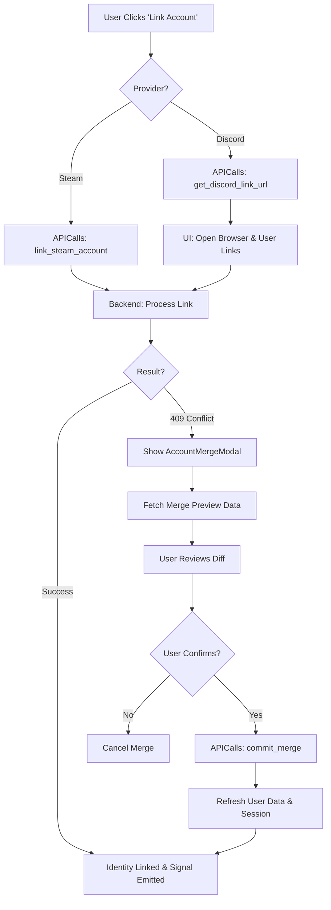

# Identity System

The Identity System manages user authentication, session persistence, and multi-provider account linking/merging.

## Core Components

### 1. APICalls (`api_calls.gd`)
The transport layer for all identity requests. It manages:
- **JWT Session Tokens**: Stored in `_auth_bearer_token`.
- **Session Persistence**: Saves/loads tokens from `user://session.cfg`.
- **Request Queueing**: Ensures auth requests are prioritized or handled gracefully during concurrent operations.

### 2. UserService (`user_service.gd`)
The domain-level service that:
- Provides access to the current user snapshot from `GameStore`.
- Triggers data refreshes via `APICalls`.
- Centralizes user-related signals for the UI.

### 3. Login Screen (`login_screen.gd`)
The primary entry point. Supports:
- **Steam Login**: Uses the local Steam client ID.
- **Discord Login**: Redirects to OAuth URL and polls for status.

## Account Linking & Merging

A user can link multiple social identities (Steam, Discord) to a single Desolate Frontiers account.

### Linking & Merging Journey

1. **Trigger**: UI initiates linking via `APICalls`.
2. **Conflict Handling**: If a 409 occurs, the `AccountMergeModal` is triggered to handle data consolidation.
3. **Completion**: All paths lead to a session resync and a `user_id_resolved` signal.

## Persistent Storage

- **Path**: `user://session.cfg`
- **Keys**:
  - `auth/session_token`: The JWT used for Authorization headers.
  - `auth/token_expiry`: Unix timestamp for token expiration.

## Key Signals (APICalls)
- `auth_status_update(status)`: Current polling/login status.
- `steam_account_linked(result)`: Payload includes `ok` and `conflict` data for 409s.
- `discord_account_linked(result)`: Payload includes `ok` and `conflict` data.
- `merge_preview_received(result)`: Contains the data consolidation summary.
- `user_id_resolved(user_id)`: Emitted when the JWT is successfully validated.
