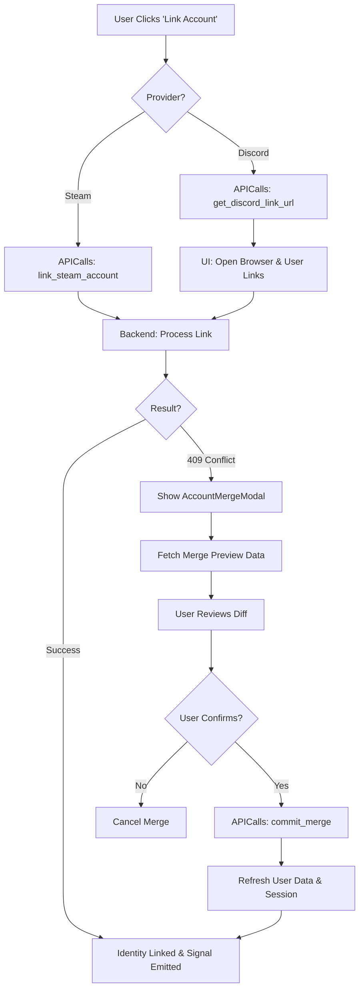

# Identity System

The Identity System manages user authentication, session persistence, and multi-provider account linking/merging.

## Core Components

### 1. APICalls (`api_calls.gd`)
The transport layer for all identity requests. It manages:
- **JWT Session Tokens**: Stored in `_auth_bearer_token`.
- **Session Persistence**: Saves/loads tokens from `user://session.cfg`.
- **Request Queueing**: Ensures auth requests are prioritized or handled gracefully during concurrent operations.

### 2. UserService (`user_service.gd`)
The domain-level service that:
- Provides access to the current user snapshot from `GameStore`.
- Triggers data refreshes via `APICalls`.
- Centralizes user-related signals for the UI.

### 3. Login Screen (`login_screen.gd`)
The primary entry point. Supports:
- **Steam Login**: Uses the local Steam client ID.
- **Discord Login**: Redirects to OAuth URL and polls for status.

## Account Linking & Merging

A user can link multiple social identities (Steam, Discord) to a single Desolate Frontiers account.

### Linking & Merging Journey

```mermaid
graph TD
    Start[User Clicks 'Link Account'] --> LinkType{Provider?}
    LinkType -->|Steam| SteamAPI[APICalls: link_steam_account]
    LinkType -->|Discord| DiscordAPI[APICalls: get_discord_link_url]
    
    SteamAPI --> BackendLink[Backend: Process Link]
    DiscordAPI --> Browser[UI: Open Browser & User Links]
    Browser --> BackendLink
    
    BackendLink --> Result{Result?}
    Result -->|Success| Linked[Identity Linked & Signal Emitted]
    Result -->|409 Conflict| Conflict[Show AccountMergeModal]
    
    Conflict --> Preview[Fetch Merge Preview Data]
    Preview --> Review[User Reviews Diff]
    Review --> Choice{User Confirms?}
    Choice -->|No| Cancel[Cancel Merge]
    Choice -->|Yes| Commit[APICalls: commit_merge]
    
    Commit --> Resync[Refresh User Data & Session]
    Resync --> Linked
```

1. **Trigger**: UI initiates linking via `APICalls`.
2. **Conflict Handling**: If a 409 occurs, the `AccountMergeModal` is triggered to handle data consolidation.
3. **Completion**: All paths lead to a session resync and a `user_id_resolved` signal.

### `SteamLinkPopup` — the concrete Steam-side implementation

*(Documented 2026-07-31. This 296-line script had no coverage anywhere in `docs/` despite being the
component that performs Steam linking and owns the 409 handoff — the exact machinery S12-3 below is
asked to reuse.)*

`Scripts/UI/steam_link_popup.gd` (`SteamLinkPopup`, a `CanvasLayer` at `layer = 101` — deliberately the
same layer as `AccountMergeModal`, above `AccountLinksPopup`'s `100`).

| Step | What happens |
|---|---|
| Input | A **`LineEdit` where the player types their Steam ID by hand.** Only the *persona name* is auto-filled, and only when `SteamManager` is live (`get_steam_username()`). |
| Dispatch | `_on_link_pressed()` disables the button, sets status "Linking…", then calls `APICalls.link_steam_account(sid, persona)`. |
| Result | `steam_account_linked(result)` → `_on_steam_link_result()`. |
| `ok` | Shows the linked ID, emits **`SignalHub.user_refresh_requested`** so other surfaces (e.g. `AccountLinksPopup`) re-read identity, then **auto-closes after a 2 s timer**. |
| `400` | *"Invalid Steam ID or already linked to this account."* |
| **`409`** | `_open_merge_modal(result["conflict"])` — **hides itself**, instantiates `account_merge_modal.gd`, wires `merge_done` / `cancelled`, and calls `open_with_conflict(conflict)`. |

Two implementation details worth knowing before extending it:

- **The result signal is connected per-attempt and disconnected in the handler.** `_on_link_pressed()`
  guards with `is_connected()` before connecting, and `_on_steam_link_result()` disconnects first thing.
  Retrying after a failed link would otherwise accumulate handlers and fire the result N times.
- **The popup hides rather than closes during a merge**, and is re-`show()`n if the merge modal fails to
  load. So a merge cancellation returns the player to the link form, not to nothing.

> [!NOTE]
> **The manual Steam-ID entry is the notable design constraint for S12-3.** A first-launch "I already
> have an account" branch that reused this popup as-is would ask a brand-new Steam player to find and
> type their own Steam ID — plausible for an Options-menu power-user flow, poor as onboarding. The
> transport (`link_steam_account` + the 409 merge path) is reusable; **the input affordance is the part
> that needs designing.** `SteamManager.get_steam_id()` already exists and is the obvious substitute — it
> returns `str(getSteamID())`, and `link_steam_account(steam_id: String, …)` takes a `String`, so the
> types line up with no conversion. **Keep a manual-entry fallback though:** `get_steam_id()` returns an
> **empty string** when Steam is not initialised, and `link_steam_account()` rejects an empty id with its
> own synthetic `400` (`api_calls.gd:707-710`) rather than reaching the server.

## First launch on Steam — the missing "I already have an account" branch

> [!WARNING]
> **Open gap (audited 2026-07-28, tracked as TODO Sprint 12 · S12-3).** A player who already has a
> Desolate Frontiers account (Discord / mobile) and then buys the game on Steam has **no way to say so**
> at first launch. They get a brand-new backend account and are pushed straight into onboarding.

Verified current flow:

1. **`login_screen.gd`** builds a **Continue with Steam** button (`:282-306`) — desktop only, and disabled
   when the Steam client isn't running (`_disable_steam_button()`, `:390`). A first-time Steam login
   creates a fresh account server-side. There is no "already have an account?" affordance on this screen.
2. **`game_screen_manager.gd::_on_login_successful()`** bootstraps user + convoy + map, then swaps to
   `MainScreen` on `initial_data_ready`.
3. **`tutorial_manager.gd::_maybe_start()`** (`:187`) decides onboarding. The gate is **server-side**:
   `user.metadata.tutorial`.
   - Key **present** → that level is the source of truth; the tutorial starts there.
   - Key **absent** → the tutorial starts **only** if the convoy sits at the `(0,0)` Tutorial City spawn
     (`_is_convoy_at_zero()`, `:160`) — i.e. brand-new accounts still onboard, returning users don't.
   - There is **no skip / opt-out branch anywhere** in `tutorial_manager.gd`.

**The machinery to fix this already exists** — it is just only reachable *after* login, from
Options → Connect Accounts (`user_info_display.gd:386`, `:437`), which opens **`AccountLinksPopup`**
(`Scripts/UI/account_links_popup.gd`, a `CanvasLayer` at `layer = 100`). Its 409-conflict path runs the
`AccountMergeModal` → merge preview → `commit_merge` → session resync flow diagrammed above. Any fix
should reuse that flow rather than adding a parallel one.

**✅ Product question ANSWERED 2026-07-29 — use the merge path.** The question was whether to **link Steam
onto the existing account** (preserving prior progress) or **sign in as the existing account** (discarding
the just-created Steam one). The decision is **merge**: link Steam onto the existing account and keep the
old progress, reusing the 409-conflict machinery rather than building a parallel flow. See
[TODO.md § S12-3](../TODO.md) for the decision record; the concrete component to build on is
[`SteamLinkPopup`](#steamlinkpopup--the-concrete-steam-side-implementation) above.

## Persistent Storage

- **Path**: `user://session.cfg`
- **Keys**:
  - `auth/session_token`: The JWT used for Authorization headers.
  - `auth/token_expiry`: Unix timestamp for token expiration.

## Key Signals (APICalls)
- `auth_status_update(status)`: Current polling/login status.
- `steam_account_linked(result)`: Payload includes `ok` and `conflict` data for 409s.
- `discord_account_linked(result)`: Payload includes `ok` and `conflict` data.
- `merge_preview_received(result)`: Contains the data consolidation summary.
- `user_id_resolved(user_id)`: Emitted when the JWT is successfully validated.

## Related

- **See also:** [MultiProviderAuth](MultiProviderAuth.md) — Google / Steam / Apple entry points
- **See also:** [AppleAuth](AppleAuth.md) — iOS and macOS specifics
- **See also:** [GameLifecycle](../03_Systems/GameLifecycle.md) — the auth state machine
