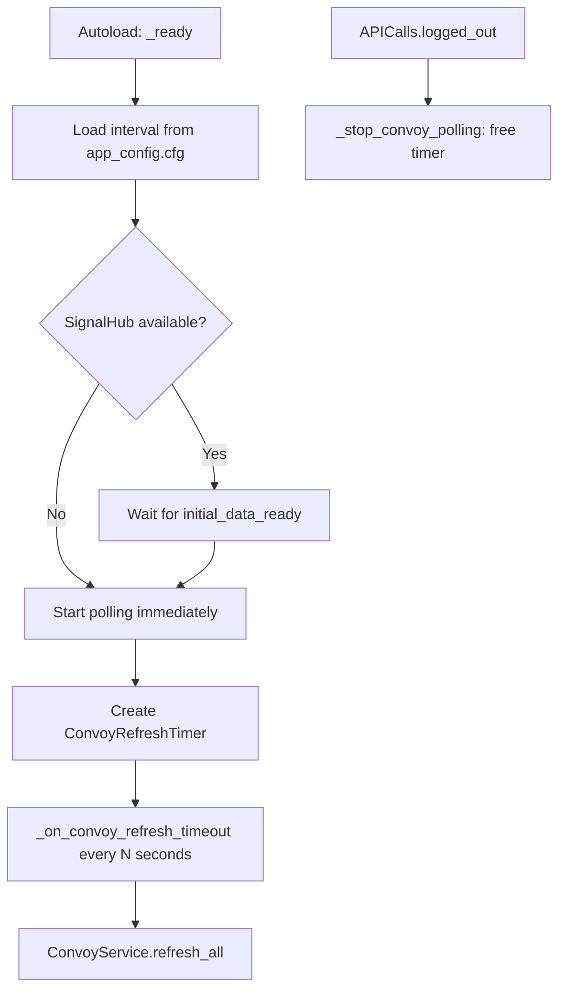

# Refresh Scheduler

`RefreshScheduler` is the **polling heartbeat** of Desolate Frontiers. It periodically calls `ConvoyService.refresh_all()` to keep convoy positions, journey progress, and cargo state up to date while the game is in the foreground.

---

## Lifecycle



Key points:
- Polling **starts only after `initial_data_ready`** to avoid racing the auth/map bootstrap.
- Polling **stops immediately on `logged_out`** (via `APICalls.logged_out` signal).
- `process_mode = PROCESS_MODE_ALWAYS` so the timer runs even when the game tree is paused (e.g. during modals).

---

## Configuration

The polling interval is configurable in `res://app_config.cfg`:

```ini
[refresh]
convoys_interval = 10
```

If the key is missing, the default is **10 seconds**. The value is loaded once at `_ready()` time; changing it at runtime requires calling `_load_interval_from_config()` followed by restarting polling with `enable_polling(true)`.

---

## Public API

| Method | Description |
|---|---|
| `enable_polling(enable: bool)` | Manually start or stop the polling cycle. Used by tests and special flows. |

---

## Adding a New Service to the Polling Cycle

To include a new service in the periodic refresh, add a call in `_on_convoy_refresh_timeout()`:

```gdscript
func _on_convoy_refresh_timeout() -> void:
    if is_instance_valid(_convoys) and _convoys.has_method("refresh_all"):
        _convoys.refresh_all()
    # Add new services here:
    var my_service := get_node_or_null("/root/MyService")
    if is_instance_valid(my_service) and my_service.has_method("refresh"):
        my_service.refresh()
```

> [!WARNING]
> Do **not** add services here unless they need background polling. Prefer reactive updates (via `SignalHub` + PATCH response) for operations the user explicitly triggers.

---

## Primary Files

- **Script**: `Scripts/System/Services/refresh_scheduler.gd`
- **Config**: `res://app_config.cfg` (`[refresh] convoys_interval`)
- **Related**: [DataFlow](../01_Architecture/DataFlow.md), [Architecture Overview](../01_Architecture/Architecture.md)
