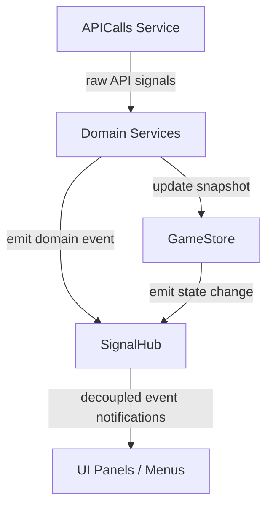

# SignalHub Event Bus

`SignalHub` (`signal_hub.gd`) is the central **Event Bus** for *Desolate Frontiers*. It decouples the UI layer from underlying domain services, enforcing the **Law of Unidirectional Data Flow**.



> [!IMPORTANT]
> **The Decoupling Rule**: UI components must **never** connect directly to services or make direct calls to `APICalls`. They should connect to `SignalHub` signals and read state from `GameStore`.

---

## Lifecycle & Configuration

`SignalHub` is registered as a Godot **Autoload** (Singleton) and is guaranteed to initialize early. 

- **File**: `Scripts/System/Services/signal_hub.gd`
- **Process Mode**: `PROCESS_MODE_ALWAYS` (allows signal dispatching and bridging to run even when the scene tree is paused, such as during modal transitions or blocking debug sequences).

---

## Bridging Layer: Low-Level to Domain Errors

`SignalHub` bridges raw transport-layer errors from `APICalls` to the localized error system:

```gdscript
func _ready() -> void:
    var api = get_node_or_null("/root/APICalls")
    if is_instance_valid(api) and api.has_signal("fetch_error"):
        api.fetch_error.connect(_on_api_fetch_error)
```

In `_on_api_fetch_error(message)`:
1. It queries `ErrorTranslator.is_inline_error(message)` to check if it's a soft warning/toast.
2. Emits `error_occurred.emit("API", "FETCH_ERROR", message, is_inline)`.

---

## Signal Catalog

### 1. Map & Settlements

#### `map_changed(tiles: Array, settlements: Array)`
- **Emitted by**: `GameStore.set_map()` (bridged from `APICalls` map fetch)
- **Listeners**: `MapCameraController`, `AutoSellService`, `ConvoyCargoMenu`, `ConvoyMenu`
- **Purpose**: Signals that the map coordinates and flat list of settlements have refreshed. Allows components to re-cache local search dictionaries (e.g. for mission destination lookups).

---

### 2. Convoys

#### `convoys_changed(convoys: Array)`
- **Emitted by**: `GameStore.set_convoys()` (polling tick or manual refresh)
- **Listeners**: `MenuManager`, `AutoSellService`, `ConvoyCargoMenu`
- **Purpose**: Signals that all active convoys have updated their state, position, or cargo stacks.
- **Gotcha**: This signal can carry shallow dictionaries (missing computed capacities). Use the Heuristic in `ConvoyMenu` to confirm if a full reload is required.

#### `convoy_updated(convoy: Dictionary)`
- **Emitted by**: `ConvoyService`
- **Listeners**: Specific menus listening to a focused convoy
- **Purpose**: Specific convoy details were updated (e.g., following a purchase or single-refresh).

---

### 3. UI Selection & Focus

#### `convoy_selection_requested(convoy_id: String, allow_toggle: bool)`
- **Emitted by**: Map settlement clicks, dropdowns, list panels
- **Listeners**: `GameStore`, `MapCameraController`
- **Purpose**: Triggers a request to change the currently focused convoy.

#### `convoy_selection_changed(selected_convoy_data: Variant)`
- **Emitted by**: `GameStore`
- **Listeners**: Main UI panels, map controllers
- **Purpose**: Informs the application of a newly selected convoy (or `null` if deselected).

#### `selected_convoy_ids_changed(selected_ids: Array)`
- **Emitted by**: `GameStore`
- **Listeners**: Map renderer
- **Purpose**: Toggles highlighters and camera anchors on the physical tiles.

---

### 4. User & Authentication

#### `user_changed(user: Dictionary)`
- **Emitted by**: `GameStore.set_user()`
- **Listeners**: `MainScreen`, `HeaderUI`
- **Purpose**: Informs that player balance, profile settings, or tutorial progress changed.

#### `auth_state_changed(state: String)`
- **Emitted by**: `UserService` / `APICalls`
- **Listeners**: `LoginScreen`, `MainScreen`
- **Purpose**: Indicates transition between `"Authenticating"`, `"Authenticated"`, or `"LoggedOut"`.

#### `user_refresh_requested`
- **Emitted by**: UI panels forcing a profile sync
- **Listeners**: `UserService`

---

### 5. Vendors & Trading

#### `vendor_updated(vendor: Dictionary)`
- **Emitted by**: `VendorService`
- **Listeners**: `ConvoyCargoMenu`, `VendorPanel`
- **Purpose**: Signals that a vendor's stock inventory or cash balance was loaded/refreshed.

#### `vendor_panel_ready(data: Dictionary)`
- **Emitted by**: `VendorService`
- **Listeners**: `VendorPanel` controller

#### `vendor_preview_ready(data: Dictionary)`
- **Emitted by**: `VendorService`
- **Listeners**: `ConvoyMenu` (Vendor Preview tabs)

---

### 6. Journey & Routing

#### `route_choices_request_started`
- **Emitted by**: `RouteService`
- **Listeners**: `ConvoyJourneyMenu` (shows loading spinner)

#### `route_choices_ready(routes: Array)`
- **Emitted by**: `RouteService`
- **Listeners**: `ConvoyJourneyMenu`
- **Purpose**: Renders selectable path lines on the map.

#### `route_choices_error(message: String)`
- **Emitted by**: `RouteService`
- **Listeners**: `ConvoyJourneyMenu` (stops spinner, displays path-finding failure)

---

### 7. Warehouses

#### `warehouse_created(result: Variant)`
- **Emitted by**: `WarehouseService`
- **Listeners**: `WarehouseMenu` (handles purchase success modal)

#### `warehouse_updated(warehouse: Dictionary)`
- **Emitted by**: `WarehouseService`
- **Listeners**: `WarehouseMenu` (forces full redraw of cargo slots and gauges)

#### `warehouse_expanded(result: Variant)`
- **Emitted by**: `WarehouseService`
- **Listeners**: `WarehouseMenu`

#### `warehouse_cargo_stored(result: Variant)` / `warehouse_cargo_retrieved(result: Variant)`
- **Emitted by**: `WarehouseService`
- **Listeners**: `WarehouseMenu`

#### `warehouse_vehicle_stored(result: Variant)` / `warehouse_vehicle_retrieved(result: Variant)`
- **Emitted by**: `WarehouseService`
- **Listeners**: `WarehouseMenu`

#### `warehouse_convoy_spawned(result: Variant)`
- **Emitted by**: `WarehouseService`
- **Listeners**: `WarehouseMenu`

---

### 8. Lifecycles & Critical Popups

#### `initial_data_ready`
- **Emitted by**: `GameStore` (when both `convoys` and `map` snapshots have loaded)
- **Listeners**: `RefreshScheduler` (starts background polling), `AutoSellService` (initiates snapshot diff)
- **Purpose**: Denotes that bootstrap is complete and the game state is stable.

#### `auto_sell_receipt_ready(receipt_data: Variant)`
- **Emitted by**: `AutoSellService`
- **Listeners**: `MainScreen`
- **Purpose**: Triggers the popup receipt modal summarizing post-journey automated sales.

#### `error_occurred(domain: String, code: String, message: String, inline: bool)`
- **Emitted by**: `SignalHub` (error bridging), Services
- **Listeners**: `MainScreen` (toast overlay or modal instantiation)
- **Purpose**: Absolute source of truth for error UI dispatch.

---

## Adding a Custom Signal to the Hub

Follow the standard cookbook pattern:
1. Define the signal with explicit parameters at the top of `signal_hub.gd`.
2. Document the signal in this file under the appropriate domain category.
3. Keep parameter types simple (prefer native types like `Array`, `Dictionary`, or `Variant` over custom class references) to prevent cyclical compilation dependencies.
